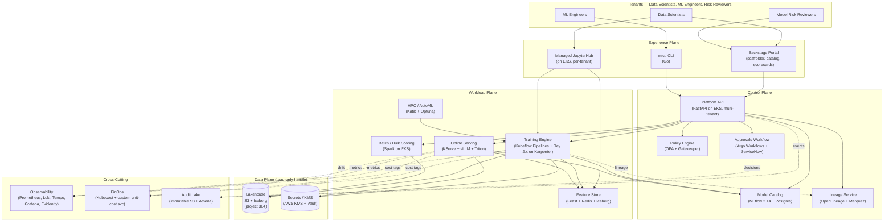

# Enterprise MLOps Platform — Architecture

> Project 301 | Target organization: TechCorp (Fortune 500, ~50k employees, ~$10B revenue)
> Author hat: Principal AI Infrastructure Architect
> Status: Reference architecture for the learning project

---

## 1. Context & Goals

### 1.1 Business problem

TechCorp has 220+ data scientists and ML engineers spread across nine business units
(retail risk, supply-chain forecasting, contact-center NLU, marketing personalization,
fraud, pricing, image moderation, internal copilots, and an emerging GenAI horizontal).
Each unit has hand-rolled its own training pipelines on a mix of SageMaker notebooks,
Databricks workspaces, raw EC2 GPU boxes, and one team running an in-house Ray cluster.
The status quo produces three concrete pains:

1. **Time-to-production is 4–9 months** for a new model, dominated by approvals,
   environment drift, and bespoke serving stacks.
2. **No common model registry, lineage, or audit trail.** The CISO cannot answer
   "which models touched EU customer PII in the last 90 days" within the SOC 2 audit
   window. Recent EU AI Act guidance (Aug 2024 implementing acts) made this a board-
   level risk.
3. **Spend is opaque and inefficient.** FY25 ML cloud spend was $38M with no
   per-model cost attribution. A FinOps spot check found GPU utilization across the
   estate averaged 19%.

The platform must consolidate model development, training, evaluation, deployment,
monitoring, and governance into a single self-service product owned by a central
Platform Engineering team (~22 FTE) and consumed by the nine business units as
internal tenants.

### 1.2 Goals (business)

| ID | Goal | Measurable target | Horizon |
|----|------|-------------------|---------|
| BG-1 | Reduce time-to-production for a new model | Median ≤ 21 days from "first commit" to canary in prod | 12 months |
| BG-2 | Drive GPU/accelerator utilization up | Fleet utilization ≥ 55% (from 19% baseline) | 9 months |
| BG-3 | Cut total ML infrastructure spend | -20% TCO at iso-workload by end of FY27 | 24 months |
| BG-4 | Pass EU AI Act + SOC 2 + internal model-risk audit on first pass | Zero blocking findings | 12 months |
| BG-5 | Increase platform adoption | ≥ 80% of new training runs go through the platform; ≥ 70% of prod inference traffic | 18 months |

### 1.3 Non-goals (explicitly excluded)

- The platform does **not** host data warehouses or general-purpose ETL — those live
  in the lakehouse (see project 304).
- The platform does **not** ship a managed LLM serving stack for foundation-model
  training; that belongs to the LLM/RAG platform (see project 303). The MLOps
  platform consumes models from the LLM platform as one of its tenants.
- The platform does **not** replace BI tooling, application APM, or DLP.

---

## 2. Architectural Drivers

### 2.1 Quality attributes (ranked, with scenarios)

| Rank | Attribute | Driving scenario | Quantitative target |
|------|-----------|------------------|---------------------|
| 1 | **Governance / auditability** | An EU AI Act audit asks for the data, code, hyperparameters, evaluation report, approvers, and deployment timeline for a specific production prediction made on 2027-03-04 at 14:22 UTC. The platform must reconstruct it. | Full lineage retrievable in ≤ 5 minutes; 7-year retention of model artifacts + lineage |
| 2 | **Developer productivity** | A new data scientist joins, clones the cookiecutter, runs `mlctl train`, and gets a successful run on real (de-identified) data on day 1. | Onboarding-to-first-successful-training ≤ 1 business day |
| 3 | **Cost-efficiency** | A team launches a 64-GPU H100 fine-tune; the platform picks the cheapest pool that satisfies SLO (on-demand vs. spot vs. capacity-reserved), with full cost attribution to the team's cost-center tag. | GPU effective hourly cost ≤ 65% of on-demand list; per-model unit cost emitted within 15 min of run completion |
| 4 | **Reliability of online inference** | An online recommender backing the homepage runs at 12k QPS; the platform survives an AZ outage with p95 latency staying ≤ 80 ms. | 99.95% monthly availability, p95 ≤ 80 ms, p99 ≤ 160 ms for tier-1 services |
| 5 | **Scalability** | 220 active developers grow to 600; concurrent training runs grow from ~40 to ~400; deployed models from ~120 to ~1,200. | Linear scaling to 600 users / 400 concurrent runs / 1,200 endpoints with no architectural rewrite |
| 6 | **Security** | Compromised CI runner cannot exfiltrate model weights or training data. | Mandatory short-lived OIDC creds; egress allowlist; SLSA-3 build provenance on every artifact |

### 2.2 Constraints

- **Cloud**: AWS is the primary substrate (existing $40M annual commit). GCP is the
  secondary for Vertex AI–native teams already there; portability is required but
  active-active across clouds is **not**.
- **Orchestration**: Kubernetes-based; the InfraOps standard is EKS 1.30+.
- **Identity**: Okta (SAML + OIDC); all human and CI access flows through it.
- **Compliance**: SOC 2 Type II, EU AI Act (high-risk system controls), GDPR,
  CCPA, internal model risk management (MRM) policy 12.4.
- **Timeline**: MVP (FR-1, FR-2, FR-3, FR-6) in 6 months; full rollout in 12 months.
- **Budget**: $14M capex (year-1 build), $26M annual opex (target equilibrium).
- **Team**: 22 FTE platform engineers + 4 SREs + 2 security engineers.

### 2.3 Assumptions (call out if invalidated)

1. Feature data lands in a governed lakehouse (project 304) accessible via Unity
   Catalog / Iceberg tables. If not, build feature ingestion in-platform: +3 months.
2. Existing IdP (Okta) supports SCIM and group-based JIT provisioning. If not,
   manual onboarding adds operational toil; reduces BG-1.
3. Workloads can tolerate ≥ 80% spot capacity for training. Inference is always
   on-demand or reserved.

---

## 3. High-Level Architecture

### 3.1 Plane responsibilities

- **Experience Plane** — How humans interact with the platform. Backstage gives a
  single pane of glass for the model catalog, scorecards, and templates; the CLI
  (`mlctl`) handles the headless / CI path; JupyterHub provides interactive
  notebooks bound to per-tenant namespaces with pre-baked images.
- **Control Plane** — Multi-tenant API + metadata. The Platform API is the single
  policy enforcement point; everything that mutates state goes through it. The
  Model Catalog (MLflow) and Lineage (OpenLineage) are append-only systems of record.
- **Workload Plane** — Where actual compute happens. Training jobs run as Argo +
  Kubeflow Pipelines steps; large jobs use Ray for distributed training. Online
  serving runs on KServe with model-mesh for high model density. Bulk scoring uses
  Spark on EKS. The feature store (Feast) backs online and offline reads.
- **Data Plane** — Strictly external from the MLOps platform's perspective. The
  lakehouse and secrets/KMS are dependencies, not owned components.
- **Cross-Cutting** — Observability, FinOps, audit. These are owned by Platform
  Engineering and run as platform services on the same EKS clusters.

---

## 4. Detailed Components

### 4.1 Platform API (Control Plane)

- **Responsibilities**: Tenant CRUD; project/experiment CRUD; model registration;
  deployment requests; policy evaluation; approval workflow orchestration; event
  emission to the audit lake.
- **Tech**: Python 3.12, FastAPI 0.110+, SQLAlchemy 2.x against Aurora Postgres 15;
  packaged as a multi-replica Deployment behind an internal ALB; OPA sidecar for
  policy decisions.
- **Interfaces**:
  - REST `/v1/{projects,models,deployments,runs,artifacts,approvals}` with cursor
    pagination and ETag-based optimistic concurrency.
  - gRPC streaming for run telemetry (used by `mlctl`).
  - Event stream → MSK Kafka topic `mlops.events.v1`, JSON-Schema validated.
- **Data ownership**: Aurora Postgres for transactional metadata (~50 GB at year 2);
  S3 for opaque blobs. **No** user training data here.
- **Scaling**: Stateless API; target P95 latency ≤ 120 ms at 800 RPS sustained;
  HPA on CPU + custom in-flight-request metric.
- **Failure mode**: Region failure → read-only via cross-region Aurora Global
  replica; writes blocked with 503 + Retry-After until controlled failover.

### 4.2 Training Engine

- **Responsibilities**: Execute training, fine-tuning, and HPO workloads with
  reproducible environments, autoscaled GPU/CPU capacity, distributed coordination,
  and lineage emission.
- **Tech**: Argo Workflows 3.5 + Kubeflow Pipelines 2.x for DAG orchestration; Ray
  2.10+ for distributed training (`RayJob` CRD); Karpenter 1.0 for node provisioning
  across multiple `NodePool`s segmented by accelerator family (CPU-only, A10G, A100,
  H100, Inferentia) and lifecycle (spot vs. on-demand vs. capacity-block).
- **Capacity strategy**:
  - Spot-first by default; jobs with `tolerate_spot=false` go to on-demand pool.
  - Long fine-tunes (>4h) of foundation models use AWS EC2 Capacity Blocks for ML,
    reserved 1–14 days ahead via the platform API.
  - Per-tenant resource quotas (CPU, mem, GPU-hours/day) enforced by Kyverno.
- **Interfaces**: Submission via Platform API → Argo → `RayJob` → `PyTorchJob` /
  `TFJob`. Step outputs land in S3 under `s3://techcorp-mlops-artifacts/{tenant}/{run_id}/`
  with KMS-CMK encryption.
- **Lineage**: Every step emits OpenLineage events to Marquez (input datasets,
  code SHA, container digest, hyperparams, output artifacts, metrics).
- **Scaling target**: 400 concurrent runs, 1,500 active pods, 1,200 GPUs at peak.
- **Failure mode**: Spot reclaim → checkpoint-restore from the last
  `Trainer.save_checkpoint` (target ≤ 10 min lost work for 8-GPU jobs).

### 4.3 Model Catalog & Registry

- **Responsibilities**: System of record for models, versions, stages
  (Dev/Staging/Production/Archived), evaluation reports, model cards, and
  deployment history.
- **Tech**: MLflow 2.14 backend, Aurora Postgres metadata, S3 artifact store; an
  in-house thin "Model Card" service layered on top to enforce required fields
  (intended use, evaluation slices, limitations, EU AI Act risk class).
- **Interfaces**: MLflow REST API (proxied through Platform API for AuthN/Z);
  CLI `mlctl model register|promote|describe`; Backstage entity provider so models
  appear as first-class catalog entities.
- **Promotion rules** (enforced by OPA):
  - Dev → Staging: tests pass, lineage present, eval report attached.
  - Staging → Production: two-person approval (one from MRM), bias eval ≤
    configured threshold, no open CVE in container image (Trivy scan), data drift
    baseline established.
- **Scaling**: ~1,200 production models, ~12k versions retained, ~200 TB artifacts.

### 4.4 Online Serving

- **Responsibilities**: Host real-time prediction endpoints; manage traffic
  splitting (canary, A/B, shadow), autoscaling, multi-model packing, GPU sharing.
- **Tech**:
  - **KServe 0.13+** as the inference control plane.
  - **Triton Inference Server** for tabular + classic DL models, including
    multi-model packing on a single GPU via Triton model-mesh.
  - **vLLM 0.5+** for transformer/LLM endpoints with PagedAttention; LoRA adapter
    hot-swap.
  - **Istio** for mTLS, traffic shaping, and per-route policy.
- **Latency budget** (tier-1 services): p95 ≤ 80 ms wall, p99 ≤ 160 ms; serving
  budget alone ≤ 40 ms p95.
- **Autoscaling**: KEDA on request-rate + GPU utilization; scale-to-N (not 0) for
  tier-1; scale-to-0 allowed for tier-3.
- **Failure mode**: AZ outage handled by topology-spread (min 2 AZ, 3 replicas);
  region outage → traffic shifts via Route 53 weighted records to warm-standby
  region (RTO ≤ 30 min for tier-1).

### 4.5 Feature Store

- **Responsibilities**: Provide consistent online + offline feature retrieval,
  point-in-time correctness for training, low-latency online reads.
- **Tech**: Feast 0.39+ as the registry; Iceberg tables (offline) on the lakehouse;
  Redis Cluster 7 (in-memory, ElastiCache) for online; materialization jobs on
  Spark + Flink for streaming features.
- **SLOs**: Online get-features p99 ≤ 8 ms for 64 features × 100 entities batch.
- **Scaling**: 30k features registered, 5B online lookups/day at peak.

### 4.6 Observability & Model Monitoring

- **Tech stack**: Prometheus (metrics, Mimir for long-term), Loki (logs), Tempo
  (traces), Grafana (dashboards). Model-specific signals via Evidently 0.4 + an
  in-house drift service writing to TimescaleDB.
- **Signals collected per deployment**:
  - Throughput, latency (p50/95/99), error rate, GPU utilization, batch size.
  - Input distribution drift (PSI, KS) per feature.
  - Output / prediction distribution drift.
  - Ground-truth-arrived metrics (when labels are joined back) — accuracy, ROC AUC,
    calibration.
  - Cost per 1k predictions.
- **Alerting**: Multi-window multi-burn-rate SLO alerts (Google SRE workbook
  pattern); model-drift alerts tiered by severity and risk class.

### 4.7 FinOps (Unit-cost Service)

- **Responsibilities**: Translate raw cloud spend + Kubecost allocations into
  per-tenant, per-project, per-model, per-run, and per-1k-prediction cost; surface
  in Backstage and weekly digest emails.
- **Tech**: Kubecost on EKS for cluster cost allocation; custom Go service joins
  Kubecost data with the run/deployment metadata from the Platform API and CUR
  (Cost & Usage Report) data from AWS; results materialized to ClickHouse and
  surfaced via Grafana + Backstage plugin.

### 4.8 Audit Lake

- Immutable S3 bucket (Object Lock — Compliance mode, 7-year retention) receiving
  every state-mutating event from the Platform API, every approval decision, every
  deployment, every IAM grant. Queryable via Athena. Hashed and Merkle-chained
  daily to satisfy MRM 12.4 tamper-evidence.

---

## 5. Cross-Cutting Concerns

### 5.1 Security

- **Identity**: Okta SAML for humans; OIDC federation from GitHub Actions, Argo,
  and Buildkite runners; **no static cloud keys** anywhere. SCIM for group sync.
- **AuthZ**: OPA + Rego policies; tenant boundaries enforced at the Platform API,
  Kyverno (admission), and IAM (per-tenant boundary policies + ABAC tag matching).
- **Network**: Per-tenant Kubernetes namespaces with default-deny NetworkPolicies;
  egress through Squid + allowlist (model registries, package repos). VPC endpoints
  for S3, KMS, ECR.
- **Secrets**: HashiCorp Vault with K8s auth method; KMS-backed transit engine for
  envelope encryption of training data caches.
- **Supply chain**:
  - All container builds via Buildkite → Kaniko → ECR with **SLSA-3** provenance,
    signed by Sigstore Cosign keyless using OIDC, verified at admission by
    Kyverno + policy-controller.
  - SBOM (Syft) attached to every image; Trivy + Grype scanning gated at admission.
- **Data protection**: Training data never leaves VPC; PII columns must carry a
  Unity Catalog tag, and OPA blocks training jobs that touch tagged columns
  without an approved Purpose-of-Use entry.

### 5.2 Observability

See 4.6. Two specific points worth repeating:

- **Trace ID continuity** from the request landing at the Istio ingress through
  Feast → model server → downstream features → back to the response. Use W3C
  traceparent headers and OpenTelemetry SDKs in all platform code.
- **Model-card scorecards** in Backstage: each model's "readiness" score is a
  live aggregate of test coverage, eval freshness, drift status, latency SLO
  compliance, and cost-per-prediction trend.

### 5.3 Governance & Model Risk

- **Risk classification at registration**: every model is tagged minimal /
  limited / high / unacceptable per EU AI Act categories. High-risk models cannot
  reach Production stage without MRM sign-off (captured in the approval workflow,
  immutable in the audit lake).
- **Model cards** are required and validated by JSON schema. The schema is versioned
  and lives in `platform-policy` repo.
- **Bias / fairness eval**: standard library (Fairlearn + custom slice eval)
  invoked as a mandatory pipeline step for high-risk classification / scoring
  models.
- **Right-to-explanation hooks**: for tier-1 customer-facing models, an explanation
  callout (SHAP for tabular, attention attribution for transformers) is exposed
  at the same endpoint via a `?explain=1` query param, with explanation persisted
  alongside the prediction in the audit lake.
- **Deprecation policy**: a model in Production must be re-validated every 180 days
  or auto-rotated to "review-required" status.

### 5.4 Cost management

- Per-tenant monthly budgets in AWS Budgets with 50/80/100% alerts.
- Karpenter consolidation enabled with `whenUnderutilized: WhenEmptyOrUnderutilized`.
- Spot-first training (target 80% spot-hour share); reserved instances and
  capacity blocks for known foundation-model fine-tunes.
- Idle endpoint reaper: any tier-3 endpoint with zero traffic for 14 days is
  archived (model stays in registry, infra returned).
- Year-1 spend model:
  - Compute (GPU spot-dominated + on-demand inference): $12.5M
  - Compute (CPU + control plane): $2.2M
  - Storage (S3 + Aurora + Redis + EBS): $3.6M
  - Networking (cross-AZ, NAT, VPC endpoints): $1.4M
  - SaaS (Datadog optional, GitHub, Okta share): $0.8M
  - Vendor support (AWS Enterprise, HashiCorp, etc.): $1.0M
  - Buffer: $4.5M
  - **Total opex ≈ $26M/yr at steady state**

---

## 6. Trade-offs & Alternatives Considered

| Decision | Chosen | Rejected | Reasoning |
|---------|--------|----------|-----------|
| Build vs. buy core MLOps | Build on OSS (MLflow, KServe, Argo, Kubeflow) | SageMaker as the platform, Databricks, Vertex AI Pipelines | Lock-in cost over a 7-year horizon outweighs OSS operational burden given the 22-FTE platform team; portability is a hard constraint for the GCP-resident teams. |
| Orchestrator | Argo Workflows + Kubeflow Pipelines | Airflow, Prefect, Dagster | Argo's K8s-native model matches the existing platform; Kubeflow Pipelines layers ML-specific affordances. Airflow does not handle long-running GPU steps well. |
| Distributed training | Ray | Horovod, native PyTorch DDP only | Ray covers RL, data-parallel, and tensor-parallel patterns under one runtime; reduces tenant cognitive load. |
| Online serving | KServe + Triton + vLLM | BentoML, Seldon Core v2 | KServe matches K8s idioms; combining Triton (classic DL) + vLLM (LLMs) gives best perf/$. Seldon v2 was a close runner-up. |
| Model registry | MLflow | Weights & Biases, Comet, Vertex Model Registry | MLflow is open, self-hostable, supports the model-stage workflow MRM needs. W&B was strongest on UX but added another paid SaaS dependency. |
| Feature store | Feast | Tecton, in-house | Feast is OSS and battle-tested; Tecton's managed offering was rejected for cost ($1.6M/yr quoted) and lock-in. |
| Identity / policy | Okta + OPA | Auth0, native AWS IAM only | Okta is already enterprise standard; OPA gives a single policy language across K8s, the API, and CI. |
| Single-region vs. multi-region | Single primary (us-east-1) + warm-standby (us-west-2) | Active-active multi-region | Active-active doubles complexity and 25–40% of the cost for marginal availability benefit at the tier-1 SLO target. |

A formal ADR record (10+ ADRs) lives in `src/adrs/`; this section is the executive
summary.

---

## 7. Implementation Roadmap

### Phase 0 — Foundation (Month 0–2)

- VPCs, EKS clusters, baseline IAM, Okta + OIDC federation, Vault, KMS, ECR, CUR
  pipeline. No tenants yet.
- Outcome: a single empty platform cluster passes the CIS EKS benchmark.

### Phase 1 — MVP (Month 2–6)

- Platform API (read + create projects), MLflow, Argo + Kubeflow Pipelines on
  Karpenter with one GPU node pool, KServe for tabular models, Feast offline only,
  Prometheus + Grafana, Backstage shell.
- Two pilot tenants migrated: a fraud model and a forecasting model. Both reach
  the new production serving path with documented lineage.
- Goes / no-goes:
  - Median time-to-prod for the two pilots ≤ 35 days.
  - Lineage retrievable in ≤ 5 minutes for any prediction.
  - SOC 2 control set drafted and pre-audit walkthrough complete.

### Phase 2 — Expansion (Month 6–9)

- Online Feast + Redis, vLLM serving path, Katib HPO, Ray distributed training,
  drift monitoring with Evidently, Kubecost + unit-cost service GA, audit lake
  with Object Lock, EU AI Act model-card schema enforcement.
- Migrate four more tenants. Begin per-tenant budgets and showback.

### Phase 3 — Hardening & GA (Month 9–12)

- Warm-standby region, capacity-block reservation flow for foundation-model
  fine-tunes, multi-tenant quota enforcement, automated promotion gates, scorecard-
  driven Backstage. Decommission legacy SageMaker notebook environments per a
  documented sunset plan.
- All nine business units onboarded.

### Phase 4 — Continuous improvement (Month 12+)

- GPU scheduling enhancements (Kueue, Volcano evaluation), model-mesh density
  tuning, advanced multi-cluster federation, FinOps anomaly detection, automated
  re-validation cadence.

---

## 8. Validation & Success Criteria

- **BG-1 verification**: median time-to-prod measured monthly from Platform API
  events; tracked on the Backstage platform dashboard.
- **BG-2 verification**: GPU utilization from `DCGM_FI_DEV_GPU_UTIL` aggregated
  hourly; target ≥ 55% fleet-weighted by end of month 9.
- **BG-3 verification**: month-over-month unit cost ($/1k predictions per tier-1
  model) trend; iso-workload comparison vs. legacy quarterly.
- **BG-4 verification**: SOC 2 Type II report with no qualifications; EU AI Act
  internal audit pass; MRM audit pass.
- **BG-5 verification**: platform-routed training-run share and inference-traffic
  share tracked weekly; 80% / 70% thresholds before sunset of legacy systems.

### 8.1 Acceptance test scenarios

1. **Cold-start onboarding**: a brand-new data scientist gets a successful
   `mlctl train --template tabular-classification` run on a sample dataset within
   2 hours of receiving Okta access.
2. **End-to-end model promotion**: from notebook → registered model → staging eval
   → production canary at 5% → 100% with full audit trail, in one business day,
   no manual cloud-console touch.
3. **AZ failure**: drain one AZ during a load test at 12k QPS; tier-1 services
   maintain p95 ≤ 80 ms with no error-budget burn.
4. **Spot reclaim during fine-tune**: forcibly evict spot nodes in a running
   8-GPU LLM fine-tune; training resumes from checkpoint with ≤ 10 minutes lost
   work.
5. **EU AI Act audit drill**: produce the lineage, model card, evaluation report,
   and approver list for a randomly selected production prediction within 5
   minutes.
6. **Cost attribution**: any tenant lead can self-serve a breakdown of their
   previous-month spend by project, model, and run from Backstage.

---

## 9. Open Questions & Risks

| ID | Risk | Likelihood | Impact | Mitigation |
|----|------|------------|--------|------------|
| R-1 | Karpenter + spot reclaim disrupts long fine-tunes more than projected | M | M | Pre-purchase capacity blocks for jobs > 4h; checkpoint cadence ≤ 15 min |
| R-2 | OPA policy growth becomes unmaintainable | M | M | Policy-as-code repo with required CODEOWNERS, conftest in CI, quarterly policy review |
| R-3 | GPU supply constraints (H100, B100) delay roadmap | H | H | Multi-region capacity strategy, fallback to A100 / Inferentia2, partner with AWS account team for committed capacity |
| R-4 | Tenant resistance to migration (existing Databricks workflows) | H | M | Provide migration tooling, side-by-side billing for 90 days, executive air cover from CTO |
| R-5 | EU AI Act enforcement timelines shift | M | M | Modular policy engine; model-card schema versioned and forward-compatible |
| R-6 | OSS upstream (Kubeflow, KServe) drift introduces breaking changes | M | M | Pin minor versions, contribute upstream patches, vendor-style backporting for critical fixes |

---

**End of architecture document.** See `STEP_BY_STEP.md` for the build-out plan
and `src/adrs/` for individual decision records.
