# Multi-Cloud AI Infrastructure — Architecture

> Project 302 | Target organization: TechCorp (Fortune 500)
> Author hat: Principal Cloud Architect, AI Infrastructure
> Status: Reference architecture for the learning project

---

## 1. Context & Goals

### 1.1 Business problem

TechCorp's AI workloads currently sit overwhelmingly in AWS us-east-1. Three
forcing functions are pushing the architecture toward multi-cloud:

1. **Accelerator scarcity.** H100 (and now B100) capacity is rationed; in 2025
   the company missed two product launches because GCP A3 quota in
   `us-central1` was the only block to a 256-GPU fine-tune. Sourcing GPU
   capacity from at least two hyperscalers is now a CIO-level directive.
2. **Regulatory data residency.** A 2025 deal with two EU banking customers
   requires inference workloads handling their data to stay inside the EU
   on a sovereign-capable cloud (OVHcloud or Azure EU North + EU Data
   Boundary). One US-only hyperscaler is no longer acceptable for those
   tenants.
3. **Concentration risk.** A 27-hour AWS us-east-1 control-plane impairment
   in Dec 2024 took down half the company's customer-facing AI features.
   The board's resilience committee is requiring "no single cloud-region
   takes down a tier-1 service."

In parallel, the CFO is pushing back on cloud sprawl: any multi-cloud
strategy must avoid 2× the spend, 2× the staffing, and 2× the operational
toil.

### 1.2 Goals (business)

| ID | Goal | Measurable target | Horizon |
|----|------|-------------------|---------|
| BG-1 | No single cloud-region failure takes down a tier-1 AI service | RTO ≤ 30 min, RPO ≤ 5 min for tier-1; demonstrated via two annual game days | 12 months |
| BG-2 | Distribute training workloads across AWS, GCP, and a sovereign-EU cloud | ≥ 30% of training GPU-hours run outside the primary cloud by end of year-2 | 24 months |
| BG-3 | Support EU sovereign-data tenants | 100% of designated tenant traffic stays inside EU sovereign boundary; SCC/Schrems-II compliant | 9 months |
| BG-4 | Keep multi-cloud premium under control | Combined opex ≤ 1.20× single-cloud baseline for equivalent workload | 18 months |
| BG-5 | Operational portability | Median time to fail a tier-1 service from primary → secondary cloud during a game day ≤ 30 min | 12 months |

### 1.3 Non-goals

- Active-active across three clouds for every workload. Most workloads are
  primary/secondary or burst.
- Replacing each cloud's managed data services with portable OSS for the
  sake of portability. Selective portability where it pays off (compute,
  serving) — not religion.
- Multi-cloud DBs (Spanner-like) for application state.
- Migrating tier-3 / experimental workloads to the multi-cloud framework.

---

## 2. Architectural Drivers

### 2.1 Quality attributes (ranked, with scenarios)

| Rank | Attribute | Scenario | Target |
|------|-----------|----------|--------|
| 1 | **Resilience** | A control-plane outage takes out AWS us-east-1 for 6 hours. Tier-1 inference traffic continues end-to-end. | RTO ≤ 30 min, RPO ≤ 5 min, no manual data restore for tier-1 |
| 2 | **Sovereignty** | A French bank's PII flows only through EU-sovereign infrastructure end-to-end (compute, storage, KMS, logs, network egress). | Zero cross-boundary requests in 90-day audit |
| 3 | **Capacity flexibility** | A 256-GPU fine-tune is requested; the platform picks AWS Capacity Block, GCP DWS, or OCI BM.GPU based on availability + price, transparent to the user. | Job lands in ≤ 24h vs. ≤ 14d on single-cloud waitlist |
| 4 | **Operational simplicity** | One on-call engineer can triage a tier-1 incident across clouds without three separate dashboards. | Single observability pane, single incident channel |
| 5 | **Cost containment** | A multi-cloud workload doesn't exceed 1.20× equivalent single-cloud baseline. | Tracked monthly against baseline |
| 6 | **Portability** | A workload can be redeployed to a different cloud in days, not quarters. | A reference tier-1 service is migrated end-to-end in ≤ 1 week during the game day |

### 2.2 Constraints

- **Primary cloud**: AWS (existing $40M annual commit, deepest enterprise
  integration).
- **Secondary cloud**: GCP (Vertex AI partnership, BigQuery analytics
  estate, A3 GPU access).
- **Sovereign-EU cloud**: Azure with EU Data Boundary + Confidential
  Computing **or** OVHcloud, evaluated per tenant. (Architecture supports
  both; default to Azure for the easier multi-cloud tooling.)
- **Optional burst cloud**: Oracle Cloud Infrastructure (OCI) for spot-
  cheap H100 capacity (OCI/NVIDIA partnership pricing).
- **No** Alibaba, Tencent (sanctions / data-flow concerns).
- Kubernetes is the compute substrate everywhere. EKS, GKE, AKS,
  OKE.
- IaC: Terraform (or OpenTofu) with provider-neutral modules where
  possible.
- Identity: Okta (humans) and SPIFFE/SPIRE for workload identity across
  clouds.
- Compliance: SOC 2, EU AI Act, GDPR + Schrems II, ISO 27001.
- Timeline: 6 months to multi-region failover within AWS, 12 months to
  cross-cloud workload portability, 18 months to sovereign-EU GA.
- Budget: $18M capex, $48M annual opex steady state.

### 2.3 Assumptions

1. The lakehouse (project 304) supports cross-cloud read replication via
   Iceberg on object storage with Polaris / Unity Catalog. If not, data
   gravity becomes a much harder problem.
2. The MLOps platform (project 301) is the consumer of multi-cloud
   compute, not the owner. We focus on infrastructure; the platform team
   owns workload abstractions.
3. Enterprise networking owns SD-WAN and inter-cloud private connectivity
   (AWS Direct Connect, GCP Partner Interconnect, Azure ExpressRoute,
   Megaport NaaS). Net-new connectivity is in scope; replacing it is not.

---

## 3. High-Level Architecture

```mermaid
flowchart TB
  subgraph Users["Tenants & End Users"]
    EU[EU Bank Tenants]
    US[US Customers]
    DS[Data Scientists]
  end

  subgraph Edge["Global Edge"]
    DNS["Cloudflare DNS<br/>(geo + health routing)"]
    CDN["Cloudflare CDN<br/>(static + API caching)"]
    WAF["Cloudflare WAF + Bot mgmt"]
  end

  subgraph Identity["Identity & Policy (cross-cloud)"]
    Okta["Okta SAML/OIDC"]
    SPIRE["SPIRE Server<br/>(per cloud, federated)"]
    OPA["OPA + Conftest<br/>(policy-as-code)"]
  end

  subgraph AWS["AWS (Primary) — us-east-1 + us-west-2"]
    AWSnet["VPC + Transit Gateway<br/>+ Direct Connect"]
    EKS1["EKS prod-east"]
    EKS2["EKS prod-west (warm)"]
    S3["S3 + KMS-CMK<br/>+ Replication"]
    RDS["Aurora Global DB"]
  end

  subgraph GCP["GCP (Secondary) — us-central1 + europe-west4"]
    GCPnet["VPC + Cloud Interconnect"]
    GKE1["GKE us-central"]
    GKE2["GKE europe-west"]
    GCS["GCS + CMEK"]
    BQ["BigQuery (analytics)"]
  end

  subgraph Azure["Azure (Sovereign EU) — northeurope + westeurope"]
    AZnet["VNet + ExpressRoute"]
    AKS1["AKS (EU Data Boundary)"]
    ABLOB["Blob + CMK in Key Vault HSM"]
    CONFC["Confidential Containers (AKS)"]
  end

  subgraph OCI["OCI (Burst) — us-chicago / eu-frankfurt"]
    OCInet["VCN + FastConnect"]
    OKE["OKE (burst training)"]
    OBJ["Object Storage"]
  end

  subgraph Mesh["Cross-cloud Mesh & Data"]
    Mesh1["Istio Multi-cluster<br/>+ Submariner / Cilium ClusterMesh"]
    Iceberg["Iceberg on object storage<br/>(Polaris catalog, multi-cloud)"]
    Vault["HashiCorp Vault<br/>(performance replication)"]
  end

  subgraph Ops["Cross-cloud Ops"]
    Argo["Argo CD (one per cloud, app-of-apps)"]
    Crossplane["Crossplane (control plane)"]
    Grafana["Grafana Cloud<br/>(metrics, logs, traces)"]
    FinOps["FinOps unified billing<br/>(CUR + GCP Billing + Cost Mgmt)"]
  end

  EU --> DNS
  US --> DNS
  DNS --> CDN
  CDN --> WAF
  WAF -->|primary| AWSnet
  WAF -->|secondary| GCPnet
  WAF -->|EU sovereign| AZnet

  DS --> Okta
  Okta --> EKS1
  Okta --> GKE1
  Okta --> AKS1

  EKS1 --- Mesh1
  GKE1 --- Mesh1
  AKS1 --- Mesh1
  OKE --- Mesh1

  EKS1 -. SPIRE federation .- SPIRE
  GKE1 -. SPIRE federation .- SPIRE
  AKS1 -. SPIRE federation .- SPIRE

  S3 <-->|S3→GCS via Storage Transfer/<br/>Iceberg manifest replication| GCS
  S3 <-->|Az copy| ABLOB
  Iceberg --- S3
  Iceberg --- GCS
  Iceberg --- ABLOB

  RDS -. global replicas .- RDS

  Argo --> EKS1
  Argo --> GKE1
  Argo --> AKS1
  Argo --> OKE
  Crossplane --> AWS
  Crossplane --> GCP
  Crossplane --> Azure
  EKS1 -. metrics .-> Grafana
  GKE1 -. metrics .-> Grafana
  AKS1 -. metrics .-> Grafana
  AWSnet -. CUR .-> FinOps
  GCPnet -. billing .-> FinOps
  AZnet -. cost mgmt .-> FinOps
```

### 3.1 Topology

- **3 + 1 clouds**: AWS (primary), GCP (secondary), Azure EU (sovereign),
  OCI (burst, optional).
- **Per-cloud**: at least two regions and three AZs per region.
- **Workload classes** map to topologies:
  - **Tier-1 customer-facing inference**: active-active in AWS east+west,
    plus a warm standby in GCP. EU-tenant variant runs active-active in
    Azure northeurope+westeurope.
  - **Tier-2 batch scoring**: pinned to the cheapest cloud for that
    dataset; cross-cloud failover allowed within 4 hours.
  - **Tier-3 training**: schedule-flexible across all four clouds.
  - **Stateful platform data**: regional within a cloud, with cross-region
    replication; **not** cross-cloud DB clusters.

---

## 4. Detailed Components

### 4.1 Edge & Global Traffic Management

- **Cloudflare** as the global front door: DNS (geo + health routing,
  weighted records), CDN, WAF, bot management, mTLS-terminated origin to
  cloud LBs.
- **Why Cloudflare** (not Route 53 + AWS WAF only): cloud-neutral and
  removes a SPOF on the primary cloud's DNS plane during a primary-cloud
  outage.
- **Routing logic**:
  - Anycast on `api.techcorp.com`.
  - Health-check probes hit a small `/__lbcheck` endpoint at each origin
    cluster (returns 200 only if the cluster's downstream dependencies are
    healthy: identity, feature store, model registry).
  - Geo-routing for sovereign tenants: requests with
    `tenant_id ∈ EU-sovereign-set` route to Azure EU. Tenant ID is
    extracted via Cloudflare Worker from the JWT subject.

### 4.2 Cross-cloud Workload Identity (SPIFFE / SPIRE)

- One SPIRE server per cloud, federated through SPIRE federation API.
- Every workload gets an SVID (X.509 or JWT) with a SPIFFE ID like
  `spiffe://techcorp/aws/eks/prod-east/fraud-scorer`.
- Authorization decisions across clouds rely on SPIFFE IDs, not cloud-
  native identities (which don't cross cloud boundaries cleanly).
- Workload-to-workload traffic across clusters is mTLS-authenticated using
  SVIDs, regardless of cloud.

### 4.3 Cross-cloud Service Mesh

- **Istio multi-primary** topology with east-west gateways per cluster.
- **Cilium ClusterMesh** as an alternative for L3/L4-only meshing (lower
  CPU overhead than Istio at scale).
- **Mesh boundary**: meshes federate at the cluster level over private
  connectivity (Direct Connect ↔ Cloud Interconnect via Megaport, or
  direct cloud-to-cloud where available).
- **Locality-aware routing**: traffic prefers same-zone → same-region →
  same-cloud → cross-cloud, only spilling cross-cloud on failure.

### 4.4 Cross-cloud Connectivity

- **Hub-and-spoke per cloud**:
  - AWS: Transit Gateway in each region, Direct Connect Gateway for on-
    prem.
  - GCP: Network Connectivity Center + Cloud Interconnect.
  - Azure: vWAN + ExpressRoute.
- **Inter-cloud private connectivity** via Megaport NaaS (single billing
  contract, low-latency cross-connect inside carrier hotels). Where
  Megaport isn't available, IPsec over public internet as a fallback
  (degraded mode only).
- **Latency budget**: cross-cloud RTT us-east-1 ↔ us-central1 ≈ 18 ms via
  Megaport; us-east-1 ↔ azure-northeurope ≈ 75 ms. Mesh policies
  marshal cross-cloud calls into batch/async where possible.

### 4.5 Data Plane (Iceberg + Object Storage)

- **Apache Iceberg** as the table format across S3, GCS, Azure Blob, OCI
  Object Storage.
- **Polaris (Snowflake-donated)** or **Unity Catalog (open source)** as
  the multi-cloud catalog.
- Replication strategies:
  - **Active-active (rare)**: cross-cloud table mirroring via Iceberg
    snapshot-export + import jobs.
  - **Hub-and-spoke (common)**: writes go to cloud-of-origin; downstream
    consumers in other clouds get read replicas via AWS DataSync / GCP
    Storage Transfer Service / Azure AzCopy on schedules tuned to RPO.
- **No cross-cloud OLTP databases.** Stateful application data is regional
  (Aurora Global DB inside AWS; Cloud Spanner inside GCP for the
  Vertex-resident teams) with cross-region replicas, not cross-cloud.

### 4.6 Secrets & KMS

- **HashiCorp Vault** as the cross-cloud secrets primary.
  - Vault Enterprise with performance replication: primary cluster in
    AWS, secondary in GCP, sovereign-EU cluster in Azure (separate trust
    domain; performance-replicated for non-sovereign secrets, fully
    isolated for sovereign tenants).
- **KMS**: cloud-native (KMS, KMS, Key Vault HSM, KMS) used for envelope
  encryption. CMKs are per-cloud; Vault holds the "intent" (which key for
  which dataset) and does cross-cloud key brokering only at issue time.
- **No exfiltration of key material across clouds.**

### 4.7 GitOps & Infrastructure-as-Code

- **Crossplane** as the unified control plane: a single `XRD`
  (`Database`, `MLCluster`, `ObjectBucket`) abstracts cloud-native
  resources. Compositions per cloud implement them.
- **Terraform** for the bootstrap layer (Crossplane itself, IAM bridges,
  networking). Modules organized as `modules/aws/*`, `modules/gcp/*`,
  `modules/azure/*` with a thin `modules/portable/*` layer that exposes
  identical interfaces.
- **Argo CD** per cluster, federated via an "app-of-apps" repo. RenovateBot
  for upgrade PRs.

### 4.8 Cross-cloud Observability

- **Grafana Cloud** as the unified pane: Prometheus-compatible metrics,
  Loki logs, Tempo traces, all scraped from per-cloud Prometheus
  instances via Grafana Agent / Alloy.
- Why SaaS pane: an outage in the primary cloud must not take out the
  observability pane.
- Per-cloud retention: 14 days hot in cloud, 13 months warm in Grafana
  Cloud, 7 years cold in S3 + GCS + Blob mirrors.

### 4.9 FinOps Across Clouds

- Ingest **AWS CUR**, **GCP Billing Export to BigQuery**, **Azure Cost
  Management Export**, **OCI Cost Reports** into a single ClickHouse +
  dbt model.
- Common dimensions (`cloud`, `region`, `service`, `tenant`, `cost_center`,
  `workload_class`, `accelerator_type`) for cross-cloud comparison.
- Daily anomaly detection (isolation forest); weekly per-tenant unit
  cost reports.
- Egress-cost-of-the-week dashboard. Cross-cloud egress is the silent
  killer; tagged and tracked relentlessly.

---

## 5. Cross-Cutting Concerns

### 5.1 Resilience patterns

- **Cell-based** within each cloud (multiple independent prod cells per
  region to limit blast radius).
- **Bulkhead** between tenants (per-tenant namespace and quota everywhere).
- **Multi-region active-active within a cloud** for tier-1 (the simplest
  resilience win; gets us to 99.99% before any multi-cloud).
- **Warm standby in secondary cloud** for tier-1: cluster running, traffic
  not flowing, data within RPO via cross-cloud replication. Failover
  exercised quarterly.
- **Chaos engineering with multi-cloud blast radius**: chaos game days run
  cross-cloud failovers, not just AZ kills.

### 5.2 Disaster Recovery (per tier)

| Tier | RTO | RPO | Strategy |
|------|-----|-----|----------|
| Tier-1 customer inference | 30 min | 5 min | AWS east+west active-active, GCP warm standby. Cloudflare DNS flip. |
| Tier-1 EU sovereign | 30 min | 5 min | Azure northeurope+westeurope active-active. No cross-boundary fallback. |
| Tier-2 batch | 4 hr | 1 hr | Single region primary, second region warm-able from S3 replication |
| Tier-3 training | 24 hr | 24 hr | Re-submit job; data is reproducible from lakehouse |
| Platform control plane | 1 hr | 15 min | Crossplane + Argo CD multi-region |

### 5.3 Security (zero-trust across clouds)

- **No long-lived static credentials.** OIDC federation everywhere (GitHub
  → cloud-native IAM; SPIRE for workload-to-workload).
- **Per-cloud admin paths**: break-glass admin to each cloud is via
  separate Okta groups + hardware MFA. Cross-cloud blast radius of a
  compromised admin is capped at one cloud.
- **Encrypted in transit cross-cloud** via mTLS (Istio + SPIRE SVIDs).
- **Encrypted at rest** per-cloud CMK; sovereign tenants get
  customer-managed CMK held outside the hyperscaler when required.
- **Network egress allowlist** per cluster (Squid + Cilium FQDN policies),
  with cross-cloud peers explicitly allowlisted.
- **Compliance**: each cloud certified in scope (AWS SOC 2 + EU AI Act
  controls, GCP equivalent, Azure EU Data Boundary attestation).
- **DLP**: cross-cloud data movement passes through a DLP scan job
  (Macie on AWS-side egress, GCP DLP on GCP-side ingress).

### 5.4 Sovereignty controls (EU)

- **EU Data Boundary** enabled for Azure tenants.
- **Confidential containers** (AKS Confidential Containers on AMD SEV-SNP
  or Intel TDX) for the most sensitive workloads; attestation gated by
  Vault before secrets release.
- **Sovereign log pipeline**: logs from EU tenants stay in EU regions of
  Azure throughout retention; no cross-boundary aggregation to Grafana
  Cloud's US region (use Grafana Cloud EU instance instead).
- **Cryptographic enforcement**: BYOK with key material generated in
  Azure Key Vault Managed HSM, ceremony documented.

### 5.5 Cost guardrails (the 1.20× promise)

- **Avoid unnecessary egress**: rules of thumb baked into platform
  defaults — never replicate a 10 PB dataset cross-cloud; instead, run
  the compute next to the data.
- **Burst, don't run**: OCI/GCP capacity used for training bursts is
  fundamentally cheaper than always-on multi-cloud serving redundancy.
- **Reserved + Committed Use**: 1-year commits sized to the steady-state
  base on each cloud; bursts on spot/preemptible.
- **Quarterly cross-cloud RFP** on accelerator capacity. Re-shape
  workloads to where the price is.
- **Tag taxonomy enforced via OPA in CI** for Terraform plans (any
  cloud resource missing `cost_center`, `tenant`, `workload_class`,
  `data_residency` fails CI).

### 5.6 Operational simplicity

- One incident channel (`#oncall-platform`), one runbook style, one
  pager (PagerDuty), one Grafana, one ChatOps bot.
- Per-cloud knowledge concentrated in a small "Cloud SME" team (2–3
  engineers per cloud) supporting on-call.
- Every multi-cloud feature must pass a "two-pizza-team can support
  it" test before GA.

---

## 6. Trade-offs & Alternatives Considered

| Decision | Chosen | Rejected | Reasoning |
|---------|--------|----------|-----------|
| Multi-cloud strategy | Active-active **within** a cloud + warm standby **across** clouds | Active-active across clouds for every tier-1 | 3× the cost of duplication, cross-cloud RTT undermines latency SLOs, complexity rises non-linearly with the number of always-live clouds |
| Cross-cloud DB | None (regional within cloud) | Spanner, CockroachDB, YugabyteDB everywhere | Latency budget, vendor lock-in for the OSS-as-a-service products, op burden |
| Catalog | Iceberg + Polaris/Unity | Delta Lake only | Delta is excellent on Databricks but weaker cross-cloud; Iceberg's catalog ecosystem (Polaris, Unity, Nessie) is more cloud-neutral |
| Mesh | Istio multi-primary, Cilium where viable | Linkerd (single cloud only), Consul mesh | Istio's federation maturity wins for cross-cloud; Linkerd lacks the federation model needed |
| Identity bridge | SPIRE federation | Per-cloud IAM with custom token exchanges | SPIRE gives a single workload identity model; cloud-native exchanges work but add an N×M problem |
| Edge | Cloudflare | AWS Global Accelerator + per-cloud equivalents | A primary-cloud-outage during which we cannot fail over because our DNS is in the failing cloud is unacceptable |
| Burst cloud | OCI | Lambda Labs, CoreWeave, neoclouds | OCI brings enterprise contracting + EA pricing; neoclouds are cheaper sticker but contracting and security review add months |
| IaC | Terraform + Crossplane | Pulumi only, ClickOps with documentation | Terraform's ubiquity + Crossplane's K8s-native abstractions are the lowest-friction combination |
| Sovereign EU | Azure + EU Data Boundary | OVH, T-Systems, GAIA-X | Azure has the strongest multi-cloud tooling AND the EU Data Boundary; OVH/T-Systems are evaluated on a per-tenant basis only |

ADR records (12+) live in `src/adrs/`.

---

## 7. Implementation Roadmap

### Phase 0 — Multi-cloud governance & guardrails (Month 0–2)

- Tag taxonomy, OPA-in-CI for Terraform, cost-attribution baseline,
  cross-cloud incident process, SPIRE federation design ratified.

### Phase 1 — AWS multi-region active-active (Month 2–6)

- Stand up `prod-west` cluster, Aurora Global DB, S3 CRR, Cloudflare
  failover. Game day proves a region kill keeps tier-1 up.

### Phase 2 — GCP warm standby (Month 6–9)

- GKE cluster in `us-central1`. Iceberg + Polaris cross-cloud read
  replicas for the tier-1 service's feature dataset. SPIRE federation
  goes live. Cross-cloud Istio multi-primary mesh established. First
  cross-cloud failover game day.

### Phase 3 — Azure EU sovereign (Month 9–15)

- AKS clusters in `northeurope` + `westeurope`. EU Data Boundary
  enabled. Sovereign Vault cluster, separate trust domain. Confidential
  Containers for first sovereign tenant. Sovereign log pipeline.
  Schrems-II / GDPR compliance pack delivered.

### Phase 4 — OCI burst & FinOps (Month 12–18)

- OCI account + private connectivity via Megaport. Training scheduler
  picks lowest-price-capable cloud for fine-tunes. Cross-cloud FinOps
  pipeline GA. Egress reduction program kicks off.

### Phase 5 — Continuous improvement (Month 18+)

- Two annual game days, ongoing capacity RFPs, expansion of confidential
  workloads, evaluation of new sovereign offerings (e.g., GAIA-X
  catalog members).

---

## 8. Validation & Success Criteria

- **BG-1**: Tier-1 service maintains availability during a quarterly
  game-day kill of one cloud-region. Cloudflare RUM confirms < 30 min
  user-impact window.
- **BG-2**: Monthly cross-cloud GPU-hour share trending toward 30% by
  month 18.
- **BG-3**: Quarterly EU data-flow audit shows zero requests for sovereign
  tenants leaving the EU sovereign boundary.
- **BG-4**: FinOps quarterly review: multi-cloud opex / equivalent
  single-cloud baseline ≤ 1.20.
- **BG-5**: Game day score: failover ≤ 30 min, no data loss, no manual
  data restore.

### 8.1 Acceptance scenarios

1. **Cloud-region kill drill**: black-hole AWS us-east-1 egress for two
   hours; tier-1 services keep serving from us-west-2 and GCP warm
   standby.
2. **Cross-cloud workload portability**: redeploy one tier-1 service
   from AWS to GCP in ≤ 1 week using only the portable Crossplane XRDs
   and the Argo CD app-of-apps.
3. **EU data-flow audit**: pick a random week, produce a query against
   logs proving no sovereign-tenant request hit a US region.
4. **Capacity-scheduling test**: submit a 256-GPU H100 job; show the
   scheduler picking the cheapest available cloud and landing the job in
   ≤ 24h.
5. **Egress containment**: run a deliberately wasteful cross-cloud job;
   the cost-anomaly alert fires within 24h and per-tenant attribution is
   correct.
6. **Single-pane operations**: on-call engineer triages a synthetic
   incident touching workloads on AWS, GCP, and Azure using only
   Grafana Cloud + Slack + PagerDuty.

---

## 9. Risks

| ID | Risk | Likelihood | Impact | Mitigation |
|----|------|------------|--------|------------|
| R-1 | Cross-cloud egress costs blow through budget | M | H | Quarterly egress review, Megaport pricing, "compute moves to data" rule |
| R-2 | Sovereignty regulation expands faster than architecture | M | M | Modular sovereign cell pattern; per-tenant sovereignty configurable |
| R-3 | SPIRE federation operational complexity beyond team capacity | M | M | Limit SPIRE rollout to cross-cloud workloads only; per-cloud identity remains primary |
| R-4 | Vendor lock-in via Crossplane abstractions becoming leaky | L | M | Explicit "30% leakage" budget; review semi-annually |
| R-5 | Capacity-scheduling abstractions hide too much from users | M | M | "Why was my job placed here?" trace UI; transparency over magic |
| R-6 | Cross-cloud auth chains create attack surface | M | H | Quarterly red-team exercise; least-privilege per cross-cloud hop |

---

**End of architecture document.** Build it with `STEP_BY_STEP.md`.
