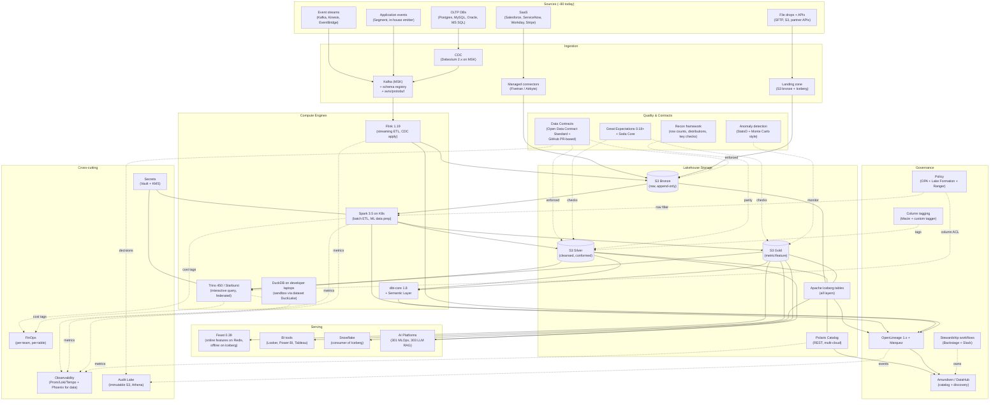

# Data Platform for AI — Architecture

> Project 304 | Target organization: TechCorp (Fortune 500, ~50k employees)
> Author hat: Principal Data Platform Architect
> Status: Reference architecture for the learning project

---

## 1. Context & Goals

### 1.1 Business problem

TechCorp's data estate has accumulated over two decades and three
acquisitions. Today:

- An on-prem Teradata warehouse handles a shrinking but business-critical
  set of finance and regulatory reports (~$8M/yr support + capex).
- A 2018-era Hadoop / Hive lake on HDFS still hosts ~14 PB of historic
  marketing and clickstream data; the cluster's last EOL extension expires
  in 18 months.
- Eight Snowflake accounts (one per BU after a procurement free-for-all)
  carry the modern analytics workload at ~$11M/yr.
- A handful of Databricks workspaces sprouted up to support ML, sharing
  data through ad hoc S3 paths.
- "Data engineering" is 70 people split across BUs; nobody owns
  ingest, modeling standards, or lineage.

The MLOps platform (301) and LLM platform (303) need governed feature data,
trustworthy ground truth, and lineage to satisfy regulators. They cannot
get any of it cleanly today. The pains are concrete:

1. **Same metric, four numbers.** Finance and Marketing show different
   "active customers" each month, because each pulled from a different
   silo with a different join filter.
2. **No lineage.** When a regulator asked which sources fed a 2024
   customer-churn model, the team produced a 30-page memo that took two
   weeks to write and was still incomplete.
3. **No data contracts.** Upstream teams ship breaking schema changes;
   downstream pipelines fail silently or quietly produce wrong numbers.
4. **GenAI demand exploded.** RAG (project 303) and feature pipelines
   (project 301) need versioned, governed, queryable, low-latency data.
   The current estate cannot serve them.
5. **Cost is out of control.** Snowflake spend grew 41% YoY without
   matching value; FinOps cannot map cost to product / team / model.

The platform must consolidate the lake + warehouse into a single
**lakehouse**, introduce a **single semantic / metric layer**, enforce
**data contracts**, capture **lineage and quality**, and serve the
modern AI workloads — all without a two-year boil-the-ocean migration.

### 1.2 Goals (business)

| ID | Goal | Measurable target | Horizon |
|----|------|-------------------|---------|
| BG-1 | Single, governed source of truth for tier-1 metrics | ≥ 60 tier-1 metrics defined in the metric layer with zero conflicting downstream definitions | 12 months |
| BG-2 | End-to-end lineage for every regulated dataset | 100% of regulated tables show source-to-consumer lineage via OpenLineage in ≤ 1 min | 9 months |
| BG-3 | Reduce total data-platform spend | -25% TCO at iso-workload by end of FY27 (vs. Teradata + Hadoop + Snowflake baseline) | 24 months |
| BG-4 | Data contracts on tier-1 producers | 100% of tier-1 producer pipelines covered by a CI-enforced data contract | 12 months |
| BG-5 | Decommission Hadoop / HDFS estate | Cluster offline, all data migrated to lakehouse | 18 months |
| BG-6 | Serve AI workloads (MLOps + LLM RAG) | < 250 ms p95 for online feature reads; cataloged tables consumable from the platforms | 12 months |

### 1.3 Non-goals

- The platform is **not** a BI tool replacement; existing Power BI /
  Tableau continue to be the visualization layer.
- The platform does **not** own real-time application transactional state
  (those stay in their service-owned OLTP DBs).
- The platform does **not** unify identity, secrets, or runtime infra
  beyond what's needed to integrate with 301 / 302.
- The platform does **not** replace Snowflake on day 1; Snowflake remains
  a consumer of lakehouse-resident tables during the migration and
  potentially long-term for some workloads.

---

## 2. Architectural Drivers

### 2.1 Quality attributes (ranked)

| Rank | Attribute | Driving scenario | Target |
|------|-----------|------------------|--------|
| 1 | **Trustworthiness / governance** | A regulator asks "what data fed this customer-risk score in March?" — the platform answers with sources, transformations, owners, and quality checks in ≤ 5 min. | 100% regulated lineage coverage; named owner per tier-1 dataset; daily data-quality scorecards |
| 2 | **Consistency** | Two teams query the same "active customer" metric in two tools and get the same number. | 0 conflicting metric definitions for tier-1; single metric layer (Cube + dbt Semantic Layer) |
| 3 | **Time-to-data** | A new data scientist gets read access to a governed Iceberg table within 1 business day. | Onboarding-to-first-query ≤ 1 business day |
| 4 | **Scale & performance** | 14 PB of historical data + 8 TB/day ingest + 50k daily queries + sub-250ms feature reads. | 14 PB cold + 200 TB hot; sustain 8 TB/day ingest; 50k queries/day; online features ≤ 250 ms p95 |
| 5 | **Cost-efficiency** | Per-table monthly cost is visible and a 30% query waste budget is hit-and-actioned per quarter. | Per-team unit costs; warehouse + lake costs tracked in one place |
| 6 | **Decoupling** | A producer team changes their app schema without breaking 12 downstream consumers. | Data contracts with CI verification; breaking changes blocked at PR |
| 7 | **Sovereignty / privacy** | EU customer data is processed and stored only in EU. PII columns are tagged and enforced. | 0 cross-boundary EU data flows; OPA-enforced column-level PII policy |

### 2.2 Constraints

- **Cloud**: AWS primary (S3 as the object substrate of record). GCP
  (BigQuery and GCS) and Azure (ADLS Gen2) as additional storage planes
  for sovereign and partner workloads (re-uses 302 multi-cloud
  topology).
- **Compute substrate**: Kubernetes for the compute frameworks (Spark,
  Trino, Flink, dbt) on the EKS clusters from 301/302.
- **Lakehouse table format**: **Apache Iceberg** as the standard.
- **Catalog**: **Apache Polaris** (Snowflake-donated) as the primary;
  **Unity Catalog OSS** evaluated for Databricks-resident teams.
- **Identity**: Okta SAML/OIDC for humans; SPIFFE for workload identity
  (re-uses 302).
- **Compliance**: GDPR, CCPA, SOX, SOC 2, EU AI Act data-quality
  controls, internal Records Management 9.1 (7-year retention).
- **Budget**: $12M capex (year-1 build), $18M annual opex steady state
  (replacing the $19M from Teradata + Hadoop + a portion of Snowflake).
- **Team**: 18 FTE platform engineers + 4 SREs + 2 governance/stewards.
- **Timeline**: 6 months to MVP (Iceberg + Polaris + 5 ingest sources
  + lineage + governance baseline). 18 months to Hadoop decommission.

### 2.3 Assumptions

1. The MLOps platform (301) consumes feature tables via Feast on
   top of Iceberg. If not, an in-platform online-feature layer adds
   +2 months.
2. The LLM RAG platform (303) consumes governed document corpora via
   the lakehouse's ingestion connectors and catalog. The lakehouse is
   the source of truth for "trusted" documents.
3. Snowflake remains a tier-2 consumer reading from Iceberg via the
   native Iceberg Tables capability. We do not move all Snowflake
   queries to Trino on day 1.
4. Existing data-engineering teams will adopt dbt within 12 months;
   exception teams get a 6-month grace migrating from Airflow-only
   pipelines.

---

## 3. High-Level Architecture



### 3.1 Layers

- **Bronze (Raw)**: append-only landing of source data, typed minimally,
  full history retained, partitioned by ingestion date.
- **Silver (Cleansed/Conformed)**: deduped, typed, joined to canonical
  keys, contract-enforced, PII tagged.
- **Gold (Curated)**: business-grade aggregates, metrics, and feature
  tables. Owned by domain teams; consumed by BI, ML, and apps.
- **Catalog**: Polaris provides REST catalog semantics across all
  layers and across clouds; namespace structure mirrors domains.

### 3.2 Domains (data mesh-lite)

- Six domains: `customer`, `commerce`, `marketing`, `finance`,
  `operations`, `risk`. Each has named **data product owners**.
- The Platform team owns the substrate, contracts framework, catalog,
  lineage, and shared tools. Domain teams own their **data products**
  in Silver + Gold.
- This is a **lite** mesh: federated ownership of products, centralized
  platform. We do not require every domain to run its own ingestion or
  storage.

---

## 4. Detailed Components

### 4.1 Ingestion

- **CDC**: Debezium 2.7 on MSK Kafka for OLTP sources (Postgres, MySQL,
  Oracle via XStream, MS SQL). Schema registry: Confluent / AWS Glue
  Schema Registry. Avro for compactness.
- **SaaS / batch**: Fivetran for the long tail (Salesforce, ServiceNow,
  Workday, Stripe). Airbyte OSS for cheap or unsupported sources.
- **Streaming**: Kafka (MSK) as the backbone; Kinesis where the source is
  already there; EventBridge for AWS-native event sources.
- **File drops / partner APIs**: a small internal ingestion service in
  Go that lands files into an S3 staging prefix with provenance
  metadata, then triggers a downstream Airflow DAG.
- **Standards**:
  - Every producer registers in the **producer registry** (a YAML in a
    `data-contracts` repo) with owner, SLA (freshness, completeness),
    schema URL, contract version.
  - Every Kafka topic has a schema-registered Avro/Protobuf schema with
    compatibility = `BACKWARD`.

### 4.2 Storage & Table Format (Iceberg)

- **Iceberg 1.5+** as the table format across all layers.
- **Compression**: ZSTD level 3 default; Parquet row groups 128 MB.
- **Partitioning**:
  - Bronze: by `ingestion_date` only (cheap, append-friendly).
  - Silver/Gold: domain-aware partitioning (`event_date`, sometimes
    `country_code`). Hidden partitioning leveraged so consumers don't
    have to know.
- **Maintenance**:
  - Daily `rewrite_data_files` for compaction on hot tables.
  - Daily `expire_snapshots` with a 14-day retention for hot, 90-day for
    audit-required.
  - Weekly `remove_orphan_files`.
  - All maintenance runs as Spark jobs orchestrated by Airflow.
- **Why Iceberg over Delta**: cross-cloud and cross-engine compatibility
  is better; the Polaris ecosystem; Snowflake's native Iceberg support
  closes the loop without forcing a one-engine world.

### 4.3 Catalog & Discovery

- **Polaris Catalog** (REST) as the primary catalog. Provides
  namespaces (mirrors domain structure), table metadata, ACLs.
- Why Polaris over Hive Metastore: REST-based, modern, multi-cloud,
  supports credential vending for object storage so engines don't carry
  IAM keys themselves.
- **DataHub** (LinkedIn OSS) or **Amundsen** as the data-discovery layer
  on top. DataHub for the richer lineage + impact analysis; Amundsen for
  smaller estates.
- Discovery integrations:
  - Auto-ingest of Polaris metadata.
  - dbt manifest → DataHub.
  - OpenLineage events → DataHub edges.
  - Slack bot for `/lookup <table>` queries.

### 4.4 Transformation & Modeling

- **dbt-core 1.8** as the SQL transformation framework for Silver →
  Gold modeling.
- **dbt Semantic Layer** + **Cube** for the **single metric layer**. A
  metric like `active_customers` is defined once with explicit
  dimensions and aggregations; consumed identically by Looker, Power
  BI, Tableau, and the LLM RAG platform's text-to-SQL.
- **Spark 3.5** on EKS for heavy ETL where dbt-SQL alone is insufficient
  (binary parsers, ML feature engineering at TB scale).
- **Flink 1.19** for streaming ETL: continuous CDC apply, real-time
  feature materialization.
- Standard dbt project layout:
  ```
  models/
    bronze/   # 1:1 with sources; minimal cleaning
    silver/   # deduped, conformed; contract-enforced
    gold/     # business-grade marts
  semantic/   # metric definitions
  tests/      # dbt + GX suites
  ```

### 4.5 Data Contracts

- **Open Data Contract Standard (ODCS)** YAML, stored in a
  `data-contracts` repo, one file per producer table.
- Contract elements:
  - Schema (typed, with descriptions).
  - SLAs (freshness, completeness, accuracy).
  - Owner, on-call, escalation.
  - Quality rules (GX-compatible).
  - Lifecycle (versioning, deprecation, breaking change policy).
- **CI enforcement**:
  - PRs against the producer's app schema run a `contract-check`
    workflow that diffs the proposed schema against the contract.
  - Breaking changes (drop column, rename, type narrowing) **block
    merge** unless a contract version bump + downstream consumer
    notification + grace-period plan is included.
- **Runtime enforcement**:
  - Bronze writes are schema-validated against the registered Avro
    schema; rejects land in a DLQ topic with a structured reason.
  - Silver pipelines fail-fast on contract violation.

### 4.6 Data Quality

- **Great Expectations 0.18** + **Soda Core** for declarative quality
  suites attached to each Silver and Gold table.
- Standard suite per table:
  - Schema test (column presence, types, nullability).
  - Distribution tests (mean, stddev, percentiles within tolerance).
  - Referential integrity (key uniqueness, foreign-key existence).
  - Recency (`max(updated_at) > now() - SLA`).
  - Volume (row count within ± X% of 7-day average).
- **Recon framework**: for migration / replication parity, compare source
  vs. target row counts, key hashes, sums of measure columns. Recon
  failures generate tickets, not silent overwrites.
- **Anomaly detection**: a small Flink job consumes GX results and
  applies seasonally-adjusted thresholds; alerts on regressions even
  inside the static suite.

### 4.7 Lineage (OpenLineage + Marquez)

- **OpenLineage 1.18+** spec across all engines:
  - Spark: native OpenLineage integration.
  - dbt: `dbt-ol` wrapper.
  - Airflow: built-in OpenLineage provider.
  - Flink: OpenLineage Flink integration.
  - Trino: `OpenLineageEventListener` plugin.
- **Marquez** as the storage + UI; events are also forked into the
  Audit Lake for long-term retention.
- **Coverage SLO**: every Silver and Gold table has lineage edges
  produced within 30 minutes of its build. Tier-1 datasets monitored
  daily.

### 4.8 Access Control & Privacy

- **Identity**: Okta groups map to Polaris principals. Workload identity
  via SPIFFE (re-uses 302).
- **Authorization**:
  - **Polaris ACLs** for namespace/table-level grants (read, write, manage).
  - **Apache Ranger** OR **AWS Lake Formation** for fine-grained
    (column / row) policies. Default choice: Lake Formation on AWS for
    operational simplicity; Ranger only if multi-cloud column policies
    are required at scale.
  - **OPA** for cross-cutting policy (e.g., "tables with `pii=true` tag
    require a PoU entry to query"). Trino + Spark integrations call OPA
    on query planning.
- **PII tagging**:
  - **AWS Macie** for automated S3 PII detection; results join a custom
    tagger that writes `pii=true` to Polaris column metadata.
  - Manual tagging path via Backstage for tags not detected automatically.
- **Tokenization**: PII columns can be tokenized (HashiCorp Vault Transit
  + format-preserving encryption) at Silver; downstream consumers see
  tokens unless re-identification is approved.
- **Right to be forgotten (GDPR)**: a "subject erasure" job marks rows
  for tombstoning across Bronze + Silver + Gold using Iceberg's
  row-level delete; a quarterly compaction makes the deletions
  physical.

### 4.9 Compute Engines

- **Spark 3.5** on EKS via the Spark Operator. Karpenter for autoscale;
  per-job pod templates with cost tags.
- **Trino 450** on EKS for interactive SQL across Iceberg, Hive
  fallback (during migration), and federated queries to OLTP for cross-
  joins where appropriate.
- **Flink 1.19** on EKS via the Flink Kubernetes Operator.
- **DuckDB** sandbox for individual analysts: a "DuckLake" pattern lets
  users query an Iceberg snapshot read-only from a laptop via a
  signed URL service (no production load).

### 4.10 Serving

- **Feast 0.39** as the feature store, online on Redis + offline on
  Iceberg. Re-uses 301.
- **Snowflake** continues as a query engine for BI; reads from Iceberg
  tables via Snowflake's native Iceberg integration so storage is not
  duplicated.
- **BI tools** (Looker, Power BI, Tableau) connect to Trino or
  Snowflake; all use the dbt Semantic Layer / Cube for metrics.
- **AI Platforms** (301 MLOps and 303 LLM RAG) consume Silver/Gold
  Iceberg tables directly, with read-only credentials vended by
  Polaris.

---

## 5. Cross-Cutting Concerns

### 5.1 Governance & Stewardship

- **Data product owner** named per Silver/Gold table; visible in DataHub.
- **Stewardship workflows** (Backstage + Slack):
  - "Owner change" workflow with proper sign-off.
  - "Schema deprecation" workflow with downstream-consumer notification
    and grace period.
  - "Access request" workflow with auto-approval for non-sensitive,
    manual approval for PII/sensitive.
- **Metric review board**: a monthly meeting where the metric layer's
  changes are reviewed; the meeting is light because day-to-day changes
  flow through PRs with reviewers.

### 5.2 Observability

- Standard infra observability (Prom/Loki/Tempo/Grafana).
- **Pipeline observability** as first-class: every dbt run, Spark job,
  Flink job emits structured events; aggregated to a "data pipeline
  health" Grafana panel showing freshness, success rate, GX pass rate.
- **Phoenix-for-data**: an internal pattern that surfaces top-N most-
  queried tables, top-N slowest queries, top-N most-expensive queries
  per team. Used by stewards to find optimization opportunities.

### 5.3 Cost management

- **Per-team tagging** on every Spark / Trino / Flink job (`team`,
  `dataset`, `purpose`).
- **Per-table cost**: storage cost computed from S3 inventory + Iceberg
  metadata; compute cost allocated from Spark/Trino metrics.
- **Query waste budget**: each team gets a quarterly "wasted query
  hours" budget (queries above 80th percentile of cost without a
  business-justification tag). When exceeded, the team has 30 days to
  reduce or pay back.
- **Snowflake credits**: tracked alongside lakehouse cost; the "migration
  scorecard" tracks Snowflake credit reduction as tables move to Trino.
- **Year-1 spend model**:
  - Storage (S3 + Glacier + Iceberg metadata): $1.6M
  - Compute (Spark + Trino + Flink + dbt on EKS): $5.2M
  - Streaming (MSK + Kinesis): $1.4M
  - Connectors (Fivetran + Airbyte OSS): $1.0M
  - Snowflake (transitional, declining): $4.6M
  - Vendor support (Starburst, dbt Cloud opt-in, etc.): $1.5M
  - Buffer + governance tools: $2.7M
  - **Total opex ≈ $18M/yr at steady state**

### 5.4 Sovereignty & residency

- EU-resident data is stored in S3 buckets in `eu-west-1` or
  `eu-central-1` with bucket policies preventing cross-region replication.
- For tenants requiring sovereign clouds (re-uses 302), data lands on
  Azure ADLS Gen2 in `northeurope` and is cataloged separately in a
  Polaris namespace marked `data_residency=eu_sovereign`. Cross-
  boundary joins are blocked by OPA.

### 5.5 Disaster recovery

- **RPO**: 15 minutes for tier-1 datasets (Iceberg snapshots replicated
  cross-region via S3 CRR; metadata + commits replicated within the
  Polaris secondary).
- **RTO**: 1 hour to switch reads to the secondary region; writers
  paused for the duration.
- **Backups beyond CRR**: weekly point-in-time backup of Polaris
  metadata to a separate account.
- Quarterly DR drill restores a randomly-selected tier-1 dataset and
  validates row-count + checksum parity.

---

## 6. Trade-offs & Alternatives Considered

| Decision | Chosen | Rejected | Reasoning |
|---------|--------|----------|-----------|
| Table format | Iceberg | Delta Lake, Hudi | Cross-cloud, cross-engine, growing catalog ecosystem; Snowflake support closes the consumption loop |
| Catalog | Polaris | Hive Metastore, AWS Glue, Unity Catalog (proprietary) | Polaris is REST-based, OSS, multi-cloud; Glue is AWS-only; Unity OSS is newer but Databricks-centric |
| Transformation framework | dbt-core | Coalesce, SQLMesh, in-house | dbt's community + ecosystem; dbt's Semantic Layer is the cheapest path to a metric layer |
| Interactive query | Trino (or Starburst Enterprise where SLA needed) | Presto fork, Dremio, Athena only | Trino on Iceberg with Polaris is the cleanest open path; Athena is fine for tactical, but lacks operational visibility |
| Streaming | Flink + Kafka | Spark Streaming only, Pulsar, Kinesis-only | Flink's stateful processing is unmatched for CDC apply; Kafka has the ecosystem |
| Mesh model | Lite mesh (federated ownership of data products; central platform) | Strict mesh, fully central | Strict mesh fails when domain teams lack capacity; central-only kills throughput; lite mesh balances |
| Governance / lineage | OpenLineage + Marquez + DataHub | Atlan, Collibra (paid), home-grown | OSS path satisfies our needs at our scale; commercial tools considered for later if regulation tightens |
| Quality framework | Great Expectations + Soda Core | dbt tests only | dbt tests are great for SQL; GX adds richer expectations + better reporting; complementary |
| Metric layer | dbt Semantic Layer + Cube | LookML only, MetricFlow stand-alone, headless BI alternatives | Choosing dbt's SL keeps single source of definition; Cube enables non-Looker consumption |
| File format | Parquet (ZSTD) | ORC, Avro for analytics | Parquet is the de-facto for Iceberg + Spark + Trino; ZSTD beats Snappy on compression with marginal CPU |
| Access control | Polaris ACLs + Lake Formation (column/row) + OPA cross-cutting | Ranger across the board, Lake Formation only | Lake Formation simpler on AWS; Ranger remains an option for cross-cloud; OPA handles "policy as code" |
| Contracts standard | Open Data Contract Standard (ODCS) | Custom YAML, dbt YAML only | Industry standard is emerging; aligning early reduces re-work |

A formal ADR record (12+ ADRs) lives in `src/adrs/`.

---

## 7. Implementation Roadmap

### Phase 0 — Foundations (Month 0–2)

- Polaris catalog deployed; first S3 buckets with Iceberg tables created;
  Okta integration; Vault; per-team cost tagging baseline; data
  contracts repo scaffold.

### Phase 1 — MVP (Month 2–6)

- 5 source systems ingested end-to-end (1 CDC, 1 SaaS, 1 streaming, 2
  batch).
- dbt Silver + Gold for one domain (`customer`).
- OpenLineage live for Spark + dbt.
- DataHub discovery live; first 20 tables cataloged with owners.
- Contracts enforced on 3 tier-1 producer pipelines.
- BI consumption from Looker via Trino.

### Phase 2 — Expansion (Month 6–10)

- 25 sources; 4 domains; metric layer covering 30+ tier-1 metrics;
  Lake Formation column-level controls; full GX coverage on Silver/Gold;
  Feast offline live; first ML model from MLOps platform consuming a
  feature table.

### Phase 3 — Mesh + Hadoop sunset (Month 10–18)

- All 6 domains active; data product owners formalized; Hadoop migration
  completed in waves; HDFS decommissioned at month 18.

### Phase 4 — Continuous improvement (Month 18+)

- Snowflake credit reduction program; query-waste budgets active;
  GraphQL/REST data-product APIs for some Gold tables;
  cross-region DR drills quarterly.

---

## 8. Validation & Success Criteria

- **BG-1 (single source of truth)**: count of tier-1 metrics defined in
  the semantic layer; periodic audit comparing BI definitions vs.
  semantic layer (target: 0 conflicts).
- **BG-2 (lineage)**: lineage coverage % per regulated dataset;
  reconstruct-an-edge drills monthly.
- **BG-3 (cost)**: monthly trend of total data-platform spend vs. the
  pre-platform baseline.
- **BG-4 (contracts)**: % of tier-1 producer pipelines with a contract
  + CI gate.
- **BG-5 (Hadoop sunset)**: Hadoop tables decommissioned per the
  migration plan; final HDFS shutdown.
- **BG-6 (AI workloads)**: number of MLOps models + RAG corpora using
  governed tables; p95 feature read latency.

### 8.1 Acceptance test scenarios

1. **Regulator drill**: ask "what data fed the customer-risk model that
   produced this prediction on date X?" — produce the lineage tree,
   source tables, contract versions, and quality scores in ≤ 5 minutes.
2. **Schema change protection**: a producer team opens a PR that drops
   a column on a tier-1 source — CI blocks merge with a clear "downstream
   contract violated" message naming the consumer.
3. **Metric consistency**: count `active_customers` from Looker, Power
   BI, and the LLM RAG bot's text-to-SQL. All three return the same
   number for the same time window.
4. **Online feature latency**: 1k feature lookups against a Gold table
   served by Feast online; p95 ≤ 10 ms, p99 ≤ 25 ms.
5. **GDPR erasure**: subject ID X requests erasure; the platform marks
   rows across all layers; a query for X within 24 h returns no
   results.
6. **DR drill**: kill the primary Polaris instance; failover to
   secondary; reads resume within 1 hour; spot-check row counts pass.

---

## 9. Risks

| ID | Risk | Likelihood | Impact | Mitigation |
|----|------|------------|--------|------------|
| R-1 | Snowflake migration takes longer than planned | H | M | Coexistence pattern (Iceberg Tables in Snowflake) bridges the gap; no big-bang switch |
| R-2 | Domain teams reject lite-mesh ownership | M | H | Executive air cover; staged adoption; platform team handles first product per domain |
| R-3 | OpenLineage coverage stalls below SLO | M | M | Per-engine coverage scorecards; office hours; in-house adapter contributions |
| R-4 | Polaris OSS upstream churn | M | M | Pin minor versions; Starburst commercial fallback; contribute upstream |
| R-5 | Iceberg table maintenance windows cause query waits | M | M | Stagger compaction; concurrent commit-friendly cadence |
| R-6 | PII tagging miss → policy gap | M | H | Macie + manual tagger combo; periodic red-team scans; PII audit cadence |
| R-7 | Streaming CDC lag on a 30-TB Oracle source | M | H | Throughput-tested in Phase 1; Debezium parallelism + log-based PK partitioning |
| R-8 | Cross-region DR drill exposes RPO gap | M | M | Iceberg metadata replication monitored; secondary smoke-tested quarterly |

---

**End of architecture document.** See `STEP_BY_STEP.md` for the build-out plan
and `src/adrs/` for individual decision records.
