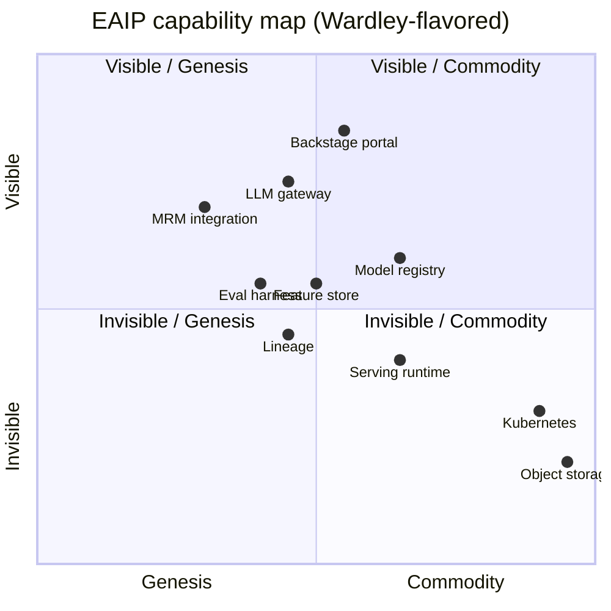
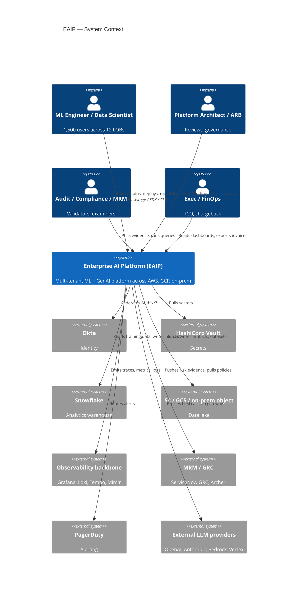
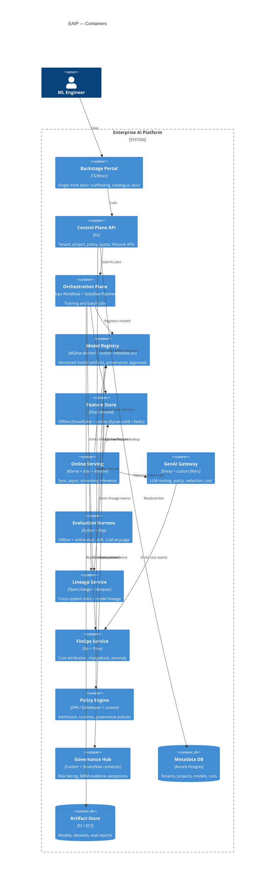
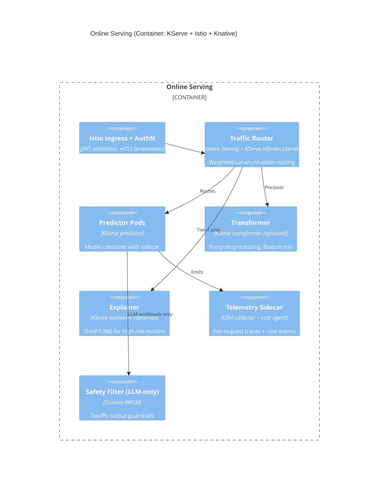
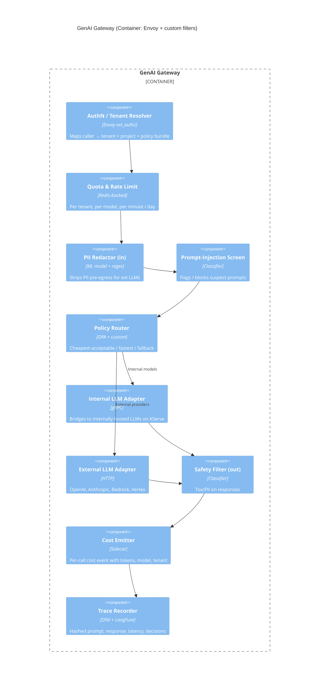
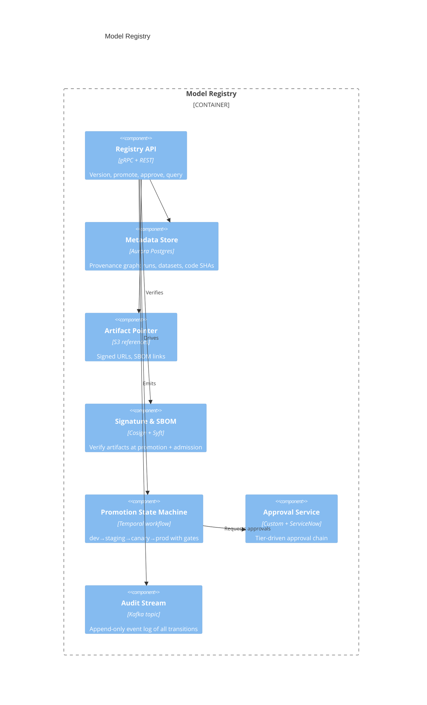

# Architecture — Enterprise AI Platform (EAIP)

This is the reference architecture you are producing. It is opinionated. Where you disagree with an opinion, write an ADR and override it — that is the point of this project.

---

## 1. Architectural drivers (the short version)

Ranked. When two drivers conflict, the higher wins by default:

1. **Auditability and governance** (REG-1, REG-3, REG-5) — every artifact provenance-tracked, every decision explainable, every model traceable.
2. **Tenant isolation** (NFR-9, NFR-11, FR-1) — blast radius of any tenant ≤ that tenant.
3. **Brownfield realism** — the architecture must accept that 23 legacy stacks exist on day 1 and degrades gracefully through migration.
4. **Cost discipline** (NFR-18) — every primitive emits cost attribution; FinOps is not a dashboard, it's a kernel feature.
5. **Developer velocity** (FR-34, NFR-24) — single front door, golden paths, no per-team toil.
6. **Evolvability** (NFR-22) — every major dependency has a documented exit; no architectural lock-in to a single vendor for any *one* capability.

If you find your architecture optimizing for #5 at the cost of #1, stop and re-justify.

## 2. Strategic positioning

### 2.1 Wardley map (executive summary)

Interpretation:
- **Buy / SaaS**: anything in the rightmost band (Kubernetes-as-product, object storage, observability backbone).
- **Adopt OSS, contribute back**: feature store, lineage, serving runtime, eval harness.
- **Build**: LLM gateway (the integration shape is yours, no vendor is right yet), MRM-platform glue (industry-specific), Backstage golden paths (yours by definition).
- **Wait**: cross-tenant model marketplace, federated learning, on-platform fine-tuning workflows.

### 2.2 Cynefin classification per capability

| Capability | Domain | Implication |
|---|---|---|
| Online serving | Complicated | Best practice exists; pick well, execute |
| Training orchestration | Complicated | Same |
| Feature store | Complicated trending Complex | Beware lock-in; design for swap |
| LLM gateway | Complex | Probe-sense-respond; expect to rewrite v1 |
| MRM integration | Complex | Domain knowledge dominates; small bets |
| Governance org & ARB | Complex | See Project 03; live alongside this |
| K8s + observability | Clear (mostly) | Lean on managed offerings |

This drives investment cadence in §10 (roadmap).

## 3. C4 — Level 1 (System Context)

## 4. C4 — Level 2 (Containers)

## 5. C4 — Level 3 (selected components)

### 5.1 Online Serving

### 5.2 GenAI Gateway

### 5.3 Model Registry

## 6. Tenancy & isolation

### 6.1 Layers of isolation

| Layer | Mechanism | Default | Override |
|---|---|---|---|
| Cloud account | AWS Organizations + Control Tower; one OU per LOB | LOB-level account | T1 high-risk workloads get dedicated account |
| Cluster | EKS clusters; ≤ 3 shared "platform" clusters per region; T1 gets dedicated | Shared cluster, vCluster per LOB | Dedicated cluster for restricted workloads |
| Network | VPC-per-account, mesh policies via Istio AuthorizationPolicy | Deny-by-default cross-namespace | Explicit, expiring NetworkPolicy + AuthZ |
| Namespace | One namespace per project (a project belongs to a team belongs to an LOB) | Quota'd, labeled, OPA-policed | n/a |
| Data | KMS CMK per LOB; per-feature ACLs in feature store | Tenant boundary follows LOB | Cross-LOB feature sharing requires approval ticket |
| Secrets | Vault namespaces mapped to LOBs; dynamic creds | Short-lived, scoped | n/a |
| Compute | Karpenter NodePools per tenancy class; GPU pools shared with bin-packing | Shared GPU pool, tenant-tainted | Reserved pool for SLO-critical |
| Observability | Tenant-labeled metrics/logs; Grafana orgs per LOB | Logical separation | Per-LOB Mimir tenants for hard separation |

The line between "control plane" and "data plane":
- **Control plane** (shared, single-tenant logical, multi-region active-active): Backstage, control-plane API, registry metadata, policy engine, governance hub, FinOps service, lineage.
- **Data plane** (per-LOB or per-tenant): training compute, serving compute, feature store online tier, namespaces in K8s, KMS CMKs.

Rationale: shared control plane gives consistent governance and dev experience; per-LOB data plane keeps blast radius and regulatory boundaries crisp.

### 6.2 Quota model

Quotas at three levels (each level's quota is a hard ceiling on the sum below it):

- LOB → Team → Project

Quotas track at minimum:
- GPU hours per class (A100, H100, L4, T4) per month
- vCPU + memory peaks (training, serving)
- Online inference RPS budget
- Online feature store QPS
- LLM gateway: per-provider tokens/day, $/day
- Artifact storage GB
- Egress GB (cross-region, internet)

Quotas are enforced **pre-admission** in three places: K8s ResourceQuota + OPA, gateway rate limiter, FinOps service for budget breakers. A workload that would breach quota is rejected with a structured error linking to the budget owner.

### 6.3 Threat model (compressed)

You will produce the full STRIDE-per-component in D4. The two scenarios you must handle in the architecture:

**Scenario A — compromised tenant**: An attacker has full credentials inside one team's namespace.
- Cannot list other tenants' workloads (Istio AuthZ + namespace RBAC + OPA listing policy).
- Cannot read other tenants' features (feature store ACL + KMS key boundary).
- Cannot exfiltrate via LLM gateway (gateway-side egress allow-lists, PII redactor, cost cap).
- Cannot escalate via shared control plane (mTLS + caller identity + OPA on control-plane API).
- *Can* exhaust their own quota — and you treat that as containment, not failure.

**Scenario B — compromised platform component**: e.g., the model registry is exploited.
- All registry mutations are signed events on an append-only Kafka topic (audit stream).
- Tampering visible within minutes via anomaly detection on the stream.
- KMS keys for tenant artifacts are not held by the registry process; serving fetches signed model bundles and verifies cosign signatures at admission, so a tampered registry cannot cause a tampered model to start serving.

## 7. Data plane

### 7.1 Feature store

- **Offline**: Snowflake (canonical). Feast feature views materialize into Iceberg tables in S3 via Spark on EMR for cross-cloud reads.
- **Online**: DynamoDB primary (low-latency); Redis Cluster for very low-latency (≤ 2 ms) read paths. ADR open on whether to push to one or keep both.
- **Definitions**: Python feature definitions in a monorepo, validated in CI, with mandatory metadata (owner, PII flag, SLO, source lineage). Definitions become Feast registry entries.
- **Train/serve parity**: enforced by sharing the same feature retrieval code in training (offline) and online (sync); train/serve skew checks run as part of the eval harness.

### 7.2 Data lineage

- OpenLineage producers everywhere: Airflow / Spark / Argo / Feast / KServe.
- Marquez (or a hosted equivalent) consumes events; graph backed by Postgres + Elasticsearch for queries.
- Lineage is a **promotion gate** for tier-1/2 models — no lineage, no prod.

### 7.3 Object & artifact storage

- S3 (primary), GCS (GCP workloads), encrypted bucket-per-LOB, versioning on, MFA-delete on prod buckets, lifecycle to S3 Glacier IR after 90d / Deep Archive after 7y.
- Artifact paths are immutable; promotions reference by hash.

## 8. Compute & runtime

### 8.1 Training

- Argo Workflows for orchestration; Kubeflow Pipelines DSL supported as an alternative front-end (legacy familiarity).
- Per-job scheduling via Volcano or Kueue (ADR), so multi-GPU jobs schedule atomically.
- Karpenter for node lifecycle; per-NodePool taints/tolerations enforce tenancy.
- Spot/preemptible: default ON for any job tagged "interruptible-ok"; preemption rate budgets per tenant.
- Checkpoints: required for jobs > 4h; stored in tenant artifact bucket.

### 8.2 Online serving

- KServe inference services on Knative; Istio for mesh.
- Multi-model serving via Triton or KServe ModelMesh for small models (cost density).
- Auto-scale to zero for low-traffic models (off-hours savings); minimum-replicas pinned for SLO-critical.
- Canary + shadow as Knative configs; promotion via registry state machine.
- LLM serving: vLLM or TGI on H100/L4 pools; tensor parallel for >7B.

### 8.3 Batch inference

- Argo Workflows; large batch on Ray Data for embarrassingly parallel; Spark when SQL-shaped.
- Outputs land in tenant bucket and/or back to Snowflake.

## 9. Generative AI gateway (deep dive)

This is the most novel piece. Treat it as a product, not an integration.

### 9.1 Policy bundle per tenant

Each tenant has a policy bundle (OPA Rego) that defines:
- Allowed providers (e.g., LOB-X cannot call OpenAI; must use Bedrock for data residency)
- Allowed model families (e.g., no models below 70B for high-stakes use)
- Budget caps per day/month
- Required guardrails (e.g., must redact PII; must capture response for audit)
- Required prompts patterns (e.g., system prompts must come from approved catalogue for prod use)

### 9.2 Routing logic

The router accepts an intent (`gpt4-class`, `cheap-summarization`, `code-gen`) and chooses among allowed concrete models for that intent, optimizing for the policy's objective (cheapest-acceptable / fastest / etc.). The application sends intent, not model names — this preserves optionality.

### 9.3 Observability

- Every call traced with: caller, tenant, intent, chosen model, tokens (in/out), cost, latency, policy decisions, guardrail outcomes.
- LangFuse-like backend for trace inspection.
- Cost feeds into FinOps service.
- Hashed prompts by default; full prompt capture is a per-tenant policy switch (with retention rules).

### 9.4 Guardrails

In-flight:
- PII redaction (ML-based + regex) before external egress
- Prompt-injection classifier
- Tox/PII filter on responses (especially user-facing)
- Per-tenant denylists / pattern blocks

Static:
- Approved prompt template catalogue (for prod use)
- Approved RAG sources catalogue (no querying arbitrary internal indexes)

### 9.5 Internal hosting

The gateway routes equally to internal models (vLLM/TGI on platform GPUs) and external. The economics of running 70B+ models internally vs. paying per-token become a tenant-by-tenant decision the gateway's cost model surfaces.

## 10. Roadmap (high-level)

Detailed Gantt in D7. Three waves, twelve quarters:

### Wave 1 (Q1–Q4): Foundations
- Control plane API, tenant model, Backstage onboarding
- Shared EKS substrate, Karpenter, Istio, base observability
- Model registry MVP, lineage MVP, FinOps showback
- Online serving MVP on KServe
- Two pilot LOBs migrated (recommend: Fraud + Customer Analytics — different latency profiles, both willing)
- **Stage gate end Q4**: 5 production models on platform; <$3M unaccounted spend.

### Wave 2 (Q5–Q8): Scale & govern
- Feature store online + offline GA
- GenAI gateway MVP → GA
- Governance hub + MRM integration live; risk tiers enforced
- FinOps chargeback live; first invoices reconciled
- 6 LOBs total; 200+ models
- **Stage gate end Q8**: 50% of new models on platform; 1 OCC-cited gap closed; NPS ≥ +10.

### Wave 3 (Q9–Q12): Consolidate & retire
- Remaining 6 LOBs migrated
- Legacy stack decommission with reversibility windows
- EU AI Act controls operational (no later than Q11)
- Cost steady state $48M/yr
- Backstage NPS ≥ +30
- **Stage gate end Q12**: 95% migration; $48M run rate; zero S1 governance incidents in trailing 90 days.

### Abandonment criteria

Each wave has explicit "stop or re-baseline" triggers:
- Wave 1: if Foundation gate misses by > 25% on either dimension at Q4, halt Wave 2 expansion and audit assumptions.
- Wave 2: if any one LOB CIO formally rejects platform adoption with cause, pause and run an ARB review.
- Wave 3: if year-3 unit cost > 110% of target with no path to converge, re-baseline FinOps model.

## 11. Risk register (top 10)

| # | Risk | Likelihood | Impact | Mitigation |
|---|---|---|---|---|
| 1 | Group CTO sponsor leaves | Med | Critical | Steering committee structure, multiple exec sponsors, written charter |
| 2 | EU AI Act implementing acts expand scope mid-program | Med | High | 6-month buffer in Wave 3 schedule; reg-watch role |
| 3 | LOB CIO refuses adoption | High | Med | Coalition strategy (Project 04 patterns); LOB advisory board co-owns roadmap |
| 4 | Platform team can't hire to 65 | Med | High | Build-vs-buy decisions skew toward buy where staffing tight |
| 5 | OpenAI / Anthropic price hikes break gateway TCO | Med | Med | Internal hosting hedge for top 3 use cases; gateway abstracts provider |
| 6 | Karpenter / EKS price changes hit FinOps model | Low | Med | Sensitivity analysis baked into model; reservation laddering |
| 7 | A regulated dataset's residency rule changes | Low | High | Per-LOB data plane already isolates; migration path documented |
| 8 | Backstage / Spotify Portal pricing changes | Low | Low | Self-host with control of upgrade cadence |
| 9 | Single platform component becomes bus factor 1 | Med | Med | NFR-21 enforced via quarterly review; rotation policy |
| 10 | Migration burnout in platform team | High | High | Wave sizing capacity-constrained; explicit "no overtime quarter" commitments |

## 12. Trade-offs and alternatives considered

For each, write the full ADR; the architecture's reasoning in short form:

### 12.1 Shared cluster + namespaces vs. cluster-per-tenant
**Chosen**: Shared "platform clusters" per region + vCluster for LOB-perception of isolation; dedicated EKS only for T1 high-risk.
**Why**: Cluster sprawl at 12 LOBs × 3 regions = 36 clusters; operational burden murders the platform team's bandwidth. vCluster gives the appearance of per-LOB control plane without the substrate sprawl. Hard isolation (account-level) is preserved.
**Cost of being wrong**: If we discover noisy-neighbor or compliance scope creep, we can promote a vCluster to a dedicated cluster within a sprint.

### 12.2 Kubeflow Pipelines vs. Argo Workflows vs. Temporal
**Chosen**: Argo Workflows as the substrate; KFP DSL supported as a translation layer for familiarity.
**Why**: Argo is K8s-native, has the strongest CNCF momentum, and integrates with Argo CD for GitOps. KFP's value is its DSL, not its runtime; we keep the DSL and replace the runtime. Temporal is excellent but a different paradigm and forces re-skilling for ML engineers used to DAGs.
**Cost of being wrong**: Argo dies in OSS — unlikely in 3 years. Translation layer to Temporal can be staged.

### 12.3 MLflow vs. SageMaker Model Registry vs. custom
**Chosen**: MLflow-derived metadata service + custom approval / signing layer.
**Why**: SageMaker locks us to AWS for a thing that must be cloud-portable. Pure custom is reinvention. Forking MLflow's data model and writing the governance layer on top is the smallest delta to our needs.
**Cost of being wrong**: MLflow fork drifts from upstream; budget 1 FTE for upstream tracking.

### 12.4 Feature store: Feast vs. Tecton vs. SageMaker FS
**Chosen**: Feast-derived (OSS), self-hosted, Snowflake as the offline store.
**Why**: Tecton is the best product but most expensive, and we don't want a SaaS for our feature semantics — the lineage and PII story crosses tenant boundaries. SageMaker FS is the wrong abstraction (very AWS-shaped) and the wrong economics at our scale.
**Cost of being wrong**: Feast's online roadmap is the weak link; we mitigate with our own DynamoDB-backed online tier, which means upstream changes are absorbable.

### 12.5 GenAI gateway: build vs. buy (Portkey, Kong AI Gateway, etc.)
**Chosen**: Build on Envoy + custom filters; potentially adopt elements of OSS gateways for specific filters.
**Why**: The gateway is where our governance, PII story, MRM integration, and FinOps converge. Commercial offerings don't yet integrate with bank-specific MRM and risk-tiering. The integration shape is the value; abstracting it ourselves preserves option value.
**Cost of being wrong**: This is the single highest exposure. We commit to a "rewrite v1" budget and treat the first 12 months as a probe.

### 12.6 Single cloud vs. multi-cloud
**Chosen**: AWS primary; GCP for BigQuery-anchored analytics workloads; on-prem for the Treasury Vault dataset.
**Why**: The cost of true multi-cloud (every service portable, no AWS-specific primitives) is enormous and benefits are speculative for our risk profile. GCP and on-prem are present because of data gravity, not optionality. We don't pretend it's portable — each substrate gets its own data plane.
**Cost of being wrong**: AWS terms or stability degrade — we have the Wardley-mapped exits per capability but not a turnkey cutover. We accept this.

## 13. Validation: how you'll know the architecture is sound

Architecture fitness functions, run in CI weekly:

1. **Tenancy fitness**: a synthetic "evil tenant" workload tries to access another tenant's features / namespace / model artifacts; must fail.
2. **Lineage fitness**: a random sample of production models — % with complete lineage to source must be ≥ 99%.
3. **MRM coverage**: % of production models with risk tier, current eval, and approval ≤ 90d old must be ≥ 99%.
4. **Cost attribution fitness**: % of compute spend with full attribution (tenant + project + model) must be ≥ 98%.
5. **Exit-readiness**: every quarter, one ADR'd dependency exercises an exit drill (boot the OSS-only fallback path; run a smoke test).

Failing fitness functions block the next platform release, not the next model release.

## 14. Open questions you must close

By the time you submit:

1. Single online feature store (DynamoDB only) vs. dual (DynamoDB + Redis)? Make a call.
2. KServe vs. Seldon vs. Triton for primary serving? Make a call.
3. vLLM vs. TGI for internal LLM hosting? Make a call.
4. Self-hosted Backstage vs. Spotify Portal commercial? Make a call.
5. Multi-region active/active vs. active/passive for control plane? Make a call.
6. Audit log: Kafka topic owned by registry, or central event bus? Make a call.
7. Per-LOB AWS account vs. per-LOB OU with shared accounts? Make a call.

Each closure is an ADR. If you submit fewer than 20 ADRs you have not done this project.

---

**Next**: [`STEP_BY_STEP.md`](./STEP_BY_STEP.md) — week-by-week build guide.
