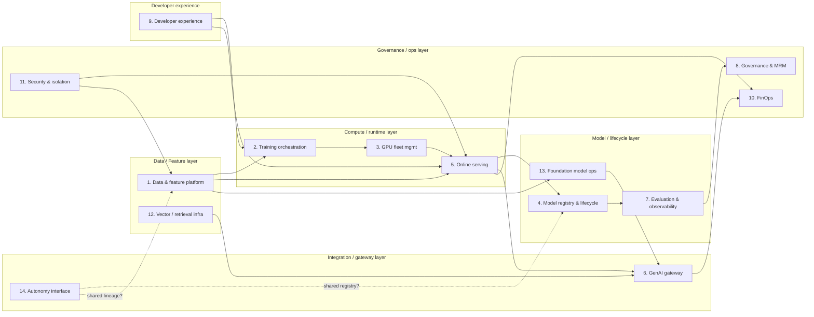
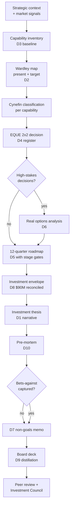
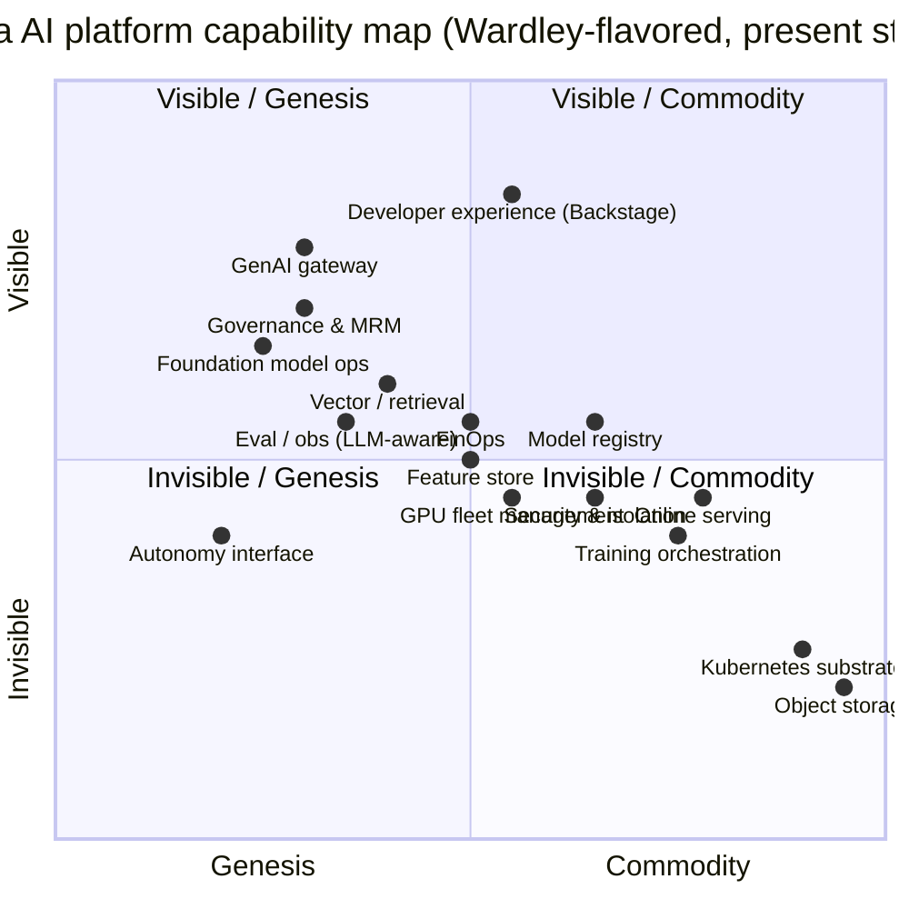
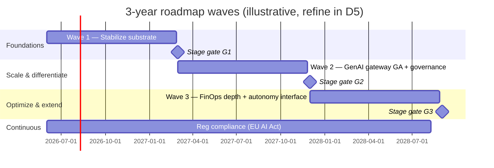

# Strategic Frameworks — 3-Year AI Platform Roadmap (Volta Mobility Group)

This file is the "architecture" of the **roadmap itself**: the frameworks you apply, the decision flow, the artifacts that feed each other, and the opinions that guide your synthesis. This is not a software architecture document — for that, see Project 01.

If you find yourself drawing C4 diagrams here, stop. The output of this project is **decisions, not systems**.

---

## 1. Strategic drivers (ranked)

When two drivers conflict, the higher wins by default. This ordering is the spine of the investment thesis.

1. **Unit economics convergence** — every capability bet has to bend the AI cost per matched ride / shipment / order curve. Capabilities that don't traceably move unit economics need either a regulatory rationale or an explicit optionality argument.
2. **Optionality preservation** — multi-year roadmaps in fast-moving domains (gen AI, GPU supply, regulation) lose money to commitment they cannot reverse. Pay for optionality.
3. **Regulatory readiness** — EU AI Act 2027 and California / NYC AI rules are not optional. Capabilities that lack a credible regulatory story do not enter the roadmap regardless of ROI.
4. **Coalition durability** — a roadmap 8 of 11 product CTOs reject is not a roadmap; it's a memo. Sequencing must respect coalition reality.
5. **Talent leverage** — the platform team is a fixed 60 FTE. Every capability either fits the team's bandwidth or is delegated to a vendor / partner with a real exit path.
6. **Reversibility** — for every "build" decision, write the unwind plan now, while it is cheap. By the time you need it, the cost has gone up 10×.

If your roadmap optimizes for #5 (leverage) at the cost of #2 (optionality) or #3 (regulatory), stop and re-derive.

## 2. Framework stack

The roadmap is the output of three frameworks applied in sequence. They are not interchangeable; they answer different questions.

### 2.1 Wardley mapping — *where are we, where is the landscape going?*

Wardley maps position components on two axes: visibility (Y, invisible → visible to the user need) and evolution (X, Genesis → Custom-built → Product → Commodity). The map is the substrate; the **movement annotations** are the value. A component drifting from Product to Commodity should drive a Build → Buy decision. A component sitting in Genesis with movement toward Custom-built may be a candidate for build with intent to commoditize internally.

**Climatic patterns** to apply (you must cite at least 4 in D2):
- *Everything evolves to commodity* — if you are still building it when it commoditizes, you have wasted capital
- *Inertia in the customer base* — internal customers (product orgs) will resist movement even when it benefits them
- *Past success creates inertia* — your own platform team will resist deprecating what they built
- *Co-evolution of practice with components* — when Kubernetes commoditized, GitOps and progressive delivery emerged as practice
- *The Red Queen* — competitors are also moving; standing still is regression
- *Open source as a market-shaping force* — OSS commoditizes faster than vendors believe

### 2.2 Cynefin — *what investment style does this domain demand?*

Cynefin classifies a domain, not a capability. The capability lives in the domain.

| Domain | Style | Bet size | Example for this roadmap |
|---|---|---|---|
| Clear (obvious) | Best practice, sense-categorize-respond | Routine | Object storage, Kubernetes substrate |
| Complicated | Good practice, sense-analyze-respond | Substantial, planned | Online serving, training orchestration |
| Complex | Emergent practice, probe-sense-respond | Small bets, parallel | GenAI gateway, foundation-model ops |
| Chaotic | Novel practice, act-sense-respond | Reactive only | Autonomous-system AI regulation (avoid pre-investing) |
| Disorder | Decompose into the above first | n/a | n/a |

**Implication for sequencing**: Complex domains get short waves with explicit re-evaluation. Complicated domains can carry longer waves with conventional stage gates. Clear domains get bought, not built.

### 2.3 Real options — *what is optionality worth?*

A real option is the right but not the obligation to take a strategic action. Five option types matter for this roadmap:

- **Defer** — wait to see how the market evolves before committing (LLM hosting; vector DB choice)
- **Expand** — small bet now that earns the right to a bigger bet later (autonomy platform interface)
- **Abandon** — explicit exit plan that bounds downside (every "build" decision needs this)
- **Switch** — ability to move providers (GPU sourcing, LLM gateway routing)
- **Contract** — scale down without unwinding (vCluster vs. cluster-per-tenant in Project 01 is the analog)

Valuation: ENPV = NPV + sum(option_values). Use a tractable method (binomial lattice or Luehrman's table-of-six approach). Do not pretend Black-Scholes is the right tool for most strategic options — it isn't.

### 2.4 EQUE 2×2 (Build/Buy/Partner/Wait)

EQUE = Existence × Quality × Uniqueness × Engagement. Practical 2×2 axes:

- X: **Strategic differentiation** — does this capability give Volta a defensible edge? (Low / High)
- Y: **Internal execution capability** — does the platform team have the bandwidth and skill to build it well? (Low / High)

| | Low diff | High diff |
|---|---|---|
| **Low capability** | **Buy** — commodity, off the shelf | **Partner** — strategic, but get help; structure to learn |
| **High capability** | **Adopt OSS + contribute** — keep the bench warm; donate code, do not maintain forks alone | **Build** — only here |

Notes:
- "Wait" appears when both axes are uncertain enough that even Buy locks in the wrong primitive. Document Wait as an active decision with a re-evaluation trigger.
- Beware the "we'll build because the team likes building" failure mode. The 2×2 anchors against it.

## 3. Capability framework (the 14)

These are the platform capabilities the roadmap must position. They are reproduced from `requirements.md` §6 with framework-level guidance.

This isn't an architecture diagram — it's a **dependency hint** for sequencing. Capabilities upstream in the graph generally need investment before those downstream are unblocked. The dashed lines to C14 (Autonomy) are deliberately undecided; the roadmap must take a position.

## 4. Decision flow (from inputs to artifacts)

Each arrow is a hand-off. Each artifact has a single accountable owner (you) and a defined input/output contract. If artifact N requires information not yet in N-1, that is a process failure, not a content failure — fix the framework, not the artifact.

## 5. Wardley positioning — illustrative present-state map

Use this as a starter. Your D2 will refine and *justify each placement*.

**Movement to anticipate over 36 months** (you must defend each in D2):
- **Vector / retrieval** drifts strongly toward Commodity (managed services from cloud vendors mature)
- **GenAI gateway** drifts toward Product but **stays Genesis-shaped** on the policy / governance integration (your integration shape is unique)
- **Foundation model ops** drifts from Genesis to Custom-built; expect to commit by year 2 if Volta wants to fine-tune at scale
- **GPU fleet management** drifts toward Product as Karpenter / KAI / cloud-native schedulers mature; reservation laddering becomes the differentiator
- **Online serving** at Commodity-Product boundary; pick well, don't rebuild

**Inertia traps to call out**:
- Internal teams will resist deprecating the legacy hand-rolled feature store ("but it works for us today")
- Procurement will resist commitment to managed services if cost > $200k/yr without a multi-year discount
- The autonomy program will lobby for dedicated everything; this is a coalition problem, not a technical one

## 6. Cynefin pass — investment style per capability

| Capability | Domain | Style | Roadmap implication |
|---|---|---|---|
| 1. Data & feature platform | Complicated | Good practice, plan | Multi-quarter waves; pick well; expect 18-month maturity arc |
| 2. Training orchestration | Complicated | Good practice | Argo/Kueue/Volcano choice; conventional execution |
| 3. GPU fleet management | Complicated trending Clear | Best practice emerging | Lean on Karpenter + provider tooling; buy reservation expertise |
| 4. Model registry & lifecycle | Complicated | Good practice | MLflow-derived + custom; conventional |
| 5. Online serving | Complicated trending Clear | Best practice | KServe / Seldon mature; pick once, don't churn |
| 6. GenAI gateway | Complex | Probe-sense-respond | Small bets, quarterly rewrites OK; expect to throw away v1 |
| 7. Evaluation & observability | Complex (LLM-aware) trending Complicated | Probe today, plan in 12 months | Invest in LLM-eval infra small, observe how the field stabilizes |
| 8. Governance & MRM | Complicated | Good practice (domain-specific) | Heavy upfront design; conventional execution; regulatory deadline drives schedule |
| 9. Developer experience | Complicated | Good practice | Backstage maturing; pick golden paths, iterate |
| 10. FinOps | Complicated | Good practice | Cost attribution is well-understood; integrate, don't invent |
| 11. Security & isolation | Complicated | Good practice | Defense in depth; conventional engineering |
| 12. Vector / retrieval | Complex trending Complicated | Probe → plan | Avoid early commitment; managed services maturing fast |
| 13. Foundation model ops | Complex | Probe-sense-respond | Heavy real-options pricing; biggest reversibility risk |
| 14. Autonomy interface | Complex (org + tech) | Probe-sense-respond | Coalition-driven; small interface bets first |

**Synthesis rule**: Complex domains get ≤ 2-quarter waves with explicit re-evaluation. Complicated domains can carry 3–4 quarter waves with conventional gates. No domain gets a 12-month wave without a mid-wave review.

## 7. Build / buy / partner — illustrative starter register

You will produce the full D4. This is the *pattern*, not the answer.

| # | Capability | Decision (provisional) | Reversibility | Rationale (compressed) |
|---|---|---|---|---|
| 1 | Data & feature platform | Build on Feast + custom online tier | Medium (3–6 quarters) | OSS substrate + lineage shape is Volta-specific |
| 2 | Training orchestration | Adopt OSS (Argo + Kueue) | Low | Commoditizing; CNCF momentum strong |
| 3 | GPU fleet management | Buy (managed) + reservation laddering | Low | Provider tooling sufficient; reservation strategy is the differentiator |
| 4 | Model registry & lifecycle | Build on MLflow-derived + custom approval | Medium | Governance glue is unique |
| 5 | Online serving | Adopt OSS (KServe + Istio) | Low | Mature, well-understood |
| 6 | GenAI gateway | Build (Envoy + custom filters) | High | Policy / MRM integration is the value |
| 7 | Evaluation & observability | Hybrid: OSS + LangFuse/Arize for LLM | Medium | LLM-eval landscape unstable; preserve switch |
| 8 | Governance & MRM | Build the platform glue; partner ServiceNow for workflow | Medium | Glue is unique; workflow is commodity |
| 9 | Developer experience | Adopt OSS (Backstage) + custom plugins | Low | Self-host; community plugins where possible |
| 10 | FinOps | Buy + custom attribution | Medium | Vendor (CloudZero / Vantage / etc.); attribution model is Volta's |
| 11 | Security & isolation | Adopt OSS + cloud-native + Sigstore | Low | Pattern is well-understood; depth matters more than novelty |
| 12 | Vector / retrieval | **Wait** → revisit Q3 year 1 | High to commit early | Cloud-managed (OpenSearch, Vertex Matching Engine, etc.) maturing fast; do not commit until clarity |
| 13 | Foundation model ops | **Defer (real option)** → small probe Q1, decide Q3 | One-way door if you commit too early | Single biggest optionality lever in the roadmap |
| 14 | Autonomy interface | **Partner** with autonomy program; thin shared services | High | Pure coalition decision; reversibility is organizational, not technical |

Each row will become 1–3 ADRs in D4 with full justification, alternatives, and exit plans.

## 8. Capability maturity model (0–5 with signals)

Generic rubric; specialized per capability in D3.

| Level | Name | Signals |
|---|---|---|
| 0 | Absent | Capability does not exist; teams build per-project |
| 1 | Ad hoc | Pilot in one team; no shared infra; no SLA |
| 2 | Repeatable | 2–3 teams using; minimal docs; informal support |
| 3 | Defined | Cross-org adoption; SLOs published; on-call exists |
| 4 | Managed | Quantitatively measured; cost attribution; tier-aware |
| 5 | Optimizing | Self-improving; fitness functions; quarterly automation review |

**Investment rule of thumb** (you will refine):
- 0 → 2: small bet, 1–2 quarters, single engineer
- 2 → 3: medium bet, 2–3 quarters, small team (3–5 FTE)
- 3 → 4: large bet, 3–4 quarters, dedicated squad with PM
- 4 → 5: ongoing investment, ≤ 1 FTE steady state; quarterly fitness function reviews

**Anti-pattern**: every capability targeting level 5 by Q12. That is not a roadmap; it is a wish list. Target levels are deliberate; some capabilities are perfectly served at level 3.

## 9. Stage gates and the wave structure

**Stage gate definition** (every gate, every wave):

- **Continue** — wave met success criteria; next wave proceeds as planned
- **Refine** — wave underperformed but within tolerance; adjust next wave scope
- **Pivot** — wave revealed a fundamentally wrong assumption; rewrite the next wave
- **Abandon** — wave failed an abandonment criterion; capability investment paused; budget reallocated

Each gate has: named decision owner (CTO chairs), input artifacts (D5 + capability KPI dashboard), output (gate decision + ADR if material).

## 10. Risk register (top 10 for the roadmap itself, not the platform)

| # | Risk | Likelihood | Impact | Leading indicator | Mitigation |
|---|---|---|---|---|---|
| 1 | CTO sponsor leaves mid-cycle | Med | Critical | Org chart changes; CTO 1:1 cadence drops | Investment Council structure; co-signed thesis |
| 2 | LLM token prices fall faster than modeled (option to defer underpriced) | High | Med | Quarterly provider price moves | Real-options model with quarterly re-pricing; gateway preserves switch |
| 3 | GPU supply tightens; reservations under-bought | Med | High | Provider quota emails; lead times slip | Reservation laddering; secondary provider relationship |
| 4 | Autonomy program forks completely | Med | High | Autonomy CTO 1:1 dynamic; perception data flows diverge | Coalition strategy (Project 04); thin shared services minimize cost of fork |
| 5 | EU AI Act implementing acts expand scope | Med | High | Reg-watch role; published draft acts | 6-month buffer in Wave 3; governance investment de-risks |
| 6 | Product-org CTOs reject roadmap | High | Med | NPS / endorsement count quarterly | Coalition building; pilot LOB selection respects political reality |
| 7 | Platform team hits bandwidth wall at 60 FTE | Med | High | Quarterly capacity vs. roadmap throughput | Buy-over-build skew; partner relationships pre-arranged |
| 8 | One-way door triggered (foundation-model commitment) | Low | Critical | Stage-gate exit indicators | Defer option until Q3 minimum; pre-mortem reviewed quarterly |
| 9 | $90M envelope cut 20% in fiscal pressure | Med | Med | CFO signal; macro indicators | Pre-prioritized cut list; defer waves identified |
| 10 | Roadmap becomes a binder no one reads | High | Med | Citation count internally; product-org cross-references | Quarterly review cadence; the deck (D9) is the public artifact |

## 11. Trade-offs and explicit positions

For each, write the full ADR in D4. The roadmap-level reasoning:

### 11.1 Build the GenAI gateway vs. Buy (Kong AI Gateway, Portkey, etc.)
**Provisional**: Build on Envoy + custom filters; consider adopting OSS filter libraries.
**Why**: The integration shape — policy, MRM evidence, FinOps cost emission, redaction — is Volta-specific and changes with regulation. Commercial gateways do not yet integrate with bank-style risk tiering. Reversibility is High (you can adopt a vendor later if one matures), so the cost of building first is bounded.
**Cost of being wrong**: 2 FTE-years; vendor mature option exists by Y2.

### 11.2 Internal LLM hosting (top-k models) vs. Gateway-only
**Provisional**: Defer commitment; small probe Q1 with 1 internally hosted model behind the gateway; decision gate at Q3 based on token-cost trajectory.
**Why**: Optionality. The decision is priced in D6 (real options). Premature internal commitment is a one-way door; premature external commitment loses optionality on price-sensitive workloads.
**Cost of being wrong**: Probe ≤ $1.5M; commitment ≥ $12M with 12-month unwind.

### 11.3 Vector / retrieval infrastructure: build, OSS, managed, or wait
**Provisional**: **Wait**, with quarterly re-evaluation. Use whichever cloud-managed offering (OpenSearch, Vertex Matching Engine, Pinecone, Weaviate Cloud) is least friction for the first 4 production RAG workloads.
**Why**: Vector stores are commoditizing. Committing early to a self-hosted Weaviate or Milvus locks in operational burden the platform team cannot afford at 60 FTE. The cost of being wrong on "wait" is small (you can adopt later); the cost of being wrong on "commit" is months of migration.
**Cost of being wrong**: Marginal; the wait posture is itself a small bet.

### 11.4 Autonomy stack: shared platform vs. dedicated fork
**Provisional**: Thin shared services (registry, lineage, FinOps emission) + dedicated compute / serving / eval for autonomy. The boundary is at the **artifact lifecycle**, not at compute.
**Why**: Autonomy latency, certification, and data scale do not fit the generic platform's primitives. Forcing the shared platform to serve autonomy generates a mediocre platform for both. But cutting governance and FinOps loose creates an unmonitored AI org inside Volta. The artifact-lifecycle boundary keeps the regulatory and cost story coherent without forcing technical homogeneity.
**Cost of being wrong**: Org-level (coalition); technical reversibility is medium.

### 11.5 Multi-cloud posture
**Provisional**: AWS primary; GCP retained where data gravity demands (BigQuery analytics, autonomy perception); no new clouds. The roadmap explicitly **does not** invest in cloud-portability abstractions ("Crossplane-everything").
**Why**: Multi-cloud as optionality is expensive and the optionality is usually theoretical. Multi-cloud as data-gravity reality is free; we already pay for it. Abstracting AWS-specific primitives away to preserve switch optionality has been measured as 1.5–2× engineering cost at peer companies for benefits rarely realized.
**Cost of being wrong**: AWS terms degrade — we have per-capability Wardley-mapped exits, not a turnkey cutover. We accept the asymmetry.

## 12. Validation: how you'll know the roadmap is sound

Roadmap fitness functions, reviewed quarterly:

1. **Citation fitness**: ≥ 8 of 11 product-org CTOs cite the roadmap in their own planning docs by end of Q1.
2. **Decision-velocity fitness**: median time from "decision needed" to "ADR'd" ≤ 14 days for non-strategic; ≤ 45 days for strategic.
3. **Abandonment fitness**: at least one wave abandoned (or formally re-baselined) by Q4. Zero abandonment is a red flag — it means criteria were not real.
4. **Envelope fitness**: actual quarterly spend within ±15% of D8 plan; >25% deviation triggers Investment Council review.
5. **Falsifiability fitness**: the falsifiable claim in D1 is re-checked quarterly with public update; "still on track / drifting / falsified" is reported every gate.

A roadmap that scores 5/5 on these is real. A roadmap that scores 0–1/5 is decoration.

## 13. Open questions you must close

By the time you submit:

1. Internal LLM hosting commitment — what's the decision gate, by when, with what threshold?
2. Foundation model ops — build vs. partner with a single foundation-model lab?
3. GPU sourcing mix — what's the year-3 target between cloud reserved, cloud on-demand, dedicated cloud (CoreWeave/Lambda), and on-prem (if any)?
4. Vector / retrieval — what triggers the move from "wait" to a chosen primitive?
5. Autonomy interface — is the artifact-lifecycle boundary the right one, or is there a cleaner cut?
6. The single falsifiable claim in D1 — what is it, and would you put your name on it?
7. The three bets-against — what conditions cause you to revisit each?

Each closure is an entry in D4 and/or a position in D1. If you submit fewer than 20 decision-register rows you have not done this project.

---

**Next**: [`STEP_BY_STEP.md`](./STEP_BY_STEP.md) — phase-by-phase build guide.
