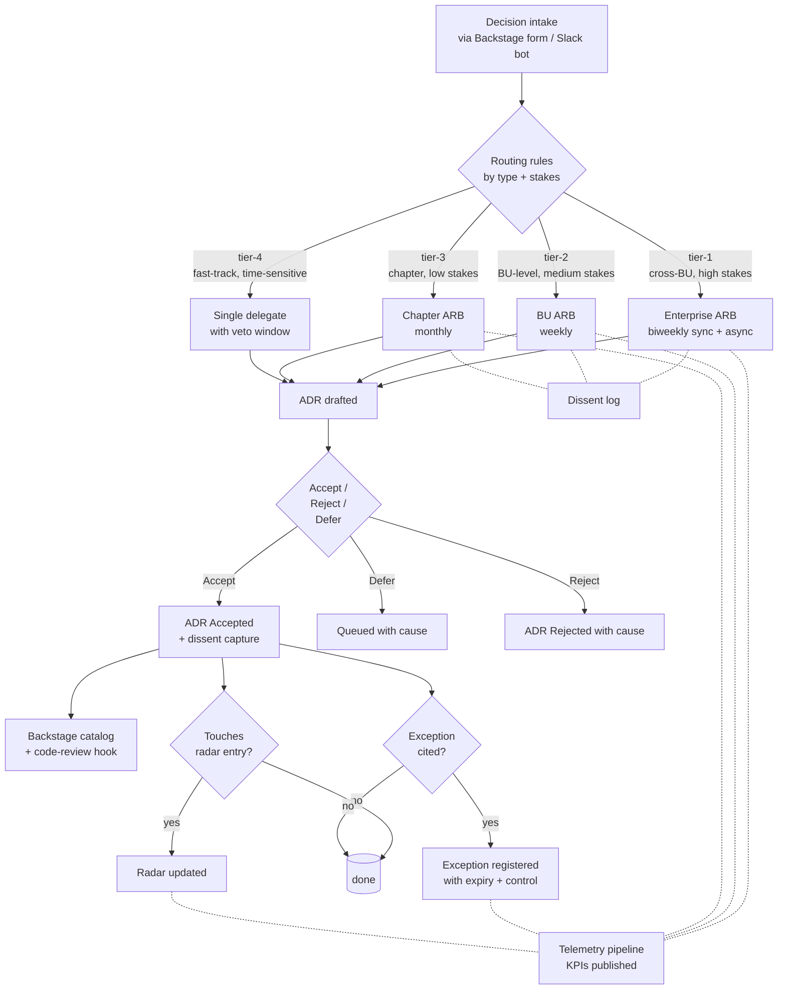
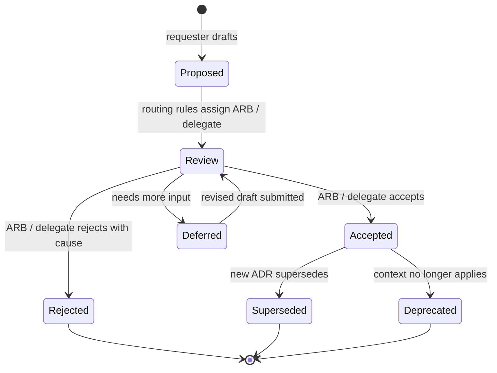

# Governance System Design — Architecture Governance Framework (Northwind)

This file is the design of the governance **system**: the topology of ARBs, the decision flows, the artifacts and their lifecycles, the telemetry shape, and the cultural-political model. This is not a software architecture document. The "system" being designed is the decision-making system of a 32,000-person org.

If you find yourself drawing C4 diagrams of software here, stop. The diagrams here are organizational, procedural, and informational.

---

## 1. Design drivers (ranked)

When two drivers conflict, the higher wins by default.

1. **Decisions over documents** — the value is decisions made and decisions retained, not the volume of ADRs filed.
2. **Locality of decision** — decisions are made at the lowest competent tier. Centralization is a tax; pay it only where consistency is irreducible.
3. **Visibility of dissent** — disagreement that is captured is decision health; disagreement that is suppressed is debt that compounds.
4. **Telemetry over assertion** — the framework's value is proven with numbers, not vibes. Every claim about "faster, fewer reversals" is instrumented.
5. **Async over sync** — sync meetings are scarce; the default channel for decision flow is asynchronous.
6. **Reversible defaults** — exceptions, ADRs, and standards default to expiry / re-review; permanence is the override, not the rule.
7. **Coalition durability** — a framework rejected by 5 chapter leads is no framework. Process design serves coalition reality.

If your framework optimizes for #5 (async) at the cost of #3 (dissent visibility), stop — async dissent is easy to bury. Re-derive.

## 2. The decision topology



Key properties of this topology:
- Every decision enters one queue (intake), is routed by rules (not by negotiation), and lands at exactly one accountable tier.
- Async by default; sync ARB meetings are for the irreducible.
- Dissent is captured at every tier; the dissent log is a first-class artifact.
- Telemetry is emitted from every transition; KPIs are derived, not asserted.

## 3. ARB tiering and charters

### 3.1 Tier definitions

| Tier | Body | Owns | Quorum | Cadence | SLA |
|---|---|---|---|---|---|
| 1 | Enterprise ARB | Cross-BU, cross-chapter; standards-level; vendor commitments > $1M/yr; one-way doors | 5 of 8 standing seats incl. CTO designate; +1 of CISO designate, Data designate | Biweekly sync (60m) + continuous async | ≤ 21 days median TTD |
| 2 | BU ARB | Within-BU standards, BU-level vendor adoption ≤ $1M/yr, BU-internal exceptions | 3 of 5 (BU CIO designate, BU lead architect, 3 rotating) | Weekly (45m) + async | ≤ 14 days median |
| 3 | Chapter ARB | Within-chapter (Solution / Data / Security / Integration) standards | 2 of 3 chapter leads + 1 rotating senior | Monthly (60m) + async | ≤ 5 days median (most decisions; cross-cutting escalate) |
| 4 | Fast-track delegate | Time-sensitive low-stakes within scope (e.g., emergency vendor swap) | Single named delegate with 48h ARB veto window | n/a (single) | ≤ 3 days |

### 3.2 Enterprise ARB charter (illustrative — your D2 refines)

**Scope**: Cross-BU standards, cross-chapter conflicts, vendor commitments > $1M/yr, technology radar movements between rings, exceptions with cross-BU scope, ADRs flagged "Enterprise" by intake, one-way-door decisions.

**Membership** (8 standing seats):
- Chief Architect (chair, tie-break)
- CTO Designate
- CISO Designate
- CDO / Data Chapter Lead Designate
- Solution Chapter Lead
- Integration Chapter Lead
- 2 rotating BU lead architects (12-month terms, staggered)

**Decision rule**: simple majority of present quorum; chair tie-break; dissent captured for every vote.

**Cadence**: Biweekly sync, 60 minutes, agenda published ≥ 48h ahead. Async decision flow continuous; any member can call for sync escalation.

**Dissent capture**: every accepted decision has a "minority position" field. Empty is acceptable; refusal to capture is not.

**Recusal**: members recuse from decisions where they have a direct line ownership; recusal is recorded.

**Term limits**: rotating BU seats 12 months; chapter lead designates 18 months (renewable once); chair appointed by CTO.

### 3.3 Delegation patterns (the load-bearing innovation)

The framework's leverage comes from what the Enterprise ARB **does not decide**. Three delegation patterns:

1. **Standing delegation by scope**: any decision wholly within Chapter X's scope, with no BU impact, is delegated to Chapter X ARB. The Enterprise ARB does not see it.
2. **Standing delegation by precedent**: once Enterprise ARB has decided on a class of decision (e.g., "all new Postgres deployments use Aurora unless a tier-3 exception applies"), future instances do not return to the ARB. The decision becomes a standard, exceptions only.
3. **Time-bounded delegation by SLA**: emergency operational decisions delegated to a named delegate with a 48-hour ARB veto window.

The Enterprise ARB's job is to delegate aggressively and intervene rarely. Anti-pattern: an ARB that reviews every decision is a bottleneck dressed in a charter.

## 4. ADR practice

### 4.1 Format (MADR-derived)

```markdown
# ADR-NNNN: <Short, decision-stating title>

**Status**: Proposed | Accepted | Superseded by ADR-MMMM | Deprecated
**Date**: YYYY-MM-DD
**Owner**: <named role, e.g., "Data Chapter Lead">
**Tier**: 1 | 2 | 3 | fast-track
**ARB**: Enterprise | BU-<name> | Chapter-<name>
**Supersedes**: ADR-XXXX (optional)

## Context

<What is the situation, what forces are at play, what triggered the decision?>

## Decision

<We will do X. Stated as imperative.>

## Consequences

<Positive, negative, neutral. Be specific.>

## Alternatives considered

<Alt 1 — why rejected>
<Alt 2 — why rejected>
<Alt N — why rejected>

## Reversibility

Low / Medium / High / One-way door — with a 1-paragraph exit plan if not Low.

## Dissent

<Captured dissent. Empty is acceptable; absence-of-capture is not.>

## Links

- Requirements: <IDs>
- Related ADRs: <links>
- Implementation: <PR / project links>
```

### 4.2 Lifecycle state machine



Transition criteria are explicit. "Accepted" requires recorded ARB / delegate decision + dissent capture (empty allowed) + telemetry emission.

### 4.3 Automation hooks (the differentiator)

Most orgs have ADR templates and most ADRs go unread. Automation:

- **ADR scaffold via Backstage Templates** — `npx adr new` produces a numbered, properly-formatted draft in the right repo with required fields.
- **CI hook: ADR-touched code surfaces ADR in code review** — when a PR modifies a file under a component covered by an ADR (tracked in `.adr-coverage.yaml`), the PR description auto-includes a link to the ADR. The reviewer must acknowledge the ADR (checkbox) before approval. This is enforced as a CODEOWNERS-style requirement.
- **CI hook: architecturally significant change detection** — heuristic rules: new top-level service, new datastore, new external dependency in `package.json` / `go.mod` / etc., new public API. Trigger an ADR-required label on the PR; merge blocked until ADR linked or "no ADR justified" comment from a chapter lead.
- **Graph: cross-link querying** — `adrctl graph --consumes <id>` returns the ADR tree. Backstage TechDocs renders the graph.
- **Search**: full-text + tag + status filters in Backstage; org-wide.

### 4.4 Anti-patterns to design against

- **The aspirational ADR**: written, never read. Mitigation: code-review surfacing.
- **The orphan ADR**: not linked to requirements or other ADRs. Mitigation: required field; CI fail on commit.
- **The decoration ADR**: written for political cover, no actual decision. Mitigation: chapter lead review for vacuity.
- **The drift ADR**: ADR accepted, code did the opposite. Mitigation: quarterly ADR-vs-code audit by governance ops.

## 5. Technology radar

### 5.1 Structure

ThoughtWorks-style: 4 rings × 4 quadrants. Tailored to insurance:

| Quadrant | Examples |
|---|---|
| Languages & Frameworks | Java 21, TypeScript, Python, Rust (Hold) |
| Tools | Backstage, Argo CD, OPA, Crossplane, Sigstore |
| Platforms | AWS EKS, Snowflake, Confluent Cloud, Databricks |
| Techniques | Strangler fig, anti-corruption layer, event sourcing (Trial in claims), generative AI for claims triage (Assess) |

Rings:
- **Adopt**: proven; choose by default for new work
- **Trial**: pursue actively in a non-trivial project; commit to evaluating
- **Assess**: worth exploring; small bets, learn
- **Hold**: do not adopt new; phase out where present (with timeline)

### 5.2 Entry / movement criteria

Each entry requires:
- A sponsor (named architect or chapter lead)
- Evidence: ≥ 1 production use case at Northwind OR ≥ 3 peer-firm references with public detail
- Justification: ≥ 3 sentences anchored in a specific need
- Risk assessment: dependencies, exit cost
- Cited radar position elsewhere (ThoughtWorks, AWS Well-Architected, etc.) — if there is one

Movement rules:
- **Assess → Trial** requires evidence of fit + sponsor commitment + radar editor approval
- **Trial → Adopt** requires ≥ 2 production deployments with ≥ 6 months uptime + chapter lead endorsement
- **Adopt → Hold** requires evidence of obsolescence + replacement entry already in Adopt + 12-month phase-out plan
- **Hold → retired** automatic after 18 months in Hold

### 5.3 Cadence and ownership

- **Editor**: 1 FTE (radar editor; reports to Chief Architect)
- **Publication**: quarterly (Q1 / Q2 / Q3 / Q4)
- **Contribution**: rolling; entries can be proposed any time, reviewed monthly by editor + chapter representative committee
- **Review at publication**: every entry reviewed; auto-flag for retirement if unreviewed > 18 months

### 5.4 Adoption mechanism

A radar is decoration if no one cites it. The framework requires:
- New project design docs cite radar entry per major component choice (target ≥ 60% per TR-9)
- Backstage TechDocs templates auto-include "Radar entries used" section
- Code-review template prompts for radar citation when introducing new components

## 6. Exception process

### 6.1 State machine

```mermaid
stateDiagram-v2
    [*] --> Requested
    Requested --> InReview: assignment to approver
    InReview --> Approved: approver decision
    InReview --> Rejected: with cause + alternative suggestion
    Approved --> Active: scope + expiry set
    Active --> NearExpiry: T-14 days alert
    NearExpiry --> RenewalRequested: requestor asks for renewal
    NearExpiry --> Closing: auto-expire path
    RenewalRequested --> InReview: same as initial flow
    Active --> Closed: scope no longer applies
    Closing --> Closed: T0, auto-revert if compensating control still in place; else escalation
    Closed --> [*]
    Rejected --> [*]
```



### 6.2 Field requirements

Every exception:
- Requestor (named role)
- Approver (per routing: Chapter ARB / BU ARB / Enterprise ARB)
- Standard or ADR being deviated from (linked)
- Scope: components / projects / time
- Justification (≥ 1 paragraph)
- Compensating control (if applicable; e.g., "PR review by 2 senior reviewers" as compensating control for waived automated scan)
- Expiry: max 90 days; default 60
- Auto-action at expiry: revert / escalate / re-review

### 6.3 Anti-overflow design

184 active exceptions today; target ≤ 40. Mechanisms:

- **Auto-expire** is default; no exception persists silently
- **Re-approval rate KPI** (TR-7): if > 20% of expiring exceptions are renewed, the standard is wrong — trigger ADR review
- **3-renewal rule** (GR-22): an exception renewed 3 times triggers ADR review; either the standard changes or the renewal pattern stops
- **Quarterly exception triage**: governance ops reviews all active exceptions; recommends closures, escalates patterns

### 6.4 Audit alignment

Every exception is exportable for audit (CSV / JSON / PDF):
- Decision record
- Approver identity
- Time bounds
- Compensating control + evidence
- Closure cause

For NY DFS / PRA, this is the audit trail for "documented risk acceptances."

## 7. Decision telemetry and dashboards

### 7.1 Telemetry shape

Every decision (ADR or exception) emits structured events:

```json
{
  "event_type": "adr.accepted",
  "adr_id": "ADR-0247",
  "tier": "enterprise",
  "arb": "Enterprise ARB",
  "decision_date": "2026-07-15",
  "intake_date": "2026-06-25",
  "ttd_days": 20,
  "stakeholders_consulted": 7,
  "dissent_count": 2,
  "reversibility": "medium",
  "supersedes": null,
  "linked_requirements": ["GR-4", "PR-7"],
  "owner_role": "Data Chapter Lead"
}
```

Events land in the org's event bus (Kafka) → analytics warehouse (Snowflake) → dashboards (Looker / Backstage TechInsights).

### 7.2 Dashboards

**Dashboard 1 — ARB performance** (audience: ETLT, weekly)
- Median TTD by tier (TR-1)
- Queue depth by tier (TR-4)
- Throughput by tier, trailing 13 weeks (TR-3)
- Reversal rate trailing 12 months (TR-2)

**Dashboard 2 — Exception health** (audience: ARB chairs + Audit, weekly)
- Active exception count + 13-week trend (TR-5)
- Median lifespan (TR-6)
- Re-approval rate (TR-7)
- Exceptions near expiry / overdue

**Dashboard 3 — Radar adoption** (audience: chapter leads + radar editor, monthly)
- Entry counts by ring + delta (TR-8)
- Adoption rate per quadrant (TR-9)
- Stale entries (unreviewed > 12 months)

**Dashboard 4 — Cultural health** (audience: Chief Architect, quarterly)
- Dissent frequency by topic (TR-10, aggregated)
- Decision-to-implementation latency (TR-11)
- ARB participant NPS (TR-12)

### 7.3 Leading vs. lagging indicators

Crucial discipline. Tag every KPI:
- **Leading**: queue depth (warns of bottleneck), exception count growth rate (warns of standard breakdown), dissent frequency on a topic (warns of unresolved disagreement)
- **Lagging**: reversal rate (only knowable after 12 months), exception lifespan (only known after closure), reversal-to-precedent ratio (long horizon)

Leading indicators drive intervention; lagging indicators prove the framework works (or doesn't).

## 8. RACI / RAPID for the top 20 decisions

You will produce the full D7. Five representative rows below; expand to 20:

| # | Decision type | R (Responsible) | A (Accountable) | C (Consulted) | I (Informed) | ARB tier |
|---|---|---|---|---|---|---|
| 1 | Adopt a new enterprise-wide datastore | Data Chapter Lead | Chief Architect | CISO, FinOps, Solution Lead | All BU lead architects | Enterprise |
| 2 | Vendor adoption < $1M/yr within one BU | BU lead architect | BU CIO | Chapter Lead (relevant) | Enterprise ARB (informed) | BU |
| 3 | New service deployed to existing platform | Project tech lead | BU lead architect | Chapter Lead (if standards-relevant) | n/a | Chapter (if standards change), else delegate |
| 4 | Exception request, single project, ≤ 30 days | Requestor | Chapter ARB chair | Compensating-control reviewer | Audit (digest) | Chapter |
| 5 | Radar movement Trial → Adopt | Entry sponsor | Radar Editor | Chapter Lead + ≥ 2 production sponsors | All chapter leads | Enterprise (radar movements always) |
| 6–20 | ... | ... | ... | ... | ... | ... |

## 9. Federation model

### 9.1 BU ARB charter template

Granted by Enterprise ARB. Each BU ARB:
- Has a charter naming what it owns and what it must escalate
- Sends quarterly summary to Enterprise ARB: decisions made, exceptions active, dissent log
- Loses its delegation if telemetry shows persistent failure (e.g., TTD > 2× SLA for 2 consecutive quarters)

### 9.2 Cross-BU routing

When a decision spans BUs:
- If standards-level: routes to Enterprise ARB
- If two BUs only and impact is symmetric: routes to a joint BU ARB session (chairs of both BU ARBs)
- If two BUs only and impact is asymmetric: routes to the impacted BU ARB, with the influencing BU as Consulted

The routing rule is published, not negotiated.

### 9.3 Disagreement escalation

When two BU ARBs disagree on a cross-BU decision:
- 5-business-day attempt at resolution between BU ARB chairs
- If unresolved → Enterprise ARB, with both positions captured
- Enterprise ARB decides; minority position recorded in the ADR's Dissent section

## 10. Cultural & coalition design

### 10.1 The chapter leads

The 4 chapter leads (Solution / Data / Security / Integration) are the single highest-stakes coalition. They have territory; they will protect it; some of them have been at Northwind > 10 years.

Design moves:
- Each chapter lead is a standing Enterprise ARB designate seat — they own their chapter's representation, not a rotating delegate
- Chapter leads co-design the charter; the framework is theirs to defend
- Chapter ARBs have meaningful delegation (Section 3.3); the framework does not centralize what chapters do well

### 10.2 The bypassing BU CIOs

A few BU CIOs (you must identify which in Phase 0) currently bypass ARB because ARB is slow. They are correct that ARB is slow; the framework's value proposition to them is *speed*, not control. Design:
- Fast-track tier (tier 4) for time-sensitive decisions
- TTD KPI prominently dashboarded — they will see the framework keeping its promises
- Early pilot with their BU, with their lead architect as a co-designer

### 10.3 The audit relationship

Audit (internal and external) is your covert ally. They need the framework to succeed because their job is verifying it. Design:
- Quarterly governance health review with Audit (not the same as audit *of* governance)
- Audit gets export endpoints for exceptions, ADRs, ARB minutes
- Pre-rollout walkthrough with Audit leadership; their endorsement in the launch comms

### 10.4 Dissent culture

The framework must protect dissent. Patterns:
- **Disagree-and-commit** language in every charter ("dissent captured does not block decision; absence of capture does")
- **Anonymous dissent channel** (rare; for cultural-safety cases)
- **Quarterly dissent retrospective** by the Chief Architect: are dissent patterns surfacing real issues?

## 11. Risk register (top 10 for the framework itself)

| # | Risk | Likelihood | Impact | Leading indicator | Mitigation |
|---|---|---|---|---|---|
| 1 | CTO or CISO sponsor leaves mid-rollout | Med | Critical | Org chart changes; sponsor 1:1 cadence drops | Co-signed framework; ETLT-level ownership |
| 2 | Chapter lead refuses to co-design | Med | High | Public pushback; missed co-design sessions | Negotiation early; reframe as territory expansion, not loss |
| 3 | Bypassing BU CIO undermines framework publicly | High | High | Pilot BU recidivism; private signals | Fast-track tier value; early pilot in their BU |
| 4 | Telemetry pipeline late or unreliable | Med | High | Sprint slippage in instrumentation work | Backstage TechInsights as fallback; manual KPIs initially |
| 5 | First 90 days: TTD does not improve | Med | High | Weekly KPI check | Triage process for stuck decisions; explicit war-room mode |
| 6 | Exception count grows despite framework | High | Med | Quarterly TR-5 trend | Aggressive auto-expiry; standards review trigger |
| 7 | Radar becomes popularity contest | Med | Med | Movement criteria not enforced | Radar editor authority; chapter committee discipline |
| 8 | Audit finds gaps in cycle 1 | Low | High | Pre-rollout audit walkthrough surfaces issues | Walkthrough is a hard gate, not optional |
| 9 | Governance ops can't hire to 6 FTE | Med | Med | Recruiting funnel weekly | Phased rollout; contractor ramp; start with 4 |
| 10 | Framework is launched but not adopted (binder rot) | High | Critical | Telemetry shows decisions still happening outside framework | Adoption rate KPI; quarterly "decisions made outside framework" audit |

## 12. Trade-offs and explicit positions

### 12.1 Centralize or federate
**Chosen**: Federate aggressively; Enterprise ARB owns the irreducible only.
**Why**: Northwind has 18 BUs and 4 chapters. A central ARB that decides everything is a bottleneck. The leverage is delegation rules + telemetry + escalation, not centralization.
**Cost of being wrong**: Standards drift; fragmentation. Telemetry surfaces it; precedent-promotion mechanism (a recurring exception triggers a standard) self-corrects.

### 12.2 Sync-first or async-first ARB
**Chosen**: Async-first; sync meetings biweekly for the irreducible.
**Why**: Sync meetings scale poorly; calendar contention with 8 standing members at Tier 1 alone is real. Async-first preserves throughput.
**Cost of being wrong**: Some decisions need live debate; the framework reserves sync escalation as an explicit option any member can invoke.

### 12.3 ADR tooling: build or adopt
**Chosen**: Adopt Backstage Templates + community MADR template + custom CI hooks (small).
**Why**: Backstage is already in production; community tooling is mature. The custom layer is the code-review surfacing hook — that's where the leverage is. Building a bespoke ADR system reinvents adopted infra.
**Cost of being wrong**: Backstage Templates drift; CI hooks need maintenance. ≤ 0.5 FTE annual.

### 12.4 Exception auto-expiry default vs. explicit-close default
**Chosen**: Auto-expire is default. Explicit-close requires action.
**Why**: 184 active exceptions today demonstrate that explicit-close defaults rot. Auto-expire forces re-evaluation; the cost of re-approving an exception that is genuinely needed is bounded.
**Cost of being wrong**: A genuinely needed exception lapses and a system breaks. Mitigation: T-14 days alert + compensating-control fallback at expiry.

### 12.5 Tech radar publication cadence: quarterly or rolling
**Chosen**: Quarterly with rolling proposal intake.
**Why**: Quarterly publication creates a focal moment for the org; rolling intake prevents the radar from being stale between publications.
**Cost of being wrong**: 3-month lag for fast-moving entries. Mitigation: editor can promote between publications when an entry's evidence is overwhelming, with backfill into the next published radar.

### 12.6 Standing Enterprise ARB seats: term-limited or permanent
**Chosen**: Chapter / officer designates are 18-month renewable (one renewal); rotating BU seats 12 months staggered.
**Why**: Calcification is the failure mode of standing committees. Rotation prevents it. Officer designates need continuity; chapter leads need representation but not lifelong tenure.
**Cost of being wrong**: Loss of institutional memory. Mitigation: governance ops maintains org memory; rotating seats are mentored.

## 13. Validation: how you'll know the framework is sound

Framework fitness functions, reviewed quarterly:

1. **TTD fitness**: median TTD tier-1 ≤ 21 days for the trailing quarter
2. **Reversal fitness**: trailing-12-month reversal rate ≤ 15%
3. **Exception fitness**: active exception count ≤ 40 sustained; re-approval rate ≤ 20%
4. **Adoption fitness**: ≥ 60% of new project design docs cite a radar entry
5. **Coverage fitness**: ≥ 90% of "architecturally significant" PRs (per CI heuristic) have an ADR linked or "no ADR justified" comment from a chapter lead
6. **Dissent fitness**: dissent capture rate per decision (capture vs. empty); zero captures across many decisions is a smell

Failing fitness functions trigger the meta-governance review (the "amend the framework" process).

## 14. Open questions you must close

By the time you submit:

1. Exception tooling — ServiceNow vs. Backstage extension vs. Jira project? Make a call.
2. ADR storage — single org-wide repo vs. per-BU repos with central index? Make a call.
3. Telemetry pipeline owner — Data Chapter or Governance Ops? Make a call.
4. Radar editor — full FTE or 0.5 FTE? Make a call.
5. Tier-1 quorum size — 5 of 8 vs. 4 of 7 vs. 6 of 9? Make a call.
6. Fast-track tier veto window — 24h vs. 48h vs. 72h? Make a call.
7. ARB participant compensation — counted as engineering time, performance-review credit, or both? Make a call.

Each closure is a defended position in D1 + D2. If you submit fewer than 7 closed open questions you have left the framework unfinished.

---

**Next**: [`STEP_BY_STEP.md`](./STEP_BY_STEP.md) — phase-by-phase build guide.
