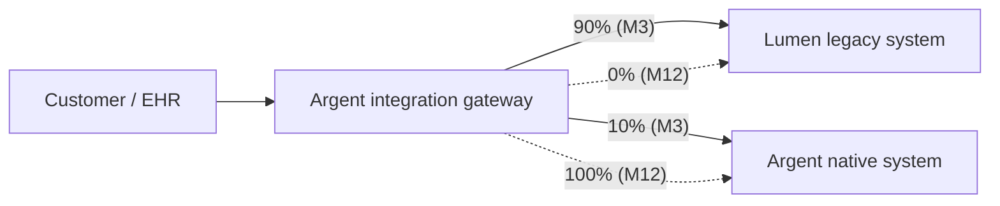

# Integration System Design — M&A Integration Architecture (Argent ← Lumen)

This file is the design of the integration **system**: the topology of the merged systems, the integration patterns selected per cutover, the data and control flows during the dual-running window, the regulatory perimeters, and the cultural model. This is not a software architecture for either Argent's or Lumen's platforms; it is the architecture **of the integration itself**.

If you find yourself designing the EAIP from scratch, stop — that is Project 01. The integration uses what exists at Argent and decides how Lumen fits.

---

## 1. Integration drivers (ranked)

When two drivers conflict, the higher wins by default.

1. **Regulatory continuity** — FDA SaMD clearance, HIPAA scope, HITRUST certification must survive the integration. Every decision is filtered through "does this trigger a regulatory event?"
2. **Customer-facing continuity** — Lumen's customers do not experience disruption from the integration. SLAs preserved or improved.
3. **Talent retention** — the 8 named ML scientists and the Lumen founder are the deal value. Decisions that put retention at risk get an explicit retention impact assessment.
4. **Reversibility** — every cutover has a tested rollback. Big-bang cross-cloud migrations are prohibited.
5. **Synergy realization** — $42M/yr by month 24. Integration design enables synergy; it does not destroy it through over-engineering.
6. **Cultural integration** — Lumen's HuggingFace-native culture and Argent's enterprise-platform culture must coexist for ≥ 18 months. Forced cultural conversion early loses talent.
7. **Architectural coherence** — long-term, the integrated system has fewer redundant capabilities, fewer system-of-record ambiguities, and consistent governance. But this driver loses to #1–6 in any conflict.

If your design optimizes for #7 (architectural cleanliness) at the cost of #3 (talent), stop — clean architecture without the people is a destroyed deal.

## 2. Integration system topology

```mermaid
flowchart LR
    subgraph PreClose["Pre-close (Day -90 to Day 0)"]
        DD[Architecture due diligence<br/>data room review]
        DD --> RF[Red flag classification]
        RF --> D2OUT[(D2: DD memo)]
    end

    subgraph Day1["Day 1 (close)"]
        D1R[Day-1 readiness<br/>identity, comms, BAAs, on-call paging]
        D1R --> KO[Kickoff: IMO + workstream leads]
    end

    subgraph Day30["Day 1 → Day 30"]
        STA[Stabilization<br/>no architectural change]
        STA --> DD2[Post-close DD confirmation<br/>(unknowns from D2)]
        DD2 --> SOR[System-of-record decisions started]
    end

    subgraph Day90["Day 30 → Day 90"]
        SOR --> WAVES[18-month wave plan<br/>D4 ratified]
        WAVES --> QW[Quick-win synergy<br/>≥ $4M run-rate]
    end

    subgraph M3to18["Month 3 → Month 18"]
        WAVES --> W1[Wave 1: identity + secrets + observability<br/>strangler fig + ACL]
        W1 --> W2[Wave 2: model registry + lineage + LLM gateway<br/>parallel-run + ACL]
        W2 --> W3[Wave 3: training orchestration + GPU fleet<br/>branch-by-abstraction]
        W3 --> W4[Wave 4: vector retrieval + FinOps<br/>strangler fig]
        W4 --> W5[Wave 5: legacy decommission<br/>verify reversibility before retire]
        W5 --> W6[Wave 6: cross-cloud question resolved<br/>migrate / accept hybrid / strangler]
    end

    subgraph Continuous["Continuous"]
        REG[Regulatory continuity<br/>HIPAA / SaMD / HITRUST]
        TAL[Talent retention<br/>retrospectives + 1:1 cadence]
        SYN[Synergy tracking<br/>quarterly to CFO]
    end

    KO -.- REG
    KO -.- TAL
    KO -.- SYN

    D2OUT --> D1R
    PreClose ~~~ Day1
    Day1 ~~~ Day30
    Day30 ~~~ Day90
    Day90 ~~~ M3to18
```

The integration has three loops:
- **Sequential**: pre-close → Day 1 → Day 30 → Day 90 → wave plan execution
- **Continuous**: regulatory, talent, synergy tracking — running throughout
- **Reactive**: stage gates that can pause / re-baseline / abandon if leading indicators fire

## 3. Pre-close architecture due diligence

The DD that happens before the deal closes is the most important architectural work of the integration. You discover what you cannot un-discover after close.

### 3.1 What an integration architect demands from the data room

- **Architecture diagrams**: C4 L1 / L2 of the platform; system context; data flows for HIPAA-relevant paths
- **Service inventory**: every production service with owner, dependency graph, SLO, last-touched date
- **Cloud spend**: 24-month trailing by service, by team; reserved commitments and remaining terms
- **Vendor inventory**: every SaaS / external service with contract terms, renewal dates, BAAs
- **Regulatory artifacts**: FDA SaMD documentation, HIPAA risk assessment, HITRUST CSF assessment, BAA list, breach history
- **Code repositories**: count, lines, primary languages, test coverage, bus-factor analysis for top-20 services
- **Open issues**: critical / high severity; security findings; auditor follow-ups
- **Architecture decisions**: ADR repository or equivalent; pending decisions
- **Talent dependencies**: who is the only person who knows X (the "bus-factor risk" list)
- **Migration prior art**: any prior migrations (data center, cloud, vendor) and how they went
- **Cost-of-rebuild estimate**: what would it cost to rebuild Lumen's platform from scratch? (Anchors the make-vs-buy reasoning for system-of-record decisions.)

### 3.2 Red-flag categorization

Every finding lands in one of 4 buckets:

| Bucket | Definition | Action |
|---|---|---|
| **Blocker** | If true, deal should not close at agreed terms | Escalate to CTO + M&A lead; price renegotiation conversation |
| **Material** | Significant integration cost or risk; deal proceeds but plan must account | Quantify cost; reflect in D4 roadmap; named in steering |
| **Monitor** | Worth knowing; small impact | Logged; tracked through Day-30 confirmation |
| **Resolved** | Initial concern proved unfounded | Documented for future DD pattern improvement |

### 3.3 Unknowns you cannot bound pre-close

Some questions you cannot answer until you have post-close access:
- Actual code quality vs. what's in the architecture diagrams
- Real bus-factor (who actually knows the system vs. who's titled)
- True cloud spend vs. what was disclosed (often differs by 5–15%)
- The 8 ML scientists' actual stay/leave intent (you cannot ask them pre-close)
- Hidden dependencies on Lumen-internal tooling that isn't in the inventory

For each, name the Day-30 activity that confirms or refutes.

## 4. Day-1 readiness

Day 1 is a calendar event with checklist precision. Anything not on the checklist does not happen Day 1.

### 4.1 Day-1 must-haves

- **Identity**: Lumen employees can authenticate; Argent IT support reachable; Argent CEO email arrives
- **Communications**: All-hands welcome from Argent CEO and Lumen founder (jointly); messaging to customers (joint); messaging to partners
- **BAAs**: Lumen → Argent BAA in place (subsidiary structure-dependent); Lumen's existing BAAs with subcontractors confirmed valid through Day 1
- **On-call paging**: Argent SRE can be paged for Argent-side issues; Lumen on-call unchanged; cross-paging not yet active
- **Customer-facing systems**: zero changes; all Lumen production runs unchanged on Lumen infrastructure
- **Financial controls**: Lumen's spending authorities updated to Argent's framework (signoff thresholds, vendor approval)
- **Legal**: all Lumen contracts assigned/transferred per closing conditions

### 4.2 Day-1 must-not-haves

- No architectural change. No service migration. No cloud migration. No identity unification.
- No comp / equity adjustment communicated to Lumen employees (HR-led, separate cadence).
- No public Argent commitment to a specific integration outcome ("we'll move you to AWS in 6 months") that the integration plan hasn't confirmed.

### 4.3 Day-1 governance setup

- IMO chartered with workstream leads named (Technology, Commercial, People, Regulatory, Finance)
- Technology workstream: co-chaired by you (Argent) + Lumen CTO; bi-weekly steering report
- Integration risk register opened; Day-1 risks logged

## 5. System-of-record decisions

The system-of-record (SoR) question is **the** architectural decision per shared concern. The SoR owns truth; everything else is a derivative.

### 5.1 The 15 shared concerns

| # | Concern | Argent system | Lumen system | Provisional SoR | Reversibility |
|---|---|---|---|---|---|
| 1 | Identity (workforce) | Okta | Custom + Google IdP | **Argent (Okta)** | Low |
| 2 | Identity (customer) | Auth0 + custom | Custom + per-EHR SSO | **Lumen (no change)** | High |
| 3 | Secrets | HashiCorp Vault | HashiCorp Vault | **Argent Vault federated; cutover by M9** | Medium |
| 4 | IdP / dev front door | Backstage (Argent-flavored) | Backstage (Lumen fork) | **Argent Backstage extended with Lumen plugins** | Medium |
| 5 | Model registry | MLflow-derived + custom | Custom (Lumen-built) | **Argent MLflow + Lumen ACL for 18 months** | Medium |
| 6 | Observability backbone | Datadog | Grafana stack + LangSmith | **Argent Datadog primary; LangSmith retained for LLM eval** | Medium |
| 7 | Vector retrieval | (none — Argent doesn't have one yet) | Pinecone | **Lumen Pinecone becomes Argent standard** | High (this is the "Lumen wins" decision) |
| 8 | FinOps | Vantage + custom | Custom GCP cost dashboards | **Argent Vantage extended to GCP** | Low |
| 9 | MRM / model governance | ServiceNow GRC + custom | Custom (built for FDA SaMD lifecycle) | **Lumen's SaMD module retained for SaMD-cleared models; Argent for everything else** | High |
| 10 | Data lineage | OpenLineage + Marquez | OpenLineage + custom | **Argent Marquez extended; Lumen producers federate in** | Medium |
| 11 | Software catalogue | Backstage Catalog | Backstage Catalog (fork) | **Argent Backstage Catalog merged** | Low |
| 12 | CMDB | ServiceNow | ServiceNow | **Argent ServiceNow** | Low |
| 13 | Internal LLM hosting | KServe + vLLM (early) | Triton + custom (mature) | **Lumen's pattern adopted; Argent migrates to it for LLM workloads** | High |
| 14 | ML training orchestration | Argo Workflows | Kubeflow Pipelines + custom | **Argent Argo; Lumen migrates with ACL over 12 months** | Medium |
| 15 | Deployment pipelines (CD) | Argo CD | Argo CD + custom | **Argent Argo CD; configs reconcile by M6** | Low |

Note rows 7, 9, 13 — these are the "Lumen wins" decisions. The integration explicitly admits Lumen does these better. This is the **co-evolution** principle: the integration is not colonization.

### 5.2 Decision framework per SoR

For each:
- **Capability fit**: which system better serves the merged org's needs?
- **Regulatory weight**: which system has the deeper regulatory tooling (often Lumen for SaMD)?
- **Migration cost**: what does it cost to move from one to the other?
- **Talent signal**: does choosing one system signal devaluation to the other team's engineers?
- **Reversibility**: if we get this wrong, what does it cost to switch?

The "Lumen wins" decisions are deliberate — they retain talent, they recognize technical merit, they build trust. They are also the riskiest from a cost-control standpoint: now Argent's standard expands.

## 6. Integration patterns playbook

You will produce D6 with 8–12 concrete cutovers. The pattern landscape:

### 6.1 Strangler fig
Use when: you can route traffic at the request boundary; the new system can be built independently of the legacy.

Apply to:
- Customer-facing API integration with EHR vendors (Argent gateway in front; Lumen system serves; over time, more endpoints route to Argent native)
- Vector retrieval requests (route increasing % through Pinecone API surface that becomes Argent's standard)



### 6.2 Anti-corruption layer (ACL)
Use when: the two systems have different domain models and you want to insulate one from the other's choices.

Apply to:
- Model registry: Lumen's models continue to live in Lumen's registry; an ACL exposes them to Argent's MLflow API surface so consumers don't see two registries
- Lineage: federate OpenLineage events; the ACL translates Lumen-specific dataset identifiers to Argent's canonical IDs

### 6.3 Parallel-run
Use when: you need to validate the new system produces the same results as the old, especially for regulated workloads.

Apply to:
- FDA SaMD-cleared model serving: run both Triton (Lumen) and KServe (Argent) for 90 days; compare outputs; cutover only when divergence < 0.1% on a defined evaluation suite
- LLM observability: emit traces to both LangSmith and Argent's Datadog; reconcile; pick one when confidence is established (likely LangSmith stays for LLM-specific work)

### 6.4 Branch-by-abstraction
Use when: there's a shared abstraction layer you can introduce, behind which implementations can be swapped.

Apply to:
- Training orchestration: introduce a "training job" abstraction (a thin SDK) that wraps both Argo (Argent) and Kubeflow Pipelines (Lumen); over 12 months, all jobs use the SDK; then swap the Lumen backend for Argo
- Object storage access: introduce an artifact-fetch abstraction; later swap S3 / GCS implementations behind it

### 6.5 Dark launch
Use when: you want to test a new code path in production without affecting users.

Apply to:
- New Argent-side LLM gateway with Lumen's policy bundles: dark-launch with mirror traffic from Lumen's existing gateway; compare; promote when confidence
- Identity unification: dark-launch Okta-federated auth alongside Lumen's existing auth; cutover once parity is proven

### 6.6 Big-bang with reversibility window
Use sparingly. When: a clean cutover is cheaper and lower-risk than parallel-run, AND a fast rollback is testable.

Apply to:
- Argent CMDB extension to Lumen assets (low-risk; rollback = stop syncing)
- Backstage Software Catalog merge (low-risk; rollback = un-merge the catalog entries)

**Prohibited**: any cross-cloud, customer-facing, or SaMD-touching cutover as big-bang. Reversibility window of 24h is the minimum for any cutover; 30 days for SaMD-touching.

## 7. The multi-cloud question

Lumen is GCP-only; Argent is AWS-primary. This is the single largest architectural decision in the integration.

### 7.1 Options

| Option | Description | TCO 18mo | Reversibility | Talent risk | Regulatory risk |
|---|---|---|---|---|---|
| A. Migrate GCP → AWS | Move all Lumen workloads to AWS over 12–18 months | High ($18M+ migration cost; $5–8M GCP early termination) | Low post-migration; High during | High (Lumen engineers may resent migration) | High (SaMD-cleared serving disrupted) |
| B. Keep dual; accept multi-cloud permanently | Lumen stays GCP; Argent stays AWS; integrate at API + identity layer | Low migration cost; ongoing dual ops cost $4–6M/yr | High to consolidate later | Low | Low (no SaMD disruption) |
| C. Strangler fig over 24–36 months | Build Argent-side capability; migrate workloads opportunistically as new versions ship | Medium ($8–12M over 24mo) | High during; Medium after | Medium | Medium |
| D. Migrate non-SaMD workloads only | SaMD-cleared modules stay GCP indefinitely; everything else moves to AWS over 18mo | Medium | Medium | Medium | Low (SaMD untouched) |

### 7.2 Provisional recommendation: Option D

Recommend **Option D**: migrate non-SaMD workloads to AWS over 18 months; SaMD-cleared modules remain on GCP indefinitely with an explicit re-evaluation gate at month 24 (post earn-out window).

Rationale:
- SaMD disruption is the highest regulatory risk; cross-cloud migration of cleared modules requires 510(k) supplement determination — expensive and slow
- Non-SaMD workloads are cleaner to migrate; the cross-cloud egress cost during dual-run is the main cost
- This protects talent retention (SaMD engineers continue to work in familiar GCP tooling through earn-out)
- Re-evaluation gate at month 24 preserves option to revisit (when founder earn-out completes)

Cost of being wrong: GCP relationship stays a permanent dependency. Argent accepts an explicit multi-cloud reality for one workload class. The Wardley-mapped exits stay tractable.

## 8. Cultural integration design

The integration's success rests on whether ~110 Lumen ML engineers and the 8 named scientists stay engaged.

### 8.1 The 8 named ML scientists

You will (in D7) profile each by:
- Role and contribution to model performance
- Earn-out / equity exposure
- Inferred motivations (research scientist? product engineer? entrepreneur-in-training?)
- Retention design: what would let this person do their best work at Argent?

The retention design is not "comp." Comp is HR's territory. The architecture-side retention design is:
- **Continuity of toolchain** (don't force them off HuggingFace / PyTorch / GCP within month 12)
- **Continuity of decision authority** (their architectural opinions still count; they get seats on relevant Argent ARBs)
- **Continuity of identity** (they don't become "the acquired team"; they get integrated into Argent's chapter / guild structure)
- **Visible respect for their work** (the "Lumen wins" SoR decisions are public signal that Argent learns from them)

### 8.2 Broader cohort (75 + 30 = 105 engineers)

Retention design at the cohort level:
- Joint working groups from M3: every workstream has Argent + Lumen co-leads
- Monthly retrospectives for the first 6 months; quarterly after
- Internal mobility opportunities (Lumen engineers can join Argent platform team and vice versa)
- Promotion paths visible: career ladders aligned, leveling exercise transparent
- No mass layoff in the first 12 months (this is a board-level commitment per the deal terms)

### 8.3 Cultural risks specific to this integration

1. **HuggingFace vs. enterprise platform**: Lumen engineers default to HF Transformers + PyTorch + custom serving; Argent platform standards are KServe + MLflow. Forcing conversion to Argent's standards early loses engineers; refusing conversion long-term creates two platforms forever.
2. **GCP vs. AWS familiarity**: Lumen engineers know GCP; multi-month learning curve to AWS reduces velocity and frustrates senior people.
3. **Acquisition fatigue**: 240 employees just went through a major life event; productivity drop of 20–30% in the first 6 months is normal and expected.
4. **Argent platform team resistance**: Argent's existing platform team may see Lumen's tooling as "not invented here." The integration must give them genuine technical engagement with Lumen's approaches, not just "you'll absorb them."

## 9. Regulatory continuity architecture

### 9.1 HIPAA scope management

Every new data flow between Lumen and Argent systems is a scope change. Process:
- Data Flow Change Request (DFCR) — lightweight form, 1-page
- Routed to: Privacy Office (Argent CCO function) + CISO Designate
- Decision SLA: 5 business days
- Outcome documented in BAA chain as an amendment if scope expands

The intent is not to slow integration; it is to make every scope change visible.

### 9.2 FDA SaMD lifecycle

Lumen has 2 cleared modules + 2 pending. The integration must:
- Preserve clearance for the 2 cleared (no substantial change without 510(k) supplement)
- Complete the 2 pending under unchanged regulatory submissions (don't change the system being submitted mid-review)
- Document any change to validated systems through Lumen's existing SaMD change-control process (which becomes Argent's process for these workloads)

A "Regulatory Affairs Liaison" role joins the IMO Technology workstream — full-time for the first 12 months.

### 9.3 HITRUST recertification

Lumen's CSF certification is owned at the org level. Options:
- **Option 1**: Lumen recertifies under new ownership at the next cycle (month 9–11) — cleanest, preserves continuity
- **Option 2**: Argent extends its existing HITRUST scope to Lumen workloads — requires reassessment; risk of finding new gaps

Recommend Option 1 for the first cycle; Option 2 at the next renewal (24 months out) when integration is mature.

### 9.4 SOC 2 Type II

Lumen's SOC 2 reports continue at next renewal. Argent's SOC 2 scope extends to Lumen workloads by month 12 (target). The two reports may overlap for 6–12 months during transition — accepted cost.

## 10. Synergy realization

$42M/yr by month 24. Lever-by-lever:

| Lever | Year-1 ($M) | Year-2 run-rate ($M) | Notes |
|---|---|---|---|
| GCP commitment renegotiation / partial unwind | 4 | 8 | After cross-cloud decision (§7); accounts for early-term penalty |
| AWS reservation extension for Lumen workloads | (3) | 6 | Net negative year 1 (commit cost); year 2 savings |
| SaaS consolidation (overlapping observability, FinOps tools) | 3 | 6 | Decommission Lumen-specific dashboards; consolidate to Argent's |
| Vendor renegotiation (Lumen's vendors covered by Argent contracts) | 2 | 5 | Pinecone, LangSmith, etc. — Argent buying power |
| Headcount overlap (HR, Finance, G&A — NOT engineering) | 4 | 9 | Mostly G&A; engineering preserved per TR-1 / TR-2 |
| Internal vendor consolidation (Lumen used 3 PSPs; Argent uses 1) | 1 | 3 | Stripe / Adyen / etc. |
| Internal tooling absorption (Lumen's Backstage fork into Argent's) | 0.5 | 2 | One Backstage instance, not two |
| Cross-cloud egress cost reduction (after migration) | 0 | 3 | Year-2 only; depends on Option D timing |
| **Total** | **11.5** | **42** | |

Sensitivity:
- GCP early-termination cost ±50% impacts year-1 by ±$2M
- Headcount overlap ±20% impacts year-2 by ±$1.8M
- Cross-cloud migration timing ±3 months impacts year-2 by ±$1M

The CFO can re-derive these from the assumptions; the model is in D9.

## 11. Stage gates

| Gate | Date | Decision | Inputs | Owner |
|---|---|---|---|---|
| Pre-close DD complete | Day -30 | Deal proceeds at agreed terms / renegotiate / withdraw | D2 (DD memo) | CTO + M&A lead |
| Day-1 readiness | Day 0 | Operationally ready to close / delay close | Day-1 checklist | IMO Tech co-chairs |
| Day-30 stabilization | Day 30 | Begin integration planning / extend stabilization | Stabilization report | IMO |
| Day-90 plan ratification | Day 90 | D4 18-month plan approved by steering | D3, D4 | Steering committee |
| Month-6 wave 1 complete | M6 | Continue to wave 2 / refine / pivot | Wave 1 KPIs (synergy run-rate, talent retention, regulatory status) | Steering |
| Month-12 mid-integration | M12 | Continue / re-baseline / abandon any in-flight wave | Talent retention KPI (≥ 75% cohort), synergy run-rate, regulatory continuity | Board Audit Committee |
| Month-18 integration complete | M18 | Integration declared complete; transition to BAU / re-baseline | All deliverables | Board |
| Month-24 synergy realized | M24 | $42M ±15% achieved / explain variance | Synergy model vs. actuals | CFO + Board |

## 12. Risk register (top 12 for the integration)

| # | Risk | Likelihood | Impact | Leading indicator | Mitigation |
|---|---|---|---|---|---|
| 1 | Lumen founder departs before M12 | Med | Critical | Founder 1:1 cadence drops; rumored offers | Earn-out alignment; visible role + decision authority |
| 2 | ≥ 3 of 8 named ML scientists depart by M12 | Med | High | Skip-level 1:1 signal; offer activity in market | Per-person retention design; toolchain continuity |
| 3 | FDA SaMD clearance event triggered by integration change | Low | Critical | Substantial-change determination triggered | Regulatory Affairs Liaison; SaMD change-control rigor |
| 4 | HIPAA breach during integration | Low | Critical | Data flow change without DFCR; security findings | DFCR process; BAA chain audit at Day 30, M6, M12 |
| 5 | Cross-cloud migration runs over budget by > 50% | Med | High | Wave 6 cost trending vs. plan; egress data | Option D limits cross-cloud scope; gates at M9 |
| 6 | Synergy run-rate < $30M by M24 (vs. $42M target) | Med | High | Quarterly synergy report; M12 trending | Lever-level tracking; CFO escalation at M9 |
| 7 | Argent platform team resists Lumen approaches (NIH) | High | Med | Working group attendance; private complaints | Joint working groups; "Lumen wins" SoR decisions public |
| 8 | Argent's M&A IT integration playbook unsuitable for AI-specific workloads | Med | Med | First wave runs over time | Adapt playbook; document learnings as patterns (D6) |
| 9 | GCP renegotiation harder than modeled (early-term penalty) | Med | Med | Provider conversation outcomes | Multiple options modeled in D9; rep + warranty insurance |
| 10 | Material Lumen customer churn post-announcement | Low | High | Customer NPS; renewal rate | Joint customer communication; account team continuity |
| 11 | Lumen engineering productivity drop > 30% in first 6 months | High | Med | Sprint velocity; PR throughput | Expected; planned for; retrospectives surface root causes |
| 12 | Board Audit Committee loses confidence at M6 or M12 review | Low | Critical | Pre-meeting signal from Audit chair | Honest reporting; surprise-free updates |

## 13. Trade-offs and explicit positions

### 13.1 Migrate Lumen to AWS vs. accept multi-cloud
**Chosen**: Option D — migrate non-SaMD to AWS over 18mo; SaMD stays GCP indefinitely; re-evaluate at M24.
**Why**: SaMD disruption is the highest regulatory risk; talent retention favors continuity of toolchain; non-SaMD migration is tractable; the synergy model survives without full migration.
**Cost of being wrong**: Permanent multi-cloud commitment; some FinOps complexity; Lumen-side knowledge stays valuable.

### 13.2 Lumen's vector retrieval (Pinecone) becomes Argent's standard
**Chosen**: Adopt Pinecone as Argent's standard for vector retrieval.
**Why**: Argent didn't have a chosen standard; Lumen's choice is production-proven; this is a "Lumen wins" decision that builds trust and saves Argent from running a separate selection process.
**Cost of being wrong**: Vendor lock to Pinecone; mitigated by abstracting the retrieval API.

### 13.3 Lumen's MRM module retained for SaMD workloads
**Chosen**: Lumen's custom MRM continues for SaMD-cleared models; Argent's ServiceNow GRC for everything else.
**Why**: Lumen's MRM is purpose-built for FDA SaMD lifecycle; Argent's ServiceNow GRC is general-purpose. Splitting by workload class avoids forcing one to do the other's job.
**Cost of being wrong**: Two MRMs for 24+ months; reconcile at M24 when SaMD volume justifies a unified approach (or doesn't).

### 13.4 Identity (workforce) cutover to Okta in Day-30
**Chosen**: Lumen employees on Okta by Day-30; Lumen IdP continues for system access for 60 days.
**Why**: Workforce identity unification is high-value (access governance, security) and low-risk (well-trodden pattern); Day-30 is realistic. Customer-facing identity stays Lumen's (no customer impact).
**Cost of being wrong**: Provisioning issues; mitigated by tested provisioning runbook in Day-1 readiness.

### 13.5 Parallel-run for SaMD model serving for 90 days
**Chosen**: Triton (Lumen) and KServe (Argent) run in parallel for 90 days for SaMD-cleared models; cutover follows divergence < 0.1% on defined eval suite.
**Why**: Regulatory safety; the 90-day window aligns with documentation cycles; rollback is tested daily.
**Cost of being wrong**: 2× infrastructure cost for 90 days; modeled in D9.

### 13.6 Joint working groups from Month-3
**Chosen**: Every workstream has Argent + Lumen co-leads from M3.
**Why**: Forced collaboration; signal of mutual respect; surfaces conflicts early.
**Cost of being wrong**: Some workstreams move slower; accepted in exchange for cultural integration health.

## 14. Validation: how you'll know the integration is sound

Integration fitness functions, reviewed monthly for first 6 months, quarterly thereafter:

1. **Continuity fitness**: zero customer-facing SLA breaches attributable to integration.
2. **Talent fitness**: month-over-month retention rates for 8 named scientists and broader cohort; trigger intervention when trend deteriorates.
3. **Regulatory fitness**: zero HIPAA breaches; zero SaMD substantial-change determinations triggered without plan; HITRUST recert on schedule.
4. **Synergy fitness**: actual quarterly run-rate vs. plan; ±15% triggers IMO review; ±25% triggers steering escalation.
5. **Reversibility fitness**: rollback drill executed quarterly on the most recently migrated cutover; pass/fail recorded.
6. **Cultural fitness**: monthly retrospective sentiment; joint working group attendance; promotion equity (Argent vs. ex-Lumen).

Failing fitness functions trigger explicit re-baseline conversations at the steering / IMO level.

## 15. Open questions you must close

By the time you submit:

1. GCP commitment unwind — exact economics and timeline?
2. Identity cutover — Day-30 or Day-60? What evidence chooses?
3. Model registry ACL — owned by Lumen team or Argent team during 18-month dual-run?
4. SaMD parallel-run duration — 90 days minimum or longer for highest-risk modules?
5. Argent platform team's role in Lumen tooling adoption — pull or push?
6. Backstage merger — when, with what plugin compatibility plan?
7. The 8 named ML scientists — do you have a credible retention design for each?

Each closure is a defended position in D1 + D5 + D6 + D7. If you submit fewer than 7 closed open questions you have left the integration plan unfinished.

---

**Next**: [`STEP_BY_STEP.md`](./STEP_BY_STEP.md) — phase-by-phase build guide.
