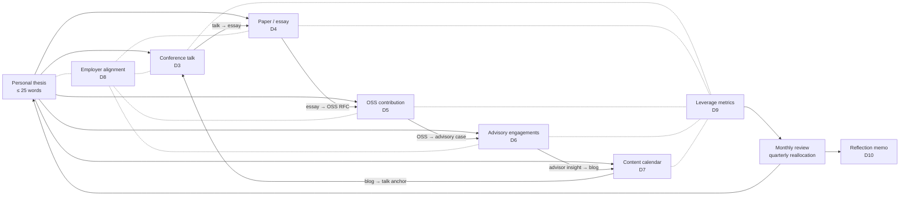

# Strategy & Operating Model — Thought Leadership Portfolio

This file is the **strategy and operating model** for the portfolio: the thesis architecture, the channel selection logic, the leverage map across channels, the operating model (cadence, drafting workflow, sponsor relationship), and the meta-loop (measure, reallocate, repeat). This is not a software architecture document. The system being designed is **your professional output system**.

If you find yourself drawing C4 diagrams here, stop. The diagrams here are personal-system and operational.

---

## 1. Strategy drivers (ranked)

When two drivers conflict, the higher wins by default.

1. **Compounding** — every piece of work should make future work easier or more valuable. A talk that becomes a paper that becomes an OSS proposal that becomes an advisory pitch compounds; isolated pieces do not.
2. **Authentic voice** — you are publishing your actual perspective, not a marketing position. A thesis you do not believe will not survive 12 months of public defense.
3. **Sustainability** — a sustained cadence beats a brilliant burst. Cycles 2 and 3 are where reputation compounds; do not optimize cycle 1 in a way that makes cycle 2 impossible.
4. **Employer alignment** — the employer is a sponsor, not an adversary. Every external piece protects the employer relationship; pieces that strain it pay a high tax.
5. **Audience asymmetry** — small-audience high-trust beats large-audience low-trust. 500 people who would hire you for a Distinguished role is worth more than 50,000 LinkedIn followers.
6. **Asymmetric optionality** — the portfolio enables future-you to take a job, found a company, take an advisory portfolio, or stay put. Don't optimize for one outcome.
7. **Honesty about what you don't know** — your credibility comes from picking your spots, not from claiming to know everything. Publishing about what you don't know yet is also a contribution.

If your strategy optimizes for #5 (audience size) at the cost of #2 (authenticity), stop — followers without trust do not convert to opportunities at the senior level.

## 2. The portfolio system

Two key properties:
- **Channels feed each other** — work in one channel becomes raw material for another (the compounding principle)
- **Metrics close the loop** — the monthly / quarterly review reallocates time and refines the thesis

## 3. Thesis architecture

The thesis is the single most important artifact in the portfolio. Get it right and every channel pulls from it; get it wrong and every channel is generic.

### 3.1 Thesis qualities

A senior thought-leadership thesis is:
- **Specific** — distinguishes you from 100 peers
- **Defensible** — survives a hostile review with evidence
- **Falsifiable** — not "AI is important"; rather, "for regulated AI infra, the integration shape of governance, FinOps, and observability is more important than any individual component choice"
- **Stable** — refines over 12 months, doesn't pivot
- **Channel-spanning** — same thesis frames a 45-minute talk, a 6,000-word paper, an OSS RFC, an advisor pitch, and 24 newsletter pieces

### 3.2 Thesis tests

Before committing to a thesis, run it through 4 tests:

1. **Recitation test**: can a peer who heard it once recite it accurately a week later?
2. **Disagreement test**: can a thoughtful peer disagree with substance? (If no one can disagree, the thesis is too general.)
3. **Anchor test**: pick 3 conference talks, 3 papers, 3 OSS contributions, 3 advisor pitches, 24 newsletter topics — do they all clearly descend from the thesis?
4. **5-year test**: would you still believe this in 5 years? If the thesis is fashion, don't build a portfolio on it.

### 3.3 Thesis development workflow

1. **Brainstorm**: 30+ candidate thesis statements (one sentence each); throw most out
2. **Synthesize**: collapse to 5 candidates that survive the recitation test
3. **Defend**: write a 1-page defense per candidate; one will be obviously stronger
4. **Anti-thesis**: name the most thoughtful peer who disagrees and write their argument
5. **Commit**: pick one. Publish it. Iterate based on response.

### 3.4 Example thesis shapes (not your thesis — illustrative only)

- "AI infra at regulated companies is bottlenecked by governance integration, not compute or model quality."
- "Internal LLM hosting is over-invested by enterprises; the real differentiator is the gateway integration shape."
- "FinOps for AI is the single most under-instrumented capability; the orgs that win the next 5 years are the ones with kernel-level cost attribution."
- "Multi-cloud abstraction is theater; data-gravity multi-cloud is reality. The Wardley map tells you which is which."
- "MLOps converges with platform engineering; the future ML platform team is an internal developer platform team that happens to serve ML."

Notice: each is specific, defensible, falsifiable, channel-spanning, and could anchor 12 months of writing.

## 4. Channel selection logic

Five channels do not get equal investment. The leverage map:

| Channel | Time cost | Compounding | Authority signal | Conversion to opportunity |
|---|---|---|---|---|
| Conference talk | High burst (40h prep) | Medium (talk → reuse) | High (CFP acceptance is a filter) | High (in-room + recorded) |
| Paper / essay | High sustained (60h+) | Very high (papers cite) | Highest (published authority) | Medium (slower compound) |
| OSS contribution | High sustained over months | Very high (maintainer status is rare) | Very high (technical credibility) | Medium (slow but durable) |
| Advisory engagement | Low ongoing (4–8h/mo) | Low (private; doesn't compound publicly) | Medium (private signal) | High direct ($ + network) |
| Content calendar | Low sustained (2–4h/week) | High over months (cadence builds audience) | Medium (depends on quality) | Medium (audience-dependent) |

Implications:
- **All five channels matter; their roles differ.** Conference talk for credibility moment; paper for durable authority; OSS for technical bona fides; advisory for direct opportunity; content calendar for audience compounding.
- **Don't add channels in cycle 1.** Podcast, book, online course — these are cycle 2+ moves.
- **Reallocate ruthlessly.** If by month 6 the content calendar isn't compounding (subscriber growth flat, inbound flat), reallocate hours to the highest-leverage channel.

## 5. Channel-by-channel design

### 5.1 Conference talk

**Selection logic**:
- Tier 1: KubeCon (CNCF), AI Engineer Summit, MLOps World, QCon, Data + AI Summit (Databricks), USENIX SREcon, Strange Loop (RIP), RAILS (AI infra-specific) — pick by alignment to your thesis
- Tier 2: regional editions, hosted vendor conferences (AWS re:Invent breakout, Google Cloud Next breakout), domain-specific (HIMSS for health-AI, RSA for security-AI)
- Tier 3: meetups, internal company events — useful as practice; not portfolio-grade

**CFP design**:
- Title that is specific and slightly provocative; CFP reviewers ignore generic titles
- Abstract ≤ 200 words; takeaways are concrete; you are not selling a product
- Speaker bio that demonstrates competence without being a wall of titles
- If reviewers ask for a slide outline, deliver 8–12 bullets that tell the story

**Talk structure** (45-min slot):
- 0–3 min: framing — the question, the stakes, the audience
- 3–10 min: the thesis stated clearly with 1 motivating example
- 10–30 min: 3–4 evidence sections; each ≤ 8 minutes
- 30–38 min: the counter-arguments and how you handle them
- 38–43 min: the practical takeaways the audience leaves with
- 43–45 min: closing + Q&A pointer

**Slide craft**:
- ≤ 1 idea per slide; large type; no walls of text
- Diagrams are hand-drawn or simply drawn; do not over-design
- A "credits + further reading" slide at the end

### 5.2 Technical paper / essay

**Selection logic**:
- Peer-reviewed (USENIX, ACM Queue, IEEE Software) — highest authority signal; long lead time; demanding editorial review
- Company engineering blogs (Cloudflare, Stripe, AWS Builder Library, GCP Solutions) — high reach; often editor-mediated; sometimes need an inside contact
- Industry magazines (InfoQ, The New Stack, IEEE Software) — moderate reach; faster turnaround
- Personal site / Substack with deliberate promotion plan — full control; you need the promotion plan to land it

**Paper structure** (6,000-word essay shape):
- Hook + thesis (≤ 500 words)
- Why this matters now (≤ 800 words)
- The evidence (3 substantial sections, ≤ 1,500 words each)
- The counter-arguments and your responses (≤ 800 words)
- What to do tomorrow + further reading (≤ 400 words)

**Editorial discipline**:
- First draft is bad; expect it
- Sit on it 48 hours before second pass
- A peer with editorial skill cuts 20–30% of the words; let them
- Read it out loud; sentences that don't survive read-aloud get rewritten

### 5.3 Open-source contribution

**Selection logic**:
- Pick a CNCF / LF AI project whose maintainers are known and named in the community
- Choose by **alignment to your thesis** — your OSS work is a public bet on the thesis (if your thesis is about gateways, contribute to a gateway project)
- Avoid projects with hostile maintainer cultures; this is a 6-month relationship

**Contribution arc** (6 months):
1. **Month 1 — Warm-up**: documentation fix, small bug fix; learn the contributing process, get a maintainer to interact with you
2. **Month 2–3 — Substantive PR**: tackle a real open issue from the backlog; deeper engagement
3. **Month 3–4 — Design proposal**: an RFC / KEP / issue-with-proposal that shapes the project's direction; this is where maintainer recognition tips
4. **Month 5–6 — Sustained engagement**: SIG / WG participation; reviewing others' PRs; co-design with maintainers

**Anti-patterns to avoid**:
- Drive-by PRs that are clever but don't align with the project's roadmap
- Reinventing what's already accepted
- Public criticism of maintainer decisions before earning the right to criticize
- Going dark mid-contribution

### 5.4 Advisory engagements

**Selection logic**:
- 2–4 engagements maximum; quality over quantity
- Stage mix: at least one early (seed/Series A) for equity exposure; at least one growth (Series C+) for cash and learning
- Domain mix: stay within your area of expertise; don't advise outside your competence

**Deal structures** (illustrative; defer to legal):
- **Equity advisor**: 0.1%–0.5% vesting over 24 months, 4-hour/month time commitment, named on advisor page (early stage)
- **Cash advisor**: $5k–$15k/month retainer, 8 hours/month, defined scope (growth stage)
- **Board observer**: cash + equity; meeting attendance + monthly availability; deeper commitment
- **Project-based**: $500–$2,000/hr for specific engagements

**Conflict-of-interest management**:
- Disclose to your employer; clear per their COI policy
- No advising for direct competitors of your employer
- Time-box: 4–8 hours per month per engagement is the discipline
- Diligence the founders before signing (you are signing your reputation, not just your time)

**Outreach pattern**:
- Warm intros from your network (5–10 candidates)
- 30-minute exploratory call (no commitment)
- If fit: 60-minute deeper conversation including current employer disclosure
- If still fit: legal review (founder's lawyer drafts; you have a lawyer review)
- Signed agreement with documented scope

### 5.5 Content calendar

**Cadence options**:
- **Bi-weekly long-form** (24 pieces/yr): newsletter pieces 1,200–2,500 words; this is the sustainable senior-engineer pattern
- **Weekly short-form** (52 pieces/yr): 400–800 word posts + threads; higher attention but harder to sustain
- **Monthly deep-dive** (12 pieces/yr): 3,000+ word essays; lower frequency but each is a milestone

Recommend bi-weekly for cycle 1; reassess at cycle 2.

**Topic queue discipline**:
- 12 months of topics queued at any time
- 4 "buffer" pieces drafted (publishable in a crunch week)
- Topics ladder back to the thesis (5 topics off-thesis is fine; 12 topics off-thesis is a thesis problem)
- Topics rotate across: technical deep-dive, opinion / framing, response-to-current-event, lessons-from-experience, book-influenced essay

**Platform**:
- Newsletter (Substack, ConvertKit, Beehiiv) — export portability is a hard requirement
- Cross-post selectively: LinkedIn-equivalent (long-form posts perform well), Twitter-equivalent (threads), Hacker News (selective)
- Personal site with RSS as the canonical home

## 6. Operating model

### 6.1 Weekly cadence

- **Friday afternoon writing block** (2–3 hours) — the load-bearing habit; protect it
- **One 30-minute reading session** Monday morning — keep the input pipe full
- **One advisor 1:1 per month per engagement** — calendar-blocked
- **One OSS engagement session per week** (1–2 hours) — usually evening or weekend

### 6.2 Monthly review

- 60 minutes, scheduled
- Outputs produced
- Leverage metrics per channel
- Reallocations (small)
- Topic queue refresh

### 6.3 Quarterly review

- 2 hours, scheduled
- Major reallocations (channel weight changes)
- Sponsor update (≤ 1 page)
- Thesis refinement (small; if large, the thesis was wrong)

### 6.4 Drafting workflow

Every piece (paper, essay, talk, blog) follows the same path:
1. **Notes** — a working doc with bullets, links, half-formed ideas
2. **Outline** — 8–15 bullets representing the spine; review for narrative
3. **First draft** — write fast; do not edit while writing
4. **48-hour sit** — let it cool; resist publishing impulse
5. **Second pass** — cut 20–30% of words; rewrite weak sections
6. **Peer review** (for paper / talk) — 1–2 reviewers; capture pushback
7. **Final revision** — address pushback
8. **Publish**
9. **Capture inbound** — DMs, emails, comments; track for leverage metrics

### 6.5 The "no" list

What you say no to is the discipline:
- Speaking at non-aligned venues (low-leverage; high time cost)
- Podcasts as host (different skill; high time; defer)
- Generic "AI is the future" pieces (your thesis is more specific)
- Twitter / X arguments (negative leverage; never wins reputation)
- More than 4 advisory engagements
- Writing on something you don't understand to chase a trending topic

## 7. Employer alignment

The employer relationship is a first-class artifact. Mismanaging it loses the portfolio its sponsor.

### 7.1 Sponsor agreement (negotiated upfront)

- Time approval (≥ 15% of work week sustained; bursts to 25% for talks)
- Approval workflow for publication (named contact, expected turnaround)
- IP boundaries (what you can talk about; what you can't)
- Advisory engagement disclosure protocol
- Quarterly sponsor update format

### 7.2 IP boundaries

- Public: architectural patterns, general principles, things in the published roadmap
- Cleared on request: specific numbers, customer names, partner relationships, anything tied to a specific product launch
- Off-limits: unannounced products, customer data, internal financials, M&A activity, security vulnerabilities

### 7.3 Approval workflow

- Submit draft via email to named contact (Legal or PR)
- 2-week turnaround expectation
- Iterate if changes requested
- Track approvals for audit

### 7.4 The conflict moment

Once or twice in cycle 1, you will face a moment where the employer asks you not to publish something you want to publish. Handle it well:
- Listen to the concern
- Propose a modification
- If they still object, defer or rewrite — never publish over an explicit "no"
- Capture the moment in the reflection memo; if it happens too often, the sponsor relationship is degrading

## 8. Leverage metrics

Per channel:

### 8.1 Conference talk
- In-room attendance (estimate)
- Video views trailing 90 days
- Inbound DMs / emails citing the talk
- Follow-on speaking invitations
- LinkedIn-equivalent connection growth in 14 days post-talk

### 8.2 Paper / essay
- Organic reads (90-day cumulative)
- Inbound citations / references in others' blogs / talks
- Time on page (proxy for depth)
- Reshares by named-author accounts in the field

### 8.3 OSS
- PR merge rate
- Maintainer engagement depth (review thread length, named-maintainer reviews)
- Subsequent issues / PRs assigned to you
- Public recognition (release notes, conference shoutouts)

### 8.4 Advisory
- Engagement count
- Hours per month per engagement
- Compensation (cash + equity value at fair-market)
- Founder NPS (informal — "would you refer me to another founder?")

### 8.5 Content calendar
- Subscriber growth (newsletter)
- Open rate
- Inbound generated (per piece, attributed)
- Cross-post performance (LinkedIn-equivalent, etc.)

### 8.6 Aggregate

- Inbound opportunities per month (the meta-metric)
- Career-level opportunities (interviews for Distinguished / VP / CTO roles, founder conversations, advisor inbound)
- Sponsor satisfaction (internal contribution unchanged or improved)

## 9. Risk register (top 10 for the portfolio)

| # | Risk | Likelihood | Impact | Leading indicator | Mitigation |
|---|---|---|---|---|---|
| 1 | Burnout — sustained cadence collapses | High | Critical | Friday writing block missed 3 weeks in a row | Buffer pieces drafted; defer rather than skip |
| 2 | Employer pulls sponsorship | Low | Critical | Sponsor 1:1 cadence drops; approval delays | Quarterly sponsor update; transparent metrics |
| 3 | Conference talk rejected from tier-1 | Med | Med | Reviewer feedback | Tier-2 backup venue; resubmit with revision |
| 4 | Paper venue review cycle longer than planned | High | Med | Editor non-response | Backup venue identified at submission |
| 5 | OSS maintainer relationship turns hostile | Low | High | Review tone | De-escalate; defer; pick a different sub-project |
| 6 | Advisory engagement turns out to be COI | Med | High | Discovery during outreach | Disclose early; abort early |
| 7 | Internal peers view portfolio as opportunism | Med | Med | Peer 1:1 signal | Stay internally contributing; bring colleagues into co-authored work where appropriate |
| 8 | Thesis turns out to be wrong (or boring) | Med | Med | Inbound flat after 3 months | Quarterly thesis review; small refinement OK; major pivot is rare |
| 9 | Public critique you cannot handle gracefully | Med | Med | Social media commentary | Pre-rehearsed response patterns; do not respond in heat |
| 10 | Sponsor leaves (your CTO transitions out) | Med | High | Org chart signals | Re-establish sponsorship with new exec; portfolio survives in modified form |

## 10. Validation: how you'll know the portfolio is sound

Portfolio fitness functions, reviewed quarterly:

1. **Compounding fitness**: each channel feeds at least one other channel; isolated channels are a smell.
2. **Cadence fitness**: 1 piece per 4 weeks at minimum; cadence streak > 6 months at end of cycle 1.
3. **Inbound fitness**: ≥ 1 substantive inbound opportunity per month by month 6; ≥ 3/month by month 12.
4. **Thesis stability fitness**: thesis recognizable at month 12 vs. month 1 (refined, not pivoted).
5. **Sponsor fitness**: sponsor confirms (in writing) that internal contribution is intact at quarterly review.
6. **Reallocation fitness**: at least one channel reallocation made by month 6 (proving you are measuring).

Failing fitness functions trigger explicit portfolio rebalancing in the reflection memo (D10).

## 11. Trade-offs and explicit positions

### 11.1 Depth vs. breadth
**Chosen**: depth in 5 channels; no 6th channel in cycle 1.
**Why**: 5 channels at depth compound; 7 channels at surface dissipate.
**Cost of being wrong**: a 6th channel emerges as obvious in cycle 2 — that's a cycle-2 problem, not cycle-1.

### 11.2 Authority venue vs. reach venue
**Chosen for paper**: prioritize authority venue (USENIX, ACM Queue) over reach venue (high-traffic blog) when forced to pick.
**Why**: authority compounds; reach decays. The publication that becomes a reference is the publication that matters for Distinguished-level reputation.
**Cost of being wrong**: 6–12 months slower visibility; mitigated by simultaneous content calendar work.

### 11.3 Equity advisor vs. cash advisor
**Chosen**: at least one of each.
**Why**: equity for asymmetric upside; cash for risk-adjusted income; diversification.
**Cost of being wrong**: equity goes to zero; cash advisor takes more time than expected. Time-boxing mitigates.

### 11.4 Newsletter platform: Substack vs. self-hosted
**Chosen**: Substack (or equivalent managed) with export-portability assurance.
**Why**: lower friction; subscriber count visible; cross-recommendation built in. Export-portability prevents lock-in.
**Cost of being wrong**: Substack changes terms — export and migrate; absorbed cost.

### 11.5 Pseudonym vs. real name
**Chosen**: real name.
**Why**: reputation compounds against your professional identity; pseudonyms split.
**Cost of being wrong**: public attention has costs; mitigated by deliberate boundary-setting (no DMs from strangers on personal accounts, etc.).

## 12. Open questions you must close

By the time you submit:

1. The thesis — written, defended, peer-recited?
2. The conference venue — CFP submitted (or active CFP cycle)?
3. The paper venue — pitched (or active editorial conversation)?
4. The OSS project — first contribution merged?
5. The advisory pipeline — ≥ 1 signed, ≥ 1 active conversation?
6. The newsletter — platform live with first piece published?
7. The sponsor agreement — in writing?

Each closure is a defended position in D1. If you submit fewer than 7 closed open questions you have left the portfolio scoped but not launched.

---

**Next**: [`STEP_BY_STEP.md`](./STEP_BY_STEP.md) — phase-by-phase build guide.
