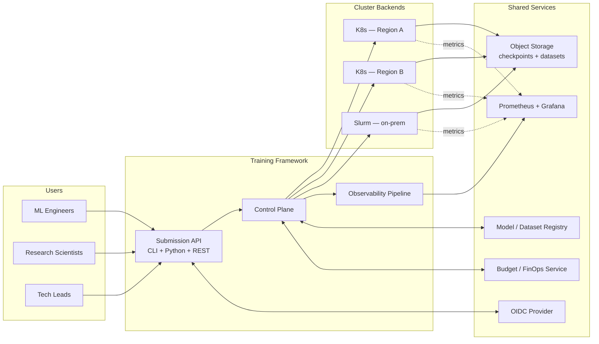
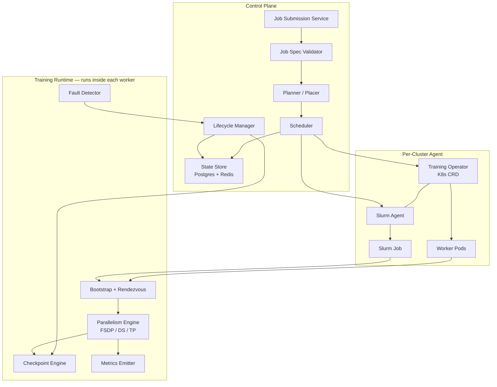
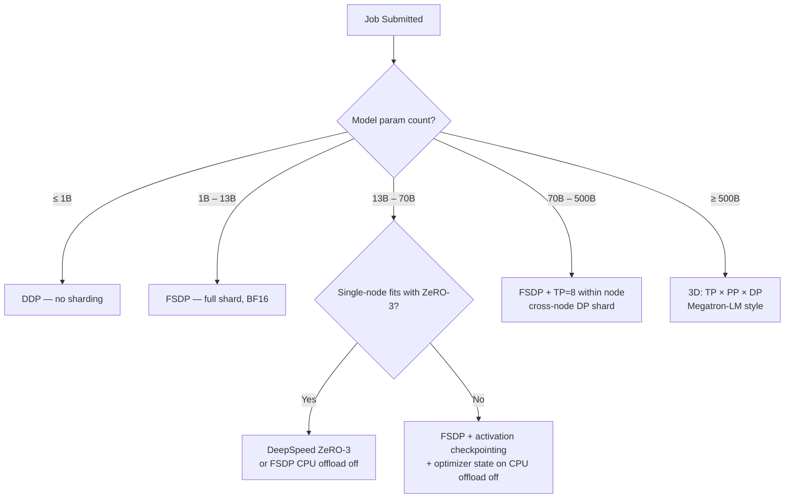
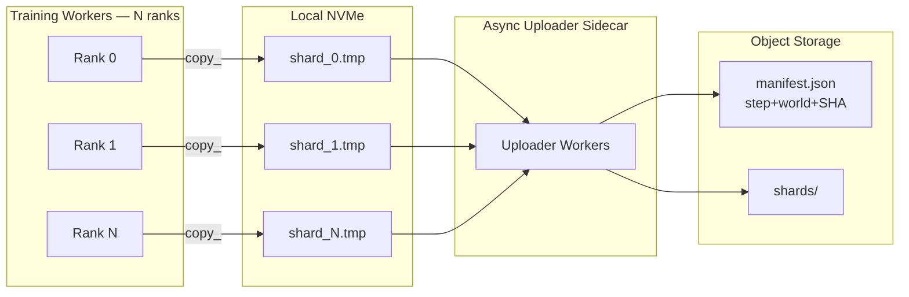
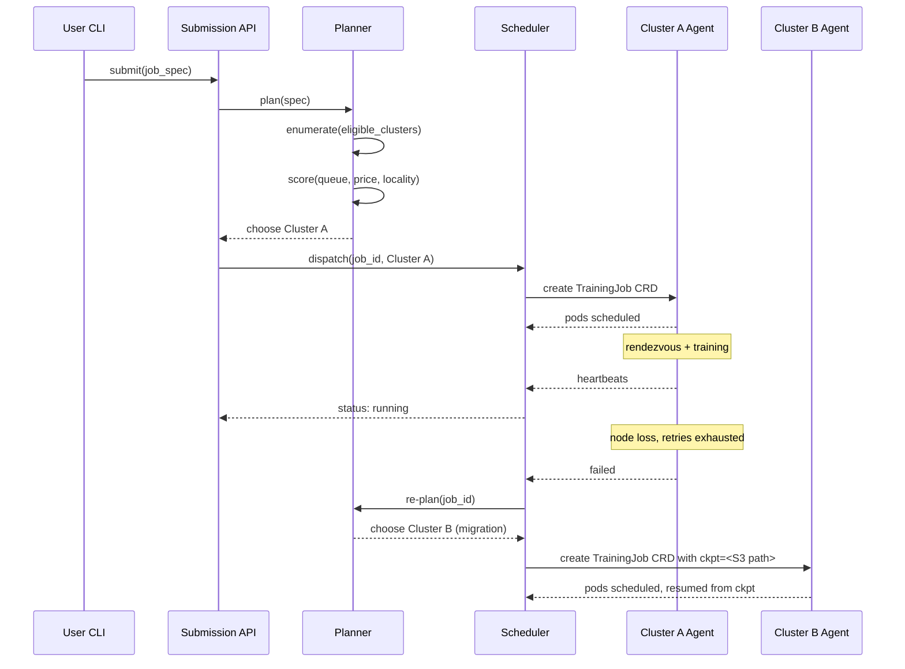
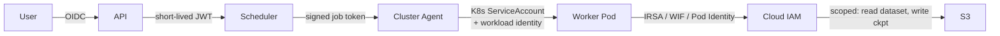

# Architecture — Project 01: Distributed Training Framework

This document describes the **target architecture** for the framework you will build. It is intentionally opinionated; you may diverge, but every deviation must be documented in an ADR.

The goal of this doc is to give you a coherent design to start from so you can spend your hours on the hard problems (sharding, fault tolerance, observability) instead of re-deriving the box-and-line layer from scratch.

---

## 1. System Context



The framework owns: **API**, **Control Plane**, **per-cluster Job Agent**, **Training Runtime library**, **Observability schema + dashboards**. Everything else (OIDC, S3, registry, Prometheus, budget service) is integrated, not owned.

---

## 2. Component Map



### 2.1 Control Plane components

| Component | Responsibility | Tech |
|-----------|----------------|------|
| **Submission Service** | Accept jobs via CLI/Python/REST; auth + rate limit | FastAPI + OIDC middleware |
| **Validator** | Static checks on job spec before any resource is touched | Pydantic + custom rules |
| **Planner / Placer** | Resolve job → (cluster, node-type, count); apply placement policy | Pure Python, pluggable policies |
| **Scheduler** | Submit to the chosen backend; track state | Talks to K8s API / Slurm REST / Ray |
| **State Store** | Authoritative job state, checkpoints, audit log | Postgres for durable, Redis for hot |
| **Lifecycle Manager** | Retries, preemption handling, migration | Async workers; consumes Fault Detector events |

### 2.2 Per-cluster Job Agent

This is the per-backend adapter. On Kubernetes it is a **CRD + Operator** (`TrainingJob` CRD); on Slurm it is a long-running agent that translates spec → `sbatch`.

The agent's job is to materialize the worker processes; it does **not** know about FSDP, checkpoints, or model code. That separation is critical — it lets you add a third backend (Ray, Nomad, raw VMs) without rewriting the training runtime.

### 2.3 Training Runtime (library)

Runs **inside each worker container**. It is what the user's training script `import`s.

```python
from training_framework.runtime import init, train_loop, checkpoint
ctx = init(job_spec)                       # rendezvous, parallelism setup
model = ctx.wrap(MyModel())                # FSDP or DeepSpeed wrap
for step in train_loop(ctx, dataloader):
    out = model(step.batch)
    out.loss.backward()
    ctx.optimizer.step()
    checkpoint.maybe_save(ctx, step)
```

Responsibilities of the runtime:
- Rendezvous (etcd / TCPStore / Slurm env)
- Wrap user model in FSDP / DeepSpeed based on job spec
- Maintain optimizer + LR scheduler
- Drive checkpoint engine on configured cadence
- Emit metrics + structured logs
- Detect local faults (NaN loss, NCCL hang, OOM) and report to control plane

---

## 3. Sharding Strategy — Decision Tree

This is one of the **load-bearing architectural decisions** of the project. Capture it in an ADR (`adr/0001-sharding-strategy.md`). A reasonable default tree:



The decision tree is informed by:
- Memory math: `param_bytes × (1 + grad + opt_state_factor) / shard_count` must fit per GPU after activations
- Comms math: TP requires NVLink-class within group; PP tolerates slow links; DP needs bandwidth proportional to gradient size
- Empirical: ZeRO-3 vs FSDP have different async-prefetch behaviors that matter at the 30B+ boundary

Your ADR should pick a *primary* (FSDP) and a *secondary* (DeepSpeed ZeRO-3) and explicitly note where Megatron-style TP becomes necessary. Don't try to support everything from day one; pick what your users actually need.

---

## 4. Checkpoint Topology



### Key decisions

1. **Sharded, not consolidated** — each rank writes its own shard. Consolidation is offline, on-demand for export.
2. **Async** — checkpoint to local NVMe synchronously (microseconds), then an uploader sidecar pushes to S3. Training resumes immediately.
3. **Manifest-based integrity** — a checkpoint is "good" only when the manifest is written *last* with `world_size`, `step`, `shard_sha256[]`. A torn checkpoint has no manifest and is ignored on resume.
4. **Topology-flexible** — for FSDP you store per-parameter shards keyed by FQN, allowing resume on a different world size (within divisibility constraints).
5. **Retention policy** — keep last K full checkpoints + a sparse history (every 100, every 1000); GC the rest with a separate job.

### Trade-offs

| Choice | Pro | Con |
|--------|-----|-----|
| Sharded, not consolidated | 10–100× faster write | Need export step for downstream consumers |
| Async upload | Hides network latency | Risk of double failure: node lost before upload completes |
| Manifest written last | Atomic-ish integrity | Adds one extra round-trip per ckpt |
| Topology-flexible (FSDP keyed by FQN) | Re-shard for resume | Format is more complex than `torch.save(state_dict)` |

The double-failure risk (#2 Con) is real. Mitigation: keep last N checkpoints on local NVMe across all ranks, and treat any checkpoint not yet in S3 as "best-effort only". Document this in the failure-mode analysis.

---

## 5. Fault Tolerance Model

State this **explicitly** in your design doc. It's the question reviewers will ask first.

| Failure | Detection | Recovery | RTO | Data loss |
|---------|-----------|----------|-----|-----------|
| Single worker pod OOM | K8s pod failure event | Restart pod, rejoin rendezvous, resume from last ckpt | ≤ 5 min @ 32 GPU | ≤ ckpt interval (≤ 30 min default) |
| Single node loss | K8s node NotReady | Reschedule pod, resume from last ckpt | ≤ 10 min @ 32 GPU | same |
| NCCL collective hang | Per-rank heartbeat timeout (3× p99 step time) | Kill rank, restart job from ckpt | ≤ 10 min | same |
| NaN loss | In-loop check after backward | Suspend job, alert on-call, do not restart | n/a | n/a |
| Spot preemption (2-min SIGTERM) | Trap signal, write ckpt synchronously | Re-queue at same priority, resume on new capacity | ≤ 15 min including queue wait | ≤ since last sync ckpt |
| Whole region outage | Control plane health check | Migrate to other region from ckpt (manual gate) | ≤ 30 min | ≤ ckpt interval |
| Bad checkpoint (corrupt) | Manifest mismatch on resume | Fall back to previous good ckpt | ≤ 5 min | ≤ 2 × ckpt interval |
| Disk full on node | Pre-flight + ckpt write fails | Drain node, reschedule | ≤ 10 min | same |
| Slow node ("straggler") | Per-rank step-time variance > 2σ | Alert; optional auto-drain after K stalls | n/a | n/a |
| Control-plane crash | Liveness probe | HA control plane (Postgres + Redis), restart pod | ≤ 2 min control-plane RTO | none (training continues) |

Note: training continues even if the control plane is down briefly, because rendezvous and gradient sync are between workers, not via the control plane. This is a deliberate decision — write it as an ADR.

---

## 6. Multi-Cluster Orchestration



### Placement policy

Pluggable. Reference implementations:
- `cheapest` — lowest $/GPU-hour among eligible (factors spot vs on-demand)
- `lowest-queue` — minimize expected queue wait
- `region-pin` — user explicitly pins to a region
- `data-locality` — prefer cluster co-located with dataset

Policy chains: e.g., `region-pin → cheapest → lowest-queue`. Document.

### Identity & secrets

Federated OIDC. The control plane mints a short-lived per-job token (e.g., 12 h) scoped to (read: datasets in spec, write: ckpt path in spec). Workers exchange this for cloud credentials via the cluster's workload identity provider (IRSA, GKE Workload Identity, AKS pod identity, or Vault for on-prem). Never put long-lived keys in the job spec.

---

## 7. Observability Schema

The metric and log schema is a **public API** — once teams build dashboards on it, you can't change it. Capture in an ADR.

### Mandatory labels on every metric

`job_id`, `team`, `cluster`, `rank`, `world_size`, `model_family`, `parallelism`

### Mandatory metrics (Prometheus exposition names)

```
training_step_seconds{phase="fwd|bwd|opt|total"}      histogram
training_loss                                          gauge
training_grad_norm                                     gauge
training_tokens_per_second                             gauge
gpu_sm_utilization_ratio                               gauge   (DCGM)
gpu_memory_used_bytes                                  gauge   (DCGM)
gpu_memory_reserved_bytes                              gauge
nccl_collective_seconds{op="allreduce|allgather|reducescatter"}  histogram
checkpoint_write_seconds                               histogram
checkpoint_bytes_written                               counter
job_node_failures_total                                counter
job_preemption_signals_total                           counter
```

### Mandatory log fields

`ts`, `level`, `job_id`, `rank`, `world_size`, `step`, `epoch`, `msg`, plus structured fields for the event.

### Dashboards shipped

- **Job overview** — one job, all ranks, key metrics, last 10 steps
- **Cluster overview** — all jobs on a cluster, queue depth, GPU utilization
- **Fleet overview** — across clusters, $ spent per team last 7d, MFU distribution
- **Postmortem dashboard** — given a `job_id`, dump everything from start to crash

---

## 8. Data Flow — A Single Training Step

```mermaid
sequenceDiagram
    participant DL as DataLoader
    participant RT as Runtime
    participant FSDP as FSDP-wrapped Model
    participant NCCL as NCCL
    participant OPT as Optimizer
    participant MET as Metrics
    participant CKPT as Checkpoint Engine

    DL->>RT: batch
    RT->>FSDP: forward(batch)
    FSDP->>NCCL: all-gather params (per layer)
    FSDP-->>RT: logits, loss
    RT->>FSDP: loss.backward()
    FSDP->>NCCL: reduce-scatter grads
    RT->>OPT: step()
    OPT-->>RT: param update (sharded)
    RT->>MET: emit step metrics
    RT->>CKPT: maybe_save(step)
    alt step % ckpt_interval == 0
        CKPT->>CKPT: write local shard
        CKPT-->>RT: return (async upload continues)
    end
```

---

## 9. Trade-offs and Alternatives Considered

You will write ADRs for the load-bearing decisions. For context, here's the menu and the strawman defaults:

| Decision | Default | Why | Major alternative |
|----------|---------|-----|-------------------|
| Primary sharding library | FSDP (PyTorch native) | Tracks upstream; no extra runtime; works with `torch.compile` | DeepSpeed ZeRO-3 — kept as secondary for memory-tight cases |
| Control plane storage | Postgres + Redis | Boring, durable, every infra team operates it | etcd directly (Kubernetes-only); ScyllaDB (overkill) |
| K8s integration style | CRD + Operator | Idiomatic K8s; works with existing tooling | Helm + raw Jobs (loses lifecycle); custom controller (reinvents wheel) |
| Multi-cluster glue | Custom control plane | Don't want to take a hard dep on KubeFed / Karmada | Use Karmada (loses control over placement logic) |
| Checkpoint format | Custom sharded + manifest | Need topology flexibility | `torch.distributed.checkpoint` (good — strongly consider; ADR should explain) |
| Comms backend | NCCL on NVIDIA, Gloo CPU fallback | Industry default | UCC / MSCCL (interesting for cross-vendor) |
| Rendezvous | etcd (K8s) / TCPStore (Slurm) | Boring, works | C10d EtcdStore directly; consul; custom |
| Job spec format | YAML + Pydantic | Familiar; validatable | HCL; Starlark (Bazel-style) — too cute |
| Observability | Prometheus + Grafana + Loki | Industry default | OpenTelemetry-only (good — defer until OTel metrics fully landed in PyTorch) |
| API style | REST + CLI + Python SDK | Three real entry points users want | gRPC (no browser story); GraphQL (overkill) |

**Heuristic:** at this scope, *boring choices* are correct choices. Save your innovation budget for the hard problems (failure model, topology-flexible checkpoints, MFU optimization).

---

## 10. Security Architecture (Brief)



- All inter-component calls signed.
- Per-job credentials minted, never long-lived, never user-managed.
- Checkpoint paths and dataset paths are part of the job spec and enforced by IAM, not by trust in the user's code.
- Job containers run as non-root, read-only root FS, drop all capabilities except `SYS_NICE` if pinned.

Full security review is a separate artifact — but the architecture must not require revisiting these decisions to add auth later.

---

## 11. What's Explicitly Not in the Architecture

- A web UI (Grafana + CLI is enough)
- A model registry (integrate with existing)
- A data versioning system (assume immutable URIs)
- Cross-organization federated training
- Auto-tuning of hyperparameters (Ray Tune is a downstream integration, not first-party)

Each of these is a multi-month project on its own. Resist scope creep.

---

## 12. Open Questions for Your Design Doc

Your design doc must explicitly resolve these. Don't leave them for "v2":

1. Do you build on `torch.distributed.checkpoint` or roll your own? If you roll your own, what specifically does the upstream not give you?
2. Do you require a specific Kubernetes version or stay compatible with 1.27+?
3. What is the SLA on the control plane? 99.9 %? 99.95 %? What infra do you need for it?
4. Where do dataset access credentials come from in the multi-cluster case where cloud accounts differ?
5. What is the policy for jobs whose spec is "valid" but whose memory math doesn't fit (and the user didn't run dry-run)? Refuse at submission, or fail fast at first step?
6. Who owns the framework on-call rotation? (You can't avoid this question by claiming "users own their jobs"; the framework itself is on-call surface.)
