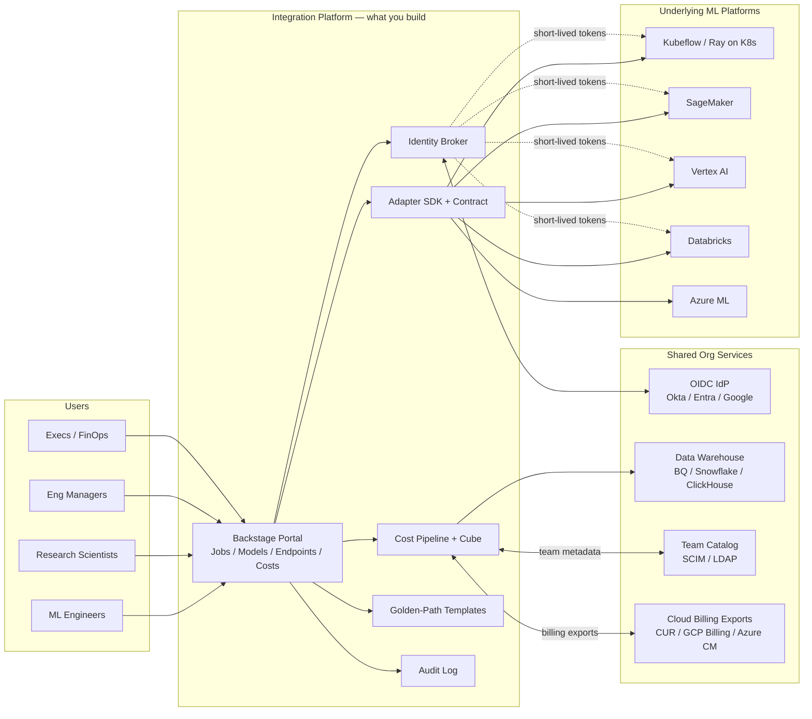
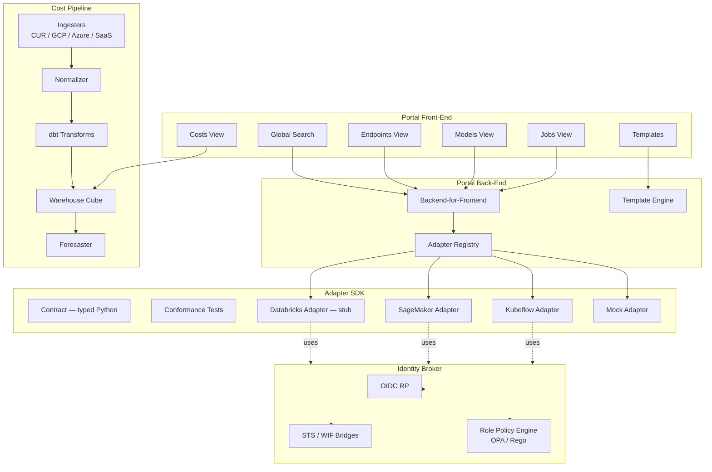
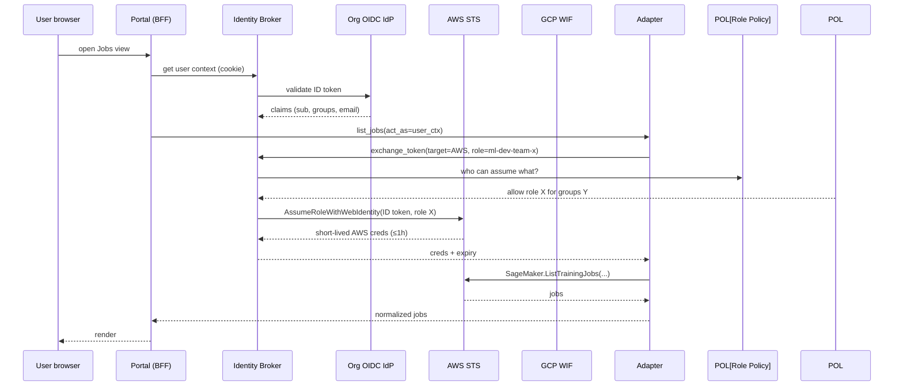
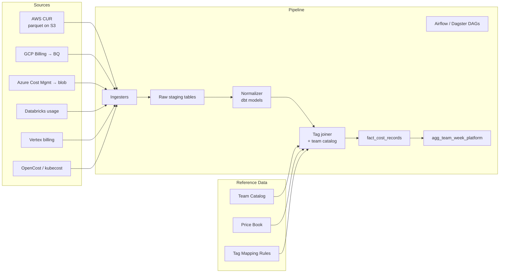
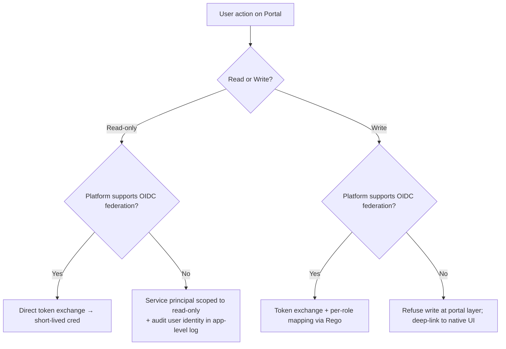
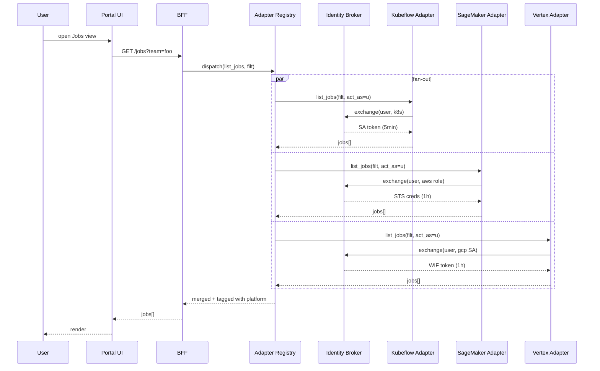

# Architecture — Project 02: Cross-Team Platform Integration

This document describes the **target architecture** for the integration platform. It is intentionally opinionated; deviations are fine but every load-bearing one must be documented in an ADR.

The goal is to give you a coherent design to start from so you spend hours on the hard problems (identity, cost normalization, adapter contract) instead of re-deriving the box-and-line layer.

---

## 1. System Context



The integration platform owns: **portal**, **adapter SDK**, **identity broker**, **cost pipeline**, **templates**, **audit log**. Everything else is integrated, not owned.

---

## 2. Component Map



### 2.1 Portal (Frontend + BFF)

| Component | Responsibility | Tech |
|-----------|----------------|------|
| **Portal UI** | Views, navigation, search, template browse | Backstage (React + TS plugins) |
| **BFF** | Auth context, multiplex adapter calls, cache | Backstage backend (Node) or a thin FastAPI gateway |
| **Adapter Registry** | Holds configured adapters, exposes one logical API | Pluggable; backend |
| **Template Engine** | Renders software templates with user inputs | Backstage software templates |
| **Audit Log** | Append-only event log of cross-platform actions | Kafka topic → ClickHouse, or Loki |

### 2.2 Adapter SDK

Runs **per-backend**. Defines the contract every platform integration must implement.

```python
# Pseudocode of the contract
class PlatformAdapter(Protocol):
    name: str
    platform_kind: Literal["k8s-ml", "saas-sagemaker", "saas-vertex",
                           "saas-databricks", "saas-azureml", "other"]

    def list_jobs(self, filt: JobFilter, page: Page) -> JobPage: ...
    def get_job(self, id: str, ctx: ActAsContext) -> Job: ...
    def cancel_job(self, id: str, ctx: ActAsContext) -> None: ...

    def list_models(self, filt: ModelFilter, page: Page) -> ModelPage: ...
    def get_model(self, id: str, version: str, ctx: ActAsContext) -> Model: ...

    def list_endpoints(self, filt: EndpointFilter, page: Page) -> EndpointPage: ...
    def get_endpoint(self, id: str, ctx: ActAsContext) -> Endpoint: ...

    def cost_records(self, time_range: TimeRange) -> Iterator[NormalizedCostRecord]: ...

    def deep_link(self, kind: ResourceKind, id: str) -> URL: ...
```

`ActAsContext` carries the user's identity plus the per-platform credential minted by the identity broker. Adapters never see long-lived secrets.

Conformance tests cover: pagination, empty results, auth failures, malformed responses, rate limiting, partial outage. ≥ 30 contract tests, parameterized per adapter.

### 2.3 Identity Broker



Key invariants:

1. **No long-lived secrets on the user device.** Browser holds an HTTP-only session cookie; everything else is server-side.
2. **No long-lived secrets in the broker per user.** Tokens are minted on demand, cached briefly (~10 min) within their TTL, scrubbed on logout.
3. **Role mapping is data, not code.** A Rego policy or YAML file maps `org_group → (platform, role)`. Changing it is a PR, not a code release.
4. **Audit is mandatory.** Every mint logs `actor`, `target_platform`, `target_role`, `request_id`, `expires_at`.

### 2.4 Cost Pipeline



### Normalized cost record (the schema is a public API)

| Field | Type | Notes |
|-------|------|-------|
| ts | timestamp | hour-grain |
| platform | enum | `aws_sagemaker`, `gcp_vertex`, `azure_aml`, `databricks`, `k8s_kubeflow`, … |
| account | string | cloud account / workspace id |
| team | string | resolved from tags + catalog; `unknown` allowed |
| project | string | resolved from tags + catalog; `unknown` allowed |
| resource_type | enum | `gpu_hour`, `cpu_hour`, `storage_gb_month`, `egress_gb`, `endpoint_hour`, … |
| resource_id | string | platform-specific id (job arn, endpoint name, cluster id) |
| quantity | float | |
| unit | string | `gpu_hour`, `gb_month`, … |
| cost_usd | float | normalized to USD via price book |
| currency | string | source currency (for audit) |
| region | string | |
| is_spot | bool | nullable; `null` means not reported |
| tags | json | raw tag map (for debugging) |
| coverage_flag | enum | `attributed` / `unattributed_team` / `unattributed_project` |

The `coverage_flag` is non-negotiable. Every record reports honestly whether team/project attribution was possible.

### 2.5 Templates

Backstage software templates with three opinionated paths:

- `train-model` — scaffolds a Git repo containing model code, a CI workflow, a job spec for the chosen backend, a model card stub, and an entry in the registry
- `serve-model` — scaffolds a serving deployment (container, autoscaling policy, dashboard, alert)
- `evaluate-offline` — scaffolds an eval pipeline with a held-out dataset reference, metric definitions, a notebook for the eval owner

Each template:
- Asks for **backend choice** at scaffold time (and writes that choice into a single re-platformable file)
- Wires telemetry: who, when, which template, which backend
- Generates a runbook stub the team must fill in before the first run

---

## 3. Adapter Contract — Decision Boundaries

The contract is the load-bearing API of this whole project. Capture in `adr/0001-adapter-contract.md`.

### Read vs act

The contract is mostly **read**. Write operations are limited to:
- `cancel_job` — universally supported, low blast radius
- `submit_job_via_template` — goes through the template engine; the template-rendered config is what the platform sees

The portal does **not** expose model deletion, endpoint recreation, RBAC edits, or quota changes. Those stay on the underlying platform's native UI.

### Stability

The contract is versioned. Breaking changes follow:
1. Add the new shape additively
2. Mark old fields deprecated for 90 days
3. Remove after 90 days *and* a notice in the portal changelog

Adapter implementations may evolve faster, but the contract is the public surface.

### Multi-tenancy

The contract assumes a single org. Cross-org / cross-tenant is explicitly out of scope.

---

## 4. Identity Model — Decision Tree



Three classes of platform:
- **Native federation** (AWS, GCP, Azure, Kubernetes) — first-class token exchange
- **OAuth 2.0 service-principal** (Databricks, some SaaS) — broker holds an SP credential, audits at app layer with original user id
- **Legacy API key only** — adapter is **read-only**; write operations refused at portal

Be explicit which platform is which. Don't paper over.

---

## 5. Cost Pipeline — Failure Model

| Failure | Detection | Recovery | Coverage impact |
|---------|-----------|----------|----------------|
| CUR export delayed | DAG sensor times out | Re-run on next schedule; mark partial | `coverage_flag=attributed` but stale |
| Tag mapping rule drift | Daily reconcile job vs catalog | Alert; do not silently re-tag historical | `unattributed_team` rate rises |
| Team catalog gap | Foreign key check at TAG step | Records land with `team=unknown`; PR to fix mapping | `unattributed_team` per gap |
| Price book version skew | Versioned price book; pinned per record | Re-run affected window with corrected book | none if re-run completes |
| Schema drift in source | Ingester schema check | Quarantine to `staging_quarantine`; alert | gap until adapter updated |
| Warehouse outage | dbt run failure | Retry; if > 6h, page on-call | freshness lag |

The pipeline never silently drops or fabricates records. A missing record is a `null` and a coverage flag; never a guess.

---

## 6. Portal Failure Model

| Failure | UX | Operational behavior |
|---------|----|----------------------|
| One adapter down | Banner on affected view; other views work | Auto-page adapter owner via PagerDuty/Opsgenie |
| Identity broker down | Login fails; warning page with direct platform links | Page broker on-call |
| Cost cube down | Costs view shows "stale as of <ts>" with last cached aggregate | Page data on-call |
| Template engine down | Template browse works; instantiation disabled | Page portal on-call |
| Portal itself down | DNS still resolves; static page shows direct links to native platform UIs | Page portal on-call |

The portal is **never** allowed to block a developer from reaching the underlying platform. Direct deep-links are first-class.

---

## 7. Observability Schema

The integration layer must be observable end-to-end.

### Mandatory metrics (Prometheus / OpenTelemetry)

```
portal_page_load_seconds{view, p="50|95|99"}                histogram
portal_adapter_call_seconds{adapter, op}                    histogram
portal_adapter_errors_total{adapter, op, code}              counter
identity_token_exchange_seconds{target_platform}            histogram
identity_token_exchange_errors_total{target_platform, code} counter
cost_pipeline_records_ingested_total{platform}              counter
cost_pipeline_attribution_rate{platform}                    gauge   (0..1)
cost_pipeline_freshness_seconds{platform}                   gauge
template_instantiations_total{template, backend, result}    counter
audit_events_total{action, platform}                        counter
```

### Mandatory tracing

OpenTelemetry distributed traces span: portal → BFF → adapter → identity broker → backend platform. Trace IDs surface in the audit log under `request_id`.

### Mandatory dashboards

- **Portal health** — page load p50/p95, adapter call success per adapter, cache hit rate
- **Adoption** — DAU on portal, template instantiations by week, golden-path completion funnel
- **Cost coverage** — % of platform spend attributed to a team; freshness per platform
- **Identity broker** — token exchange volume, error rate, p95 latency per target
- **Audit** — actions by platform; spike-detection on writes

---

## 8. Data Flow — A Single "List My Jobs" Request



Latency budget: ≤ 2 s p95 portal-end-to-end. Adapter calls in parallel; cache by `(user, filter)` for 30 s.

---

## 9. Trade-offs and Alternatives Considered

| Decision | Default | Why | Major alternative |
|----------|---------|-----|-------------------|
| IDP framework | Backstage | OSS, vast plugin ecosystem, React | Port (SaaS, faster but locks you in); custom (loses ecosystem) |
| Adapter language | Python | Aligns with ML platform SDKs (boto3, kfp, google-cloud-aiplatform, databricks-sdk) | Go (faster but most platform SDKs are weaker) |
| Identity broker | Custom thin service in front of cloud STS / WIF | Direct control; auditable | Cerbos / SpiceDB only (good for policy, not token mint) |
| Policy engine | OPA / Rego for role mapping | Industry standard; data-driven | Cedar (interesting, less mature in this stack) |
| Cost warehouse | BigQuery or ClickHouse | Cheap, scalable, fast | Snowflake (cost rules out); Postgres (won't scale) |
| Cost pipeline orchestrator | Dagster or Airflow | Battle-tested; observable | Custom scheduler (don't) |
| Cost transforms | dbt | Versioned, testable SQL | Custom Python (loses lineage tooling) |
| Audit log store | ClickHouse | Cheap append; fast query | Kafka-only (no ad-hoc query); Splunk (cost) |
| Adapter contract format | Typed Python Protocol + Pydantic for over-the-wire | Mypy strict gives us guard rails | gRPC (heavier for non-perf-critical contract) |
| Template format | Backstage software templates | Native to portal | Cookiecutter (loses portal integration) |

**Heuristic:** at integration scope, *boring choices* are correct choices. The interesting work is the contract, the identity model, and the cost coverage story — save innovation budget for those.

---

## 10. Security Architecture (Brief)

```mermaid
flowchart LR
    USER[User] -->|OIDC code flow| FE[Portal UI]
    FE -->|HTTP-only cookie<br/>session in BFF| BFF[BFF]
    BFF -->|server-side ID token| IB[Identity Broker]
    IB -->|RFC 8693 token exchange<br/>per call| STS[STS / WIF / Token Endpoint]
    STS -->|short-lived cred ≤1h| ADP[Adapter]
    ADP -->|signed requests| BE[Backend Platform]
```



- No long-lived per-user secret leaves the IdP.
- Browser never holds platform credentials.
- Broker scoped role chosen by Rego policy; role decisions are auditable independent of the adapter code.
- Every cross-platform action emits an audit event with `request_id` linkable to the OTel trace.
- Audit retention ≥ 1 year, append-only storage (object storage with versioning + lock, or ClickHouse with delete-disabled grant).

Full security review is a separate artifact; the architecture must not require revisiting these decisions to satisfy a security partner.

---

## 11. What's Explicitly Not in the Architecture

- A new ML platform (you are integrating, not replacing)
- A new model registry (federate over existing)
- A new billing system (you produce data; chargeback is downstream)
- A new identity provider (federate to existing)
- Cross-org / cross-tenant data plane
- Approval workflows / governance gates (display only)
- Fine-grained per-resource RBAC (delegated to platforms)

Each of these is its own multi-month project. Resist scope creep.

---

## 12. Open Questions for Your Design Doc

Your design doc must explicitly resolve these. Don't punt:

1. What is the **contract version** policy? When you have 4 adapters and the contract evolves, how do older adapters survive?
2. Who **owns** the cost cube — platform team, data team, FinOps? Where does the on-call live?
3. What happens when a **platform's API breaks** — circuit-breaker the adapter, or fail-open with last-known data?
4. What is the **promotion path** from an experimental adapter to a "blessed" adapter that the portal surfaces to all users?
5. How do you **deprecate** an adapter when a platform is wound down? What is the 90-day notice mechanism in the portal?
6. **Compliance**: does the audit log satisfy SOC 2 / ISO 27001 evidence requirements? If yes, name the control; if no, what's the gap?
7. **Cross-region**: if the portal is hosted in one region but an adapter has to call a service in another, how do you avoid the egress + latency tax?
