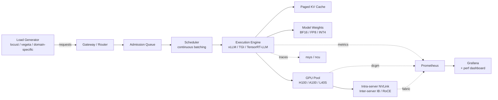
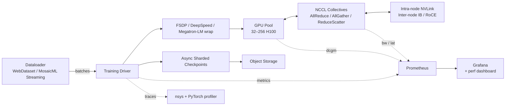
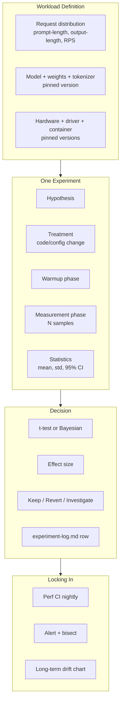
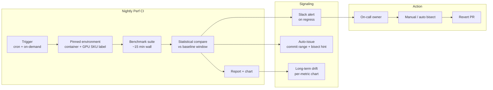
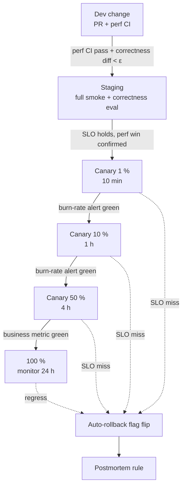

# Architecture — Project 03: Performance Optimization Initiative

This document describes the **methodology architecture** and the **technical surface** for the optimization campaign. It is intentionally opinionated; deviations are fine but every load-bearing one must be documented in an ADR.

Performance work has two architectures: one for how the *system under test* fits together, and one for how the *measurement and decision-making* fit together. Both matter. The second is often where principal-level work is judged.

---

## 1. System Context — Two Reference Targets

You will pick **one** of the two reference targets below. The architecture differs substantively; do not try to do both.

### 1.A Reference Target — LLM Inference Serving



### 1.B Reference Target — LLM Training



Pick one and own it. The optimization layers (kernel / framework / system / policy) apply to both; the specific techniques differ.

---

## 2. Measurement Architecture (the more important one)



### Why the measurement architecture matters

The single most common way principal-track perf work fails is by **measuring poorly**. The headline number is wrong, the reviewer notices, the rest of the project loses credibility. Lock down measurement before touching a kernel:

1. **Workload definition is the contract.** Pin everything: request distribution, model version, dataset, hardware SKU, driver, container, kernel module versions.
2. **Warmup is not negotiable.** First N seconds of any run discarded. Compiles, JITs, page faults, allocator warming.
3. **Sample size is computed, not guessed.** Use a power calculation from baseline variance and target effect size to get N.
4. **Statistical tests are written in the doc, not chosen post-hoc.** Pre-register: Welch's t-test on means with α=0.01, or Bayesian with HDI > 99 %.
5. **Confounders are addressed.** Same time-of-day window or randomized order; same node (or pool), not "whatever was free."

---

## 3. Optimization Layers — The Knob Inventory

You will not turn every knob. You will pick **a handful per layer** that the profile points at, and you will document the rest as "considered, didn't pursue, here's why."

### 3.1 Kernel layer

| Technique | When applicable | Cost / risk |
|-----------|----------------|-------------|
| **FlashAttention-2** | Any attention-heavy model on Ampere+; default for new work | Low if upstream; medium if you maintain your own |
| **FlashAttention-3** | Hopper (H100); +1.5–2× over FA-2 in many shapes | Hopper-only; PyTorch integration newer |
| **Fused QKV projection + RoPE + attention** | Memory-bound prefill | Custom kernel; numeric care |
| **Fused MLP (GEMM + bias + GELU/SiLU)** | Many small ops in MLP | Triton-friendly |
| **Fused RMSNorm** | Llama-style models | Low risk |
| **FP8 via NVIDIA Transformer Engine** | Hopper; training and inference | Numeric per-tensor scaling; needs eval |
| **Weight-only INT4 quantization (AWQ / GPTQ)** | Inference memory-bound | Accuracy delta required |
| **SmoothQuant (W8A8)** | Inference compute-bound for low-end GPU | Activation outliers handled |
| **Custom Triton kernel** | Specific shape not in upstream | High authoring cost; high learning |
| **Tensor-core utilization tuning** | Anywhere `nvprof` shows < 60 % TC util | Often a config tweak |

### 3.2 Framework layer

For **inference**:

| Technique | When applicable |
|-----------|----------------|
| **vLLM continuous batching + paged KV** | LLM serving, mixed prompt lengths |
| **Chunked prefill** | Long prompts blocking decode |
| **Speculative decoding** (Medusa / EAGLE / draft+verifier) | Memory-bandwidth-bound decode |
| **Prefix caching** | Repeated system prompts / RAG |
| **TensorRT-LLM** | NVIDIA SKU lock-in acceptable; want max throughput per GPU |
| **`torch.compile` + CUDA Graphs** | Static shapes; warmup acceptable |

For **training**:

| Technique | When applicable |
|-----------|----------------|
| **FSDP comms overlap tuning** | Multi-node FSDP not hitting compute-bound |
| **Selective activation checkpointing** | Memory headroom vs recompute trade |
| **ZeRO stage choice (1/2/3)** | Memory vs comms trade |
| **`torch.compile` with dynamic shapes off** | Static training shape |
| **Microbatch sizing + grad accumulation** | Find compute-bound batch |
| **Tensor parallel within node** | 70B+ models |
| **MoE expert placement** | Mixture-of-experts cross-node BW dominates |

### 3.3 System layer

| Technique | Signal it's worth doing |
|-----------|-------------------------|
| **NCCL_ALGO / NCCL_PROTO tuning** | NCCL test BW below expected; profile shows comms stalls |
| **NCCL_NTHREADS / NCCL_BUFFSIZE** | Small-message AllReduce dominating |
| **Topology-aware ranks (NUMA + GPU + NIC pinning)** | Cross-socket / cross-NIC traffic visible |
| **GPU clock policy / persistence mode** | DVFS-induced jitter |
| **CUDA allocator tuning** (`PYTORCH_CUDA_ALLOC_CONF`) | Fragmentation; expandable segments |
| **Hugepages** | TLB miss in profile |
| **Network MTU / EFA tuning** | Inter-node BW below theoretical |
| **CPU isolation / pinning** | Host-side noise in latency p99 |

### 3.4 Policy layer

| Technique | When applicable |
|-----------|----------------|
| **Request routing by sequence-length bucket** | Mixed-length workload causing tail |
| **SLO-aware admission control** | Goodput collapses at overload |
| **Predictive autoscaling** | Capacity ramp lags demand |
| **Priority queueing** | Multiple tenants share fleet |
| **Batch admission policy (max in-flight tokens)** | KV cache thrash |
| **Cache warmup on deploy** | Cold-start spikes |

The principal-level move is to **profile first**, then pick knobs the profile points at — not to enable every flag in the table.

---

## 4. Statistical Methodology

A pre-registered template for every experiment row.

```
Experiment ID: 014
Hypothesis: Enabling FA-3 on H100 reduces TTFT p99 at QPS=128 by ≥ 15 %.
Baseline metric: TTFT_p99 = 245 ms ± 12 ms (N=10000, CI95)
Treatment: deploy build sha=abc1234 with FA-3 enabled via env var X
Sample size: N = 10000 requests per arm; computed for MDE=10% at α=0.01, power=0.9
Workload: prompt-len ~ Zipf(α=1.1), output-len ~ LogN(μ=4, σ=1), QPS=128 closed loop
Hardware: 8× H100 80GB SXM5, single node, NVLink, driver 550.x, CUDA 12.4
Confounders addressed: same node, alternating arms every 60s for 2h, warmup 5min discarded
Measurement: TTFT_p99 = 198 ms ± 9 ms (N=10000)
Statistical test: Welch's t-test on p99 bootstrap; p < 0.001; effect = -19.2% (CI95 [-21.7, -16.4])
Attribution: estimated 60% kernel time reduction in attention prefill; 40% headroom for batch growth
Decision: KEEP; rolled to canary 10 % via PR #234
Risk / rollback: env var off → FA-2 fallback; verified parity within ε=1e-3 logits on eval set
```

Every experiment in the log uses this template (or a strict subset of it). Reviewers will read for *structure* before they read for *numbers*.

---

## 5. Performance CI Architecture



### Statistical detection

Don't use a fixed threshold ("alert if > 5 % regression"). Use a **statistical test** against a rolling baseline window (e.g., last 14 days): one-sided Welch's t-test, α=0.01. This avoids alert fatigue when daily noise is high and avoids missing slow drift when noise is low.

For the rubric demo: open a PR that intentionally regresses the smoke benchmark by ≥ 5 %, verify the CI catches it within one run, attach the chart.

---

## 6. Layer Correlation — How to Read a Profile

A common junior mistake is to look only at one tool. Principal-level work correlates:

```mermaid
flowchart LR
    subgraph K[Kernel — ncu]
        K1[GEMM efficiency]
        K2[Memory throughput]
        K3[TC utilization]
        K4[Stall reasons]
    end

    subgraph F[Framework — PyTorch profiler / Chrome trace]
        F1[Op-level time]
        F2[Comms overlap]
        F3[Host-side gaps]
    end

    subgraph S[System — nsys + DCGM]
        S1[Kernel timeline + bubbles]
        S2[SM utilization]
        S3[NCCL collective time]
        S4[NVLink / IB BW]
    end

    subgraph P[Policy — Prom + dashboard]
        P1[QPS / batch size]
        P2[Queue depth]
        P3[p50/p99 latency]
        P4[Goodput]
    end

    K -.zoom out.-> F
    F -.zoom out.-> S
    S -.zoom out.-> P
    P -.zoom in.-> S
    S -.zoom in.-> F
    F -.zoom in.-> K
```



The narrative for a single optimization should always be: a **policy** symptom (p99 spiked) was traced to a **system** signal (NCCL collective time grew) traced to a **framework** behavior (FSDP wasn't overlapping a comms op) traced to a **kernel** root cause (a synchronization barrier was unnecessary). The fix happens at the kernel; the win is reported at the policy.

If the narrative only lives at one layer, you haven't done principal-grade work.

---

## 7. Rollback & Canary Architecture



### Rollback principles
1. **Every optimization is feature-flagged.** No "edit and pray."
2. **Reliability SLO is non-negotiable.** A perf win at the cost of SLO is a regression.
3. **The on-call who triggers a rollback is not blamed.** Optimizations are reversible by design.
4. **Postmortem rule**: any rollback writes a postmortem within one week, addressed to both the perf and reliability teams.

---

## 8. Observability Schema for Perf Work

Beyond the system's normal metrics, the optimization campaign emits its own.

```
perf_experiment_runs_total{exp_id, arm}                       counter
perf_experiment_metric_seconds{exp_id, arm, p="50|95|99"}     histogram
perf_canary_traffic_share{change_id, env}                     gauge   (0..1)
perf_correctness_divergence_ratio{change_id, metric}          gauge
perf_ci_regression_alerts_total{benchmark, change_range}      counter
perf_tunable_set{name, value}                                 info
```

A perf dashboard in Grafana ships with the project, showing:
1. The headline metric over time, baseline overlay
2. Per-experiment arm distributions (violin or box plots)
3. Correctness divergence over time
4. Canary traffic and SLO burn rate

---

## 9. Trade-offs and Alternatives Considered

| Decision | Default | Why | Major alternative |
|----------|---------|-----|-------------------|
| Reference target | LLM inference serving | Largest org cost in most companies; clear metrics | LLM training (also valid; pick one) |
| Profiler | nsys + ncu + PyTorch profiler | NVIDIA stack standard, deep | AMD `rocprof`, Intel VTune (valid for those vendors) |
| Inference engine | vLLM | Mature continuous batching + paged KV; OSS | TGI, TensorRT-LLM, MK-1 (all credible) |
| Statistical test | Welch's t-test on percentiles via bootstrap | Robust, well-understood | Bayesian estimation (interesting; document if used) |
| Perf CI threshold | Statistical (rolling-window t-test) | Adapts to noise | Fixed % (creates alert fatigue) |
| Kernel author tool | Triton | Friendly, productive, good for shape exploration | Raw CUDA (when Triton can't express it) |
| Quantization method | AWQ for inference weight-only | Strong accuracy-vs-bits trade | GPTQ, SmoothQuant, SqueezeLLM |
| Canary infrastructure | Whatever the org already uses | Don't invent | New canary system (only if existing is broken) |
| Workload generator | locust or vegeta + custom request distribution | Reproducible, scriptable | k6, wrk2 (also fine) |
| Rollback mechanism | Feature flag with kill switch | Fast, audited | Image redeploy (slower; acceptable if CI/CD is fast) |

**Heuristic:** in performance, *measurement quality* is the leverage point. Boring measurement + interesting optimizations beats interesting measurement + boring optimizations every time.

---

## 10. What's Explicitly Not in the Architecture

- A new framework (you patch existing ones; you don't replace them)
- A new profiler (use nsys / ncu / PyTorch profiler / DCGM)
- A new orchestration system
- A new identity system
- Cross-vendor portability (if you target NVIDIA, you target NVIDIA — note AMD considerations if relevant)
- Multi-modal optimization in the same project (pick text **or** vision **or** audio for the campaign)

Each of these is its own multi-month project. Resist scope creep.

---

## 11. Open Questions for Your Design Doc

Your design doc must explicitly resolve these:

1. **The metric**: which one, why, and what's the business connection? What's the dollar value of moving it 30 %?
2. **The baseline**: how did you measure it, what's the noise floor, what's the MDE?
3. **The hardware story**: are you reporting results on H100 / A100 / something else? How do you extrapolate (if you do) to production hardware you don't have?
4. **The correctness contract**: what is "correct enough"? Logits diff? Eval accuracy delta? Loss curve overlap?
5. **The durability story**: when the next model ships, what wins are kept, what need re-optimization?
6. **The rollback story**: who flips the flag at 3am? What signal triggers them?
7. **The campaign budget**: 100 hours; how many for measurement, how many for optimization, how many for the CI + narrative? Defend the split.
