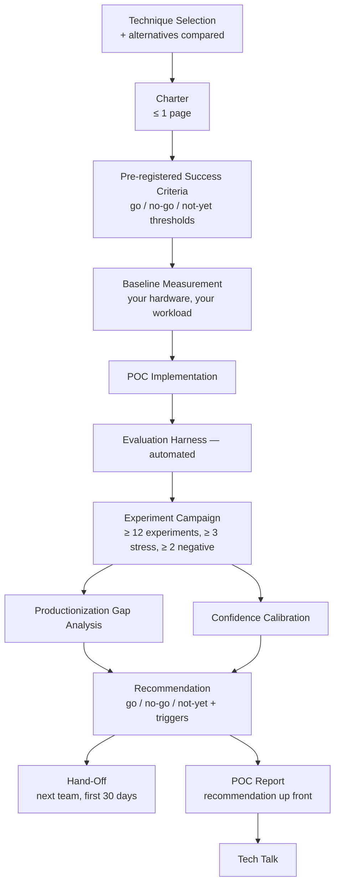
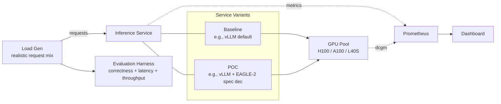
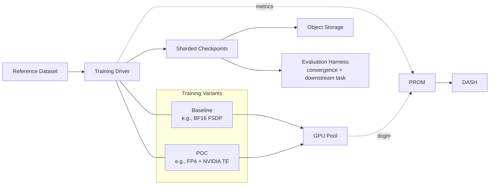
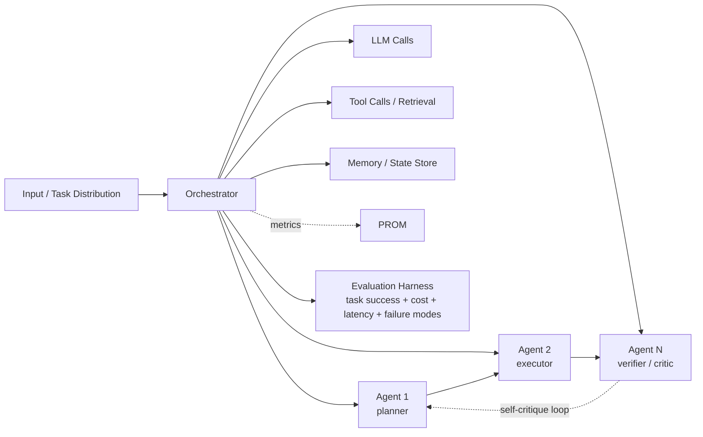
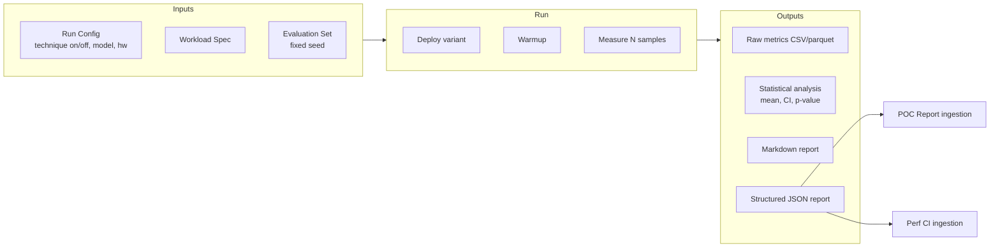
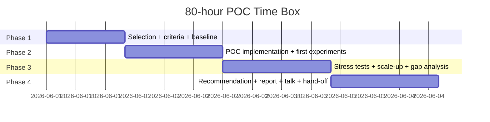

# Architecture — Project 04: Technical Innovation POC

This document describes the **POC architecture** and the **decision architecture** for the campaign. It is intentionally opinionated; deviations are fine but every load-bearing one must be documented in an ADR.

Innovation POCs have two architectures: one for *the thing you build* (technique-specific) and one for *how you decide what it means* (the same every time). The second is where principal-level work is judged.

---

## 1. Decision Architecture (the more important one)

This is the spine of the project. Whatever technique you pick, this architecture stays the same.



Key invariants:

1. **Pre-registration is non-negotiable.** Commit success criteria to git before the first experiment. Post-hoc criteria are rationalization, not methodology.
2. **Baseline is on your stack.** The paper's benchmark is interesting but not sufficient. Re-measure on your hardware, your model size, your data distribution.
3. **Confidence is calibrated.** A recommendation with "high confidence" is unfalsifiable. A recommendation with "70 %, would flip to no-go if X happens" is testable.
4. **Hand-off is explicit.** The project ends with a named next owner. Not "we'll figure that out."

---

## 2. Technique-Side System Context

Each candidate technique has its own architecture. Below are three reference shapes; pick the one closest to your chosen technique and adapt.

### 2.A Inference Technique (e.g., speculative decoding, FP8 inference, paged-KV at extreme concurrency)



### 2.B Training Technique (e.g., FP4 training, MoE training, online RLHF)



### 2.C Pipeline / Agentic Technique (e.g., agentic ML pipelines, self-healing inference)



The technique-side architecture matters, but it is **secondary**. What makes the POC principal-grade is the decision architecture above. A perfect technique implementation with no pre-registered criteria, no stress tests, and no calibrated recommendation is a junior project at scale.

---

## 3. Success-Criteria Schema (Pre-Registered)

A pre-registered success-criteria document follows a strict schema. Reviewers should be able to score the project against this document mechanically.

```yaml
# docs/success-criteria.md (also commit as YAML for machine-parsability)
technique: "eagle-2-speculative-decoding"
pre_registered_at_commit: "abc1234"
baseline_measured_at_commit: "abc1230"

primary_metrics:
  - name: ttft_p99_ms
    direction: lower_is_better
    baseline_value: 245
    baseline_ci95: [233, 257]
    go_threshold: { value: 160, condition: "<= 160ms at QPS=128, prompt-len=256" }
    no_go_threshold: { value: 220, condition: ">= 220ms" }
    not_yet_band: { lo: 160, hi: 220 }
  - name: throughput_tokens_per_second
    direction: higher_is_better
    baseline_value: 3200
    baseline_ci95: [3050, 3350]
    go_threshold: { value: 4800, condition: "1.5x or higher" }
    no_go_threshold: { value: 3500, condition: "< 10% over baseline" }
    not_yet_band: { lo: 3500, hi: 4800 }

secondary_metrics:
  - name: accuracy_diff
    direction: as_low_as_possible
    threshold_for_go: "<= 0.5pp drop on MMLU"
  - name: correctness_logits_diff
    threshold_for_go: "median KL divergence <= 1e-3 on held-out prompts"
  - name: cost_per_M_tokens_usd
    direction: lower_is_better
    threshold_for_go: ">= 20% reduction"

stress_conditions:
  - "QPS=512 saturation"
  - "prompt-length p99=2048 (long context)"
  - "batch with extreme variance in output length"

decision_matrix:
  - "All primary metrics in go-band AND all secondaries pass: GO"
  - "Any primary in no-go band: NO-GO"
  - "Otherwise: NOT-YET, with explicit trigger conditions"
```

This file changes the conversation from "did the technique work?" (subjective) to "did the technique cross threshold X?" (objective).

---

## 4. Evaluation Harness Architecture



### Principles

1. **Two-arm experiments by default.** Always compare to a baseline run on the same hardware in the same time window.
2. **Fixed seed for the evaluation set.** Reproducibility requires a frozen corpus.
3. **Diff vs baseline, not absolute numbers.** Report `delta = (treatment - baseline) / baseline` with CI.
4. **Machine-readable output.** JSON first, Markdown rendered from JSON, so the report is auditable.
5. **Reusable.** Another engineer should be able to swap model / technique in ≤ 1 day.

### Pseudocode of the harness driver

```python
def run_harness(config: HarnessConfig) -> HarnessReport:
    baseline = deploy_variant(config.baseline)
    treatment = deploy_variant(config.treatment)
    # alternate between arms to control for time-varying noise
    for i in range(config.n_samples):
        arm = baseline if i % 2 == 0 else treatment
        sample = run_single(arm, config.workload[i])
        record(arm, sample)
    return analyze(records, alpha=config.alpha)
```

---

## 5. Stress-Test Matrix

Every POC must stress the technique outside the paper's optimal regime. A reference matrix for inference techniques:

| Dimension | Paper's regime | Stress condition |
|-----------|----------------|------------------|
| Prompt length | 256–1024 typical | p99 ≥ 2048 (long context) |
| Output length | 32–256 | ≥ 1024 (long generation) |
| Concurrency / QPS | moderate | saturate the fleet |
| Request mix | uniform | bimodal (chat + bulk) |
| Hardware | their SKU | your SKU |
| Cold start | warm | cold |
| Distribution shift | in-distribution | out-of-distribution prompts |
| Adversarial input | benign | jailbreak / nonsense / very repetitive |

For training techniques:

| Dimension | Paper's regime | Stress condition |
|-----------|----------------|------------------|
| Model size | their size | smaller and larger than paper |
| Sequence length | 2048–4096 | 8k+ |
| Dataset distribution | their corpus | your corpus |
| Optimizer state | float32 | float16 / bf16 |
| Gradient accumulation | none | high accumulation |
| World size | their N | half + double |
| Hardware variability | uniform | mixed (different SKU per rank, if relevant) |

Pick at least 3 stress conditions. Two should be regimes the paper specifically didn't optimize for.

---

## 6. Productionization Gap Schema

Each gap is a row with the following shape:

```yaml
gap_id: G-007
category: "observability"
description: "Speculative decoding adds an extra decode loop that bypasses the existing TTFT histogram path"
blocker_for: ["go-month-1", "go-month-3"]
work_to_close: "Add a per-token-source histogram and a draft-acceptance-rate metric to the existing dashboard"
effort_engineer_weeks: 1.5
owning_team: "Inference Platform"
priority: "P1"
dependency_on: ["G-003 — harness in CI"]
risk_if_not_closed: "Silent perf regression on technique-enabled fleet"
```

Aggregate into a dependency graph (Mermaid) showing which gaps block which others.

The gap analysis is what turns a POC into a productionization plan. Without it, a "go" recommendation is incomplete.

---

## 7. Recommendation Architecture

A principal-grade recommendation has a fixed structure:

```yaml
# docs/recommendation.md
recommendation: "not-yet"   # one of: go / no-go / not-yet
confidence: 0.7             # calibrated probability of the recommendation being right
written_at_commit: "def5678"

summary: |
  EAGLE-2 speculative decoding delivers a 1.6x throughput win on our standard request
  distribution but only a 1.1x win at the long-context stress condition we test for in
  production, and the draft-model fine-tuning step adds 2 engineer-weeks of recurring
  ops. We recommend NOT-YET with two trigger conditions.

primary_findings:
  - "Throughput: 1.6x on baseline workload (95% CI [1.52, 1.71]); 1.1x at QPS=512 stress"
  - "Accuracy drift: MMLU drop 0.2pp (within go-threshold of 0.5pp)"
  - "Cost: 35% $/M token reduction at base; 12% at stress"

not_yet_trigger_conditions:
  - condition: "vLLM upstreams EAGLE-2 with first-class API (no fork)"
    monitor: "vLLM release notes"
    expected_within: "Q3"
  - condition: "Long-context workload share drops below 10% of fleet (currently 22%)"
    monitor: "fleet workload mix dashboard"
    expected_within: "uncertain"

alternative_if_not_now:
  - "Stay on vLLM continuous batching + paged KV; revisit when triggers fire"
  - "Pilot prefix caching for repeated system prompts (separate POC, est. 3 weeks)"

what_would_change_my_mind:
  - "If long-context stress result improved to >= 1.4x (paper claims this should be possible)"
  - "If vLLM merges the fork upstream within Q3"
  - "If the productionization gap on draft-model fine-tuning could be automated"

owned_by_after_this_project: "Inference Platform team"
next_decision_point: "End of Q3, after vLLM 0.7 release"
```

The recommendation is the centerpiece of the report. Open the POC report with it.

---

## 8. Time-Box Architecture



### Time-box rules

1. **Phase gates are hard.** Don't slide phase boundaries to "really nail" a sub-experiment. The next phase is where most of the value lives.
2. **Discoveries get logged, not pursued.** If experiment 5 reveals a new interesting question, log it under "follow-up" in the hand-off — don't burn week 3 on it.
3. **Recommendation is written even if incomplete.** A 70 %-confident `not-yet` is more useful than a `couldn't tell` after the time box.
4. **Time overruns documented.** If you slip 10 hours, write the cause in the hand-off doc as a methodology lesson.

---

## 9. Observability for the POC

Even a POC produces telemetry, and that telemetry is the foundation of the harness and the recommendation.

```
poc_experiment_runs_total{exp_id, arm, technique}              counter
poc_experiment_metric{exp_id, arm, name, p="50|95|99"}          histogram
poc_diff_vs_baseline{metric}                                    gauge
poc_correctness_divergence{metric}                              gauge
poc_stress_condition_active{name}                               gauge   (0/1)
poc_gap_count_by_category                                       gauge
```

A small Grafana dashboard ships with the POC showing: per-arm latency distributions, harness diff over time, correctness divergence, gap analysis progress.

---

## 10. Trade-offs and Alternatives Considered

| Decision | Default | Why | Major alternative |
|----------|---------|-----|-------------------|
| Pre-registration medium | Markdown + YAML, committed to git | Auditable; reviewer can verify commit time | Notion / Confluence (no commit timestamp) |
| Harness framework | EleutherAI lm-evaluation-harness + custom workload | Industry standard; extensible | Vendor benchmarks (locks you in) |
| Statistical test | Welch's t-test on percentiles via bootstrap | Robust for non-Gaussian | Bayesian estimation (document if used) |
| Reproducibility | `repro/<exp-id>/` directories with pinned versions | One reviewer can rerun | Random README notes (won't survive a month) |
| Recommendation format | Structured YAML + Markdown | Machine + human readable | Slide-only (loses precision) |
| Confidence representation | Calibrated probability + trigger conditions | Falsifiable | "High / med / low" (unfalsifiable) |
| Hand-off mechanism | Named team + first 30 days outlined | Concrete continuation | Implicit ("the team will pick it up") |
| Stress test design | Pre-defined matrix; ≥ 3 conditions | Catches regime-fragility | Only run paper's regime (misleads) |

**Heuristic:** in innovation POCs, *methodology quality* is the leverage point. A 1.5× win with rigorous methodology and a `not-yet` is more useful than a 2× win with hand-waving and a `go`.

---

## 11. What's Explicitly Not in the Architecture

- A productionized system (gap analysis only)
- A novel research contribution (faithful reproduction at credible scale is enough)
- Benchmark of every adjacent technique (one technique, one POC)
- A new framework (use existing)
- A multi-month training run (justify the substitute)
- Org roadmap changes (you produce one input; the roadmap is downstream)

Each of these is its own multi-month project. Resist scope creep.

---

## 12. Open Questions for Your Design Doc

Your design doc must explicitly resolve these:

1. **What is the org-level question** the POC is answering? Phrased so a VP could repeat it.
2. **What does success look like 12 months from now** for each of the three recommendation outcomes (go / no-go / not-yet)?
3. **Which alternative techniques** did you not pick, and what would re-open the comparison?
4. **What's the smallest credible scale** at which the headline can be measured? What would you have to extrapolate to claim production-scale?
5. **What's the productionization owner's preferred contract?** Do they want a wrapper, a fork, an upstream patch, or an alternative service path?
6. **What's your blind spot?** What about your background or your org makes you systematically over- or under-confident in this technique? Name it.
