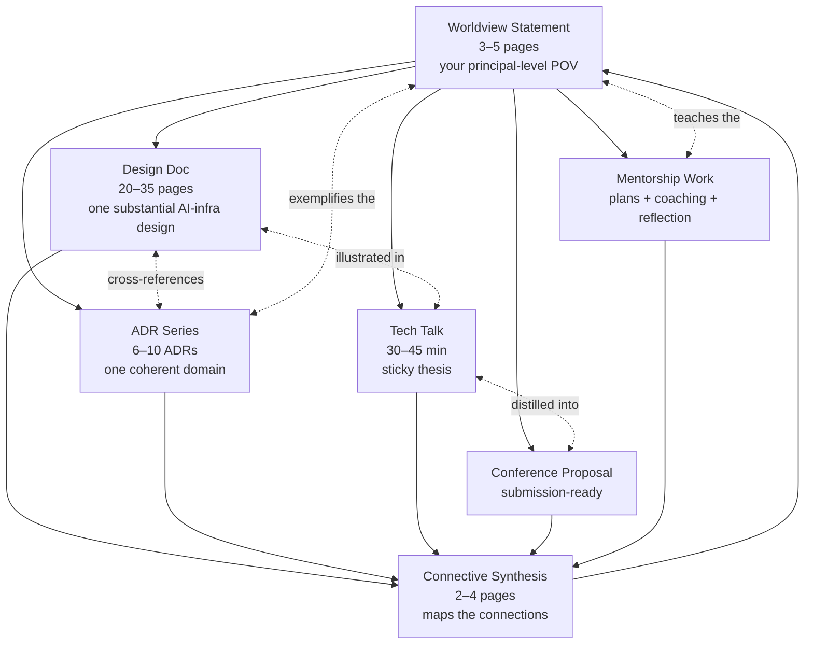
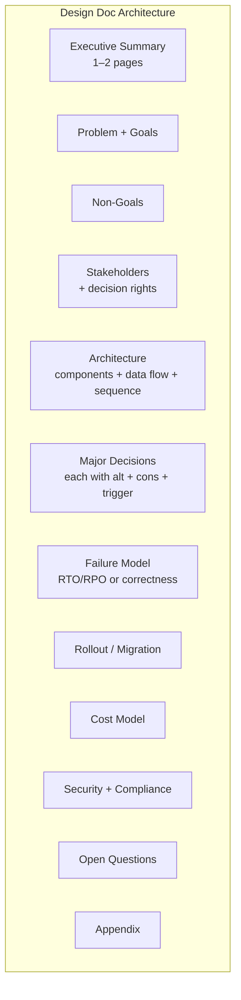
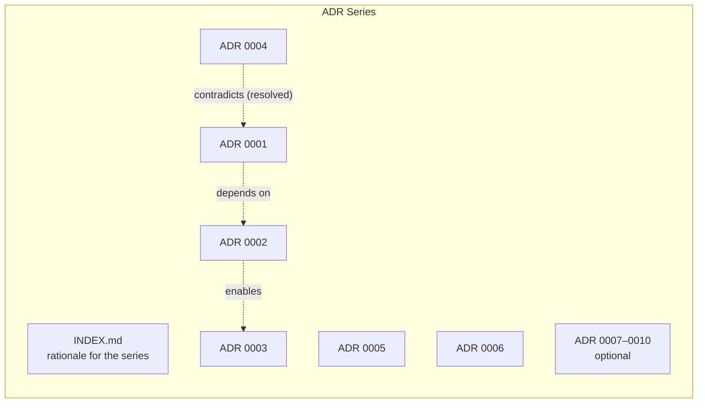
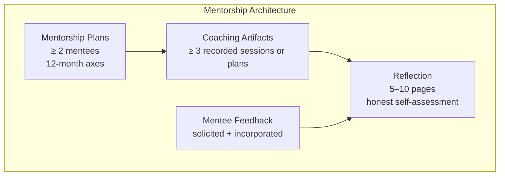
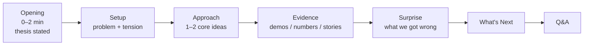

# Architecture — Project 05: Technical Leadership Capstone

This document describes the **portfolio architecture** — how the artifacts fit together and why. Unlike the technical projects in this curriculum, the "architecture" here is the *connective structure* between deliverables, not a system diagram of running services.

The architecture is intentionally opinionated. The single most common failure mode of a leadership portfolio is *scatter* — four good artifacts on four unrelated topics. This architecture exists to prevent that.

---

## 1. The Portfolio Spine



The worldview sits at the top because it constrains everything else. The connective synthesis sits at the bottom because it makes the connections legible to an outside reader.

If a reviewer can read only the worldview and the synthesis and predict the broad shape of the rest of the portfolio, you've built the spine right. If they can't, the artifacts are scattered.

---

## 2. The Worldview as Constraint

A worldview is a focused, falsifiable, principal-level point of view on a *narrow* area of AI infrastructure. It is not a list of opinions about everything.

### Anatomy of a strong worldview

```mermaid
flowchart LR
    subgraph WV[Worldview Doc]
        FOC[Focus Area<br/>"LLM serving stacks for cost-constrained orgs 2025–2027"]
        CLM[Falsifiable Claims<br/>"continuous batching + paged-KV + INT4 weights is the right default"]
        NON[Explicit Non-Claims<br/>"I am not making a claim about training stacks here"]
        WRG[What I Was Wrong About<br/>"In 2024 I underestimated speculative decoding"]
        BLD[Blind Spots<br/>"I have not operated on AMD MI300"]
    end
```

### Examples of focused worldviews

- "The right LLM-serving stack for cost-constrained orgs through 2027 is vLLM + INT4 weights + speculative decoding behind a thin BFF, not a vendor SaaS — even when the vendor is cheaper at small scale, because the lock-in tax compounds."
- "Training-stack convergence in mixed-cluster orgs has to be at the *job spec* layer, not the framework layer; teams will never agree on a framework but they will agree on a contract."
- "Inference platforms over the next 24 months will fork along the prefill/decode axis; disaggregation is real, will outpace continuous batching for cost, and will require new placement primitives."
- "Agentic ML pipelines are not yet production-ready as the *primary* control plane, but are production-ready as a *self-healing layer* on top of deterministic pipelines."

Each is one sentence + the rationale. Each makes claims that future evidence could prove wrong.

### Examples of weak worldviews

- "AI infrastructure is changing rapidly." (No claim.)
- "We should adopt best practices." (Empty.)
- "I have opinions about training, serving, evals, agents, and observability." (Brochure, not worldview.)

---

## 3. Artifact Architecture

### 3.1 Design Doc

The design doc is your "I can frame a real problem at depth" artifact.



### Structural rules

- **Executive summary survives a 90-second read.** If a VP picks up the doc and only reads the first page, they should be able to quote the recommendation.
- **Decisions are not buried.** Each major decision has its own H3 section with alternatives + consequences.
- **Failure model is non-negotiable.** Every principal-level design doc has an honest failure-model table.
- **Diagrams are load-bearing.** Each diagram has a caption and is referenced from the prose.
- **Open questions are kept.** A doc with no open questions is either trivial or dishonest.

### Connection to worldview

The design doc is the **proof** that your worldview holds in a specific case. If your worldview is about LLM serving stacks, the design doc is the reference architecture you would build to embody that worldview.

### 3.2 ADR Series

The ADR series is your "I can defend consequential decisions across a domain" artifact.



### Structural rules per ADR

- Context: what is the situation that requires a decision
- Decision: one sentence, plain language
- Alternatives considered: ≥ 2 named, with why-not for each
- Consequences accepted: operational, organizational, technical debt
- Status: proposed / accepted / superseded / deprecated
- Date, deciders, reviewers

### Series-level rules

- The ADRs are on **one** domain (a 24-month roadmap, a single platform, a single capability area). Not a grab-bag.
- The INDEX shows the dependency graph and the order of decisions.
- At least 2 ADRs name **trigger conditions** for revisiting.
- At least 1 ADR captures a decision you would now make differently — the "calibrated wrongness" that signals principal maturity.

### Connection to worldview

A reader should be able to derive the worldview's principles by reading the ADRs alone. The principles in the worldview should manifest as patterns across the ADRs.

### 3.3 Mentorship Architecture

The mentorship work is your "I make other engineers more effective" artifact.



### Per-mentee plan template

- **Current state**: level, strengths, growth edges, recent project
- **12-month axes**: 2–4 growth dimensions (e.g., "scope of design ownership", "design-review craft", "cross-team negotiation", "depth in one technical area")
- **Milestones**: per axis, observable signals at month 3, 6, 9, 12
- **Stretch goal**: one step-change outcome
- **Risks**: what could go wrong; how you'd respond
- **Cadence**: 1:1 frequency, project pairing, external visibility opportunities

### Coaching artifact template

For each session:
- What the coachee brought
- The coaching mode you were in (directive / supportive / coaching / delegating, per situational leadership)
- The questions you asked (if coaching mode)
- What was decided / committed
- Outcome (next session check-in)
- Your reflection: what you'd do differently

### Reflection structure

- What you do well as a mentor (with evidence, not vibes)
- What you do poorly as a mentor (with evidence)
- Where you fall back to "doing it yourself" instead of growing others
- Your active work areas
- Pushback you'd welcome from a reviewer

The reflection is the most important artifact in the mentorship pillar. A reflection that says "I'm good at everything" loses points; a reflection that names a specific bad habit and what you do about it gains points.

### 3.4 Tech Talk Architecture

The talk is your "I can land a thesis in front of an audience" artifact.



### Structural rules

- **Thesis in the first 90 seconds.** Audience members who arrive late or check Slack should still get the headline.
- **One or two core ideas, not five.** Talks die from breadth.
- **Evidence is concrete.** A demo, a number, a story — not a stack of architecture diagrams.
- **Surprise slide is non-negotiable.** A talk with no "what we got wrong" is a marketing talk, not a principal talk.
- **Sticky language.** The thesis should be quotable two weeks later.

### Speaker notes

Speaker notes (`talks/speaker-notes.md`) are written such that another principal-level engineer could give a close version of the talk from the slides + notes alone. This is the "would survive being open-sourced" bar.

### 3.5 Conference Proposal Architecture

The proposal is your "I can pitch this work to the world" artifact.

Components:
- Title (≤ 80 chars, descriptive + hook)
- 200-word abstract (the version that goes in the program)
- Full description (audience, learning outcomes, outline)
- Speaker bio (focused; not a résumé)
- Prior speaking experience (if any)
- AV requirements
- Cover letter (200–400 words to the program committee)

### Venue-fit rationale

A separate doc (`docs/proposal-venue-rationale.md`) explains why **this venue** for **this talk**. A scatter-shot submission to every venue is graded down; a targeted submission with rationale is graded up.

### 3.6 Connective Synthesis

The synthesis is the 2–4 page document that makes the worldview legible across the artifacts.

It answers:
- What is the worldview in one paragraph?
- How does the design doc embody the worldview?
- How do the ADRs operationalize the worldview's principles?
- How does the talk distill the worldview for a wide audience?
- How does the conference proposal extend the worldview to an external audience?
- How does the mentorship work teach (and depend on) the worldview?

Include a diagram showing the connections.

This is the document that turns a portfolio quilt into a portfolio.

---

## 4. The Voice Layer

Across all artifacts, a single recognizable voice is part of the architecture. Principal-grade work is recognizable because it sounds like one engineer thinking clearly, not like a bureaucrat hedging.

### Voice principles

- **Use the first person where appropriate.** "I argue that…" lands better than "It is argued that…"
- **Defend, don't summarize.** Every claim has a "because" attached.
- **Avoid filler.** "It is worth noting that…", "In conclusion…", "This document will discuss…"
- **Show calibration.** "I'm 70 % confident in X" beats "X is likely."
- **Honest, not falsely humble.** "I got this wrong" beats "I could have done better."

The voice across all five artifacts must be the same engineer. A talk that sounds like a marketing pitch and a design doc that sounds like a bureaucratic memo betray the portfolio.

---

## 5. Trade-offs and Alternatives Considered

| Decision | Default | Why | Major alternative |
|----------|---------|-----|-------------------|
| Worldview scope | Narrow + falsifiable | Forces depth | Broad ("opinions on AI infra") — graded down |
| Design doc scope | One substantial doc | Depth signals | Multiple shorter docs — loses connective tissue |
| ADR domain | One coherent domain | Demonstrates worldview-in-practice | Grab-bag of unrelated ADRs — graded down |
| Mentorship cadence | ≥ 2 mentees, real or modeled | Real practice required | Sketched personas only — only acceptable if detailed |
| Talk venue | External preferred, internal acceptable | External proves transferability | Notes-only ("I would give this talk") — graded down |
| Connective synthesis | Mandatory artifact | Most common scatter cause | "Implicit" connection — fails the legibility test |
| LLM use | Assisted drafting fine; authorship not | You sign your name | LLM-authored portfolio — fails honesty bar |
| Recording quality | Clear audio mandatory; video optional | Audio is the floor | Live-only without recording — loses portfolio value |

**Heuristic:** in a leadership portfolio, *connective tissue* is the leverage point. Four strong but disconnected artifacts score lower than three strong + connected artifacts.

---

## 6. What's Explicitly Not in the Architecture

- A second design doc (one is enough; two splits attention)
- A formal mentorship program (this is for individual mentorship work)
- Research-paper authorship (proposal-only for the conference work)
- Peer-360 surveys (reflection is self + small peer set)
- A blog series (acceptable as part of the talk distillation; not separately required)
- A book proposal (great if you have one; out of scope here)

Each is its own multi-month effort. Resist scope creep.

---

## 7. Open Questions for Your Worldview / Design

Your worldview doc must explicitly resolve these:

1. **What is your focus area, in one sentence?** If you can't, the worldview isn't ready.
2. **What are the 3 falsifiable claims?** What evidence would change your mind on each?
3. **What are you explicitly not claiming?** Where is the boundary of your competence?
4. **What is your blind spot?** What hardware / org / domain do you not have direct experience with?
5. **What were you wrong about a year ago?** Concrete, not generic.

And your connective synthesis must resolve these:

6. **How does each artifact serve the worldview?** One sentence per artifact.
7. **Where would the portfolio look incoherent to an outside reader, and what's your response?**
8. **What's missing from the portfolio that you'd add with more time?**
