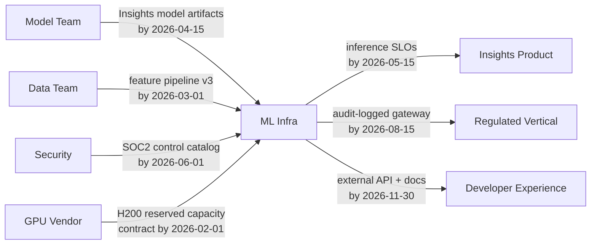

# Playbook — Project 02: Technical Strategy & Roadmap

This is the working manual for the strategy project. Templates, frameworks, scripts, and synthetic inputs. Copy what fits, adapt the rest.

Sections:

1. Synthetic business inputs (the "company brief")
2. Customer-team interview script
3. Finance/CFO interview script
4. Wardley mapping primer for ML infra
5. Rumelt kernel template (Diagnosis / Guiding Policy / Coherent Actions)
6. Worked example: a 4-line strategy statement
7. Roadmap template + sample
8. Capacity model template + worked example
9. Dependency map patterns (Mermaid)
10. Risk register template + pre-mortem facilitation script
11. Executive narrative templates (1-pager, 5-pager, 30-min deck)
12. OKR drafting templates
13. Anticipated objections — pre-baked responses
14. Stakeholder negotiation scripts

---

## 1. Synthetic Business Inputs ("Company Brief")

Use these if you don't have a real environment to anchor against. Reviewer assumes these as the world unless you document a different one.

### Company snapshot

- **Stage:** Series C, ~400 engineers, ~$120M ARR, growing 40% YoY.
- **Product:** AI-powered analytics + workflow platform for mid-market enterprises. Increasingly LLM-centric.
- **Engineering org:** ~400 eng / 50 PM / 30 design / 25 ML researchers. Roughly 8 product teams, 6 platform teams. Your team is one of the 6.
- **Fiscal cycle:** January–December. Annual planning happens in October. Quarterly OKR refreshes.

### Headline business commitments for the next year

1. **Flagship LLM product launch (Q2).** New "Insights Copilot" product. Requires ~10x inference throughput for one fine-tuned model vs. current peak. Marketing has committed a date with three lighthouse customers.
2. **Regulated-industry vertical (Q3).** Healthcare + financial-services GA. Requires SOC 2 Type 2 controls on the inference path, EU data-residency support, audit logging with 7-year retention, and a documented model-card pipeline.
3. **Developer-platform GA (Q4).** Self-serve external API for the inference gateway. Goes from internal-only to external customer-facing.

### Financial inputs

- **Current inference spend (your team's gateway):** $4.2M/yr (cloud + GPU rental + reserved capacity).
- **Finance constraint:** Inference cost growth ≤ 15% YoY. Revenue growing 40% → inference cost-per-request must drop ~18%.
- **Hiring freeze:** Two quarters (Q1 + Q2). One open headcount may be backfilled in Q3 subject to BU performance.
- **Capex constraints:** Reserved-capacity commitments capped at $3M/yr for cloud GPUs; spot/on-demand fills the rest.

### Customer landscape

- 30 internal product teams total.
- 12 critical / SLO-bearing (paged within 10 min): Insights, Search, Workflows, Connectors, Auth, Billing, Reporting, Notifications, Pricing, Onboarding, Analytics, Admin.
- 18 best-effort: experimental and internal-tools teams.
- 5 teams generate 80% of inference traffic. Top user: Insights (the LLM product team).

### Technology trends to form a position on

- **Mixture-of-Experts (MoE) serving.** Top labs ship MoE models; serving overhead is ~2x for naive deployment. New runtime work needed.
- **Long-context inference (>200K tokens).** KV-cache cost explodes. Memory/cost tradeoffs change. Some workloads benefit, most don't.
- **Open-weight model adoption.** Several customers want self-hosted open models (Llama 4-class). Your gateway either supports this as a first-class path or doesn't.
- **In-house inference runtime vs. vendored (vLLM, TensorRT-LLM, SGLang, etc.).** Vendor velocity is fast. In-house lets you optimize for your traffic mix. Choice has 18-month consequences.

### Personnel context (relevant to capacity model)

- Staff engineer is the technical authority on the gateway. Wants to spend Q1-Q2 on a major gateway refactor.
- One senior engineer is pregnant; expected leave in Q3 (~12 weeks).
- One mid-level engineer in Berlin is on a track for promotion to senior within the year.
- The junior engineer is in month 5 of a 9-month onboarding ramp.

---

## 2. Customer-Team Interview Script

For: product team leads or senior eng of teams that use your platform.

**Length:** 30 minutes.

**Frame:**

> "I'm planning my team's strategy for next year. I'd like to understand what you need from us — not just the asks you've already made, but the things you might not have thought to ask. Nothing you say goes into a doc with your name on it; I'm synthesizing across many of these conversations."

**Questions (pick 6-8, in order):**

1. What's the one thing about our platform that, if it got 2x better, would change the way you build?
2. What's the one thing that, if it stopped working tomorrow, would block your team for a week?
3. Walk me through the last time you considered building something we should have built. What stopped you from coming to us?
4. What's a capability you assume we'll have in 12 months that we don't have today?
5. What does your team's roadmap look like next year? Where does it touch our surface?
6. If we had to drop one capability we provide today, what would hurt least?
7. What's the platform decision we made that you most disagree with?
8. What's a number we could move that would matter for your team's metrics (cost, latency, accuracy, time-to-launch)?
9. If I told you we had one open headcount we could earmark for a single capability over the next year, what would it be?
10. What's something you wish we'd just say no to?

**Capture format:**

- 1 paragraph summary per interviewee.
- Tag every comment as: ASK (something they want), SIGNAL (a trend you should watch), or PUSHBACK (a complaint about your team).
- After all interviews, count by tag and look for patterns appearing in ≥ 3 interviews. Those become diagnosis inputs.

---

## 3. Finance/CFO Interview Script

For: your finance partner or, in real life, the CFO/VP Finance.

**Length:** 30 minutes.

**Frame:**

> "I'm writing my team's strategy for next year. The cost story is going to be a meaningful part of the narrative. Before I draft it, I want to make sure I understand the financial picture — what success looks like to you, what would make you want to fund more, what would worry you."

**Questions:**

1. How does my team's spend show up in the company P&L? Is it COGS, R&D, or split?
2. What's the headline metric finance cares about for inference spend? Cost per request, cost per customer, gross margin contribution?
3. What's the threshold above which my budget request would require board approval?
4. If we underspent by 20%, what would you want me to do with the savings — return them, reinvest, hold?
5. If we overran by 20%, what's the conversation we'd have?
6. What's the finance view of headcount vs. infra spend tradeoffs? Is one preferred?
7. When you look at peer companies, what financial pattern would you want my team to look like in 18 months?
8. What's a number you would put in front of the board that I should know about?

**Use the answers to:**

- Frame cost reductions as a *named outcome* in your strategy, not a side effect.
- Calibrate the executive narrative to finance's vocabulary (margin, COGS, leverage).

---

## 4. Wardley Mapping Primer for ML Infra

Wardley maps plot a value chain (user → component) against component evolution (genesis → custom → product → commodity). For ML infra, a useful map looks like:

```text
Anchor (user need): "Product team can ship an ML feature in < 2 weeks"

Visible components:
- Inference API (Product → Commodity)            <-- moving right rapidly
- Feature pipeline (Custom → Product)
- Model registry (Product → Commodity)
- Training orchestration (Custom → Product)

Hidden components:
- GPU capacity (Commodity)
- Observability (Product)
- Vector store (Product → Commodity)
- Secrets/keys (Commodity)

Genesis edge (you should be experimenting here):
- MoE serving runtime
- Long-context KV-cache offload
- Speculative-decoding orchestration
```

**Heuristics for using the map in your diagnosis:**

- Anything in the **Genesis** column should be R&D / experimentation, not roadmap commitments.
- Anything in **Custom** is your moat. Investments here compound.
- Anything in **Product/Commodity** should be bought or thinly wrapped — building it in-house is anti-strategic unless you have a unique requirement.
- The most expensive strategic mistake: building something that the industry is rapidly commoditizing. Wardley calls this "yak shaving the wrong yak."

**Output for your diagnosis:** identify 2-3 components that are at the wrong stage for the investment your team is currently making, and use those as policy inputs.

---

## 5. Rumelt Kernel Template

```markdown
# [Team Name] Strategy — [Year]

## Diagnosis

### Dominant force
[One sentence. The single thing that, if you got it wrong, would invalidate everything else.]

### Secondary forces
1. [Force, with quantitative evidence]
2. [Force, with quantitative evidence]
3. [Force, with quantitative evidence]

### What is hard for this team that isn't hard for every other team
[1-2 paragraphs. The thing that makes this strategy *specific* rather than generic.]

### What we keep getting wrong
[1 paragraph. A real institutional failure pattern, named honestly.]

## Guiding Policy

We will prefer the following:

1. **[Policy 1]**: We will prefer X over Y because Z.
   - **Forcing function:** We will stop doing [specific thing] to make this real.
   - **What it rules out:** [specific consequence]
2. **[Policy 2]**: ...
3. **[Policy 3]**: ...
4. **[Policy 4]**: ...
5. **[Policy 5]**: ...

### Non-goals (explicit)
- [Thing we will not do, tied to policy N]
- [Thing we will not do, tied to policy N]
- [Thing we will not do, tied to policy N]
- [Thing we will not do, tied to policy N]
- [Thing we will not do, tied to policy N]

## Coherent Actions

### Q1 themes
- **[Theme 1]** (DRI: [name]) — [outcome statement]
- **[Theme 2]** (DRI: [name]) — [outcome statement]

### Q2 themes
- ...

### Q3 themes
- ...

### Q4 themes
- ...

## What we'd need to change our minds
[1 paragraph. The signal that would cause us to revisit this strategy mid-year.]
```

---

## 6. Worked Example — a 4-line Strategy Statement

Compress your strategy down to four lines. Use this as the spine of every other artifact. The 1-page exec summary is essentially this expanded.

> **Diagnosis:** We are about to ship a 10x-throughput LLM product on inference infrastructure that was designed for a 1x world, while finance is asking us to lower cost-per-request by 18%.
>
> **Policy:** We will prefer commoditized serving over custom optimization wherever possible, optimize ruthlessly only on the hot path that the LLM launch depends on, and decline new platform asks that don't compound across the top-5 customer teams.
>
> **Actions:** Q1 = harden the hot path. Q2 = ship the LLM launch. Q3 = add compliance + data residency for the regulated vertical. Q4 = open the gateway for external developer GA.
>
> **What we'd give up:** We will not refactor the gateway end-to-end this year, will not adopt MoE serving as a first-class path, and will not take on observability scope beyond what the existing vendor provides.

If you cannot write the 4-line version, your strategy is not yet a strategy.

---

## 7. Roadmap Template + Sample

### Template

| Quarter | Theme | Outcome (verb + audience + measure) | DRI | Linked policy | Non-commit (deferred from this quarter) |
|---|---|---|---|---|---|
| Q1 | Theme 1 | ... | [Name] | P1 | [What was cut and trigger to revive] |
| Q1 | Theme 2 | ... | [Name] | P3 | ... |
| Q2 | ... | ... | ... | ... | ... |

### Sample (anonymized, illustrative)

| Quarter | Theme | Outcome | DRI | Policy | Non-commit |
|---|---|---|---|---|---|
| Q1 | Hot-path hardening for LLM launch | By end of Q1, the Insights model's p99 latency at 5x current peak is < 800ms and cost per 1K tokens is ≤ $0.0023. | Staff eng | P1 (commoditize where possible, optimize only hot path) | Gateway refactor v2 — defer; revive if Q1 hot-path work stalls. |
| Q1 | Inference cost program | By end of Q1, $0.5M/yr run-rate savings identified and 50% implemented. | Senior eng | P2 (cost is a first-class metric) | New model onboarding work — defer to Q2. |
| Q2 | LLM launch readiness | By end of Q2, Insights Copilot inference path passes load test at 10x current peak and ships to lighthouse customers. | Staff + Senior eng | P1, P3 | MoE serving R&D — defer to Q3. |
| Q2 | Junior-to-mid ramp completion | By end of Q2, junior engineer is shipping production changes unsupervised. | Senior eng (mentor) | P5 (compounding investments in people) | — |
| Q3 | Regulated-vertical compliance | By end of Q3, gateway supports SOC2 controls, audit logging, EU residency for 3 named customers. | Senior eng | P3 (serve named regulated customers, not generic compliance) | Self-serve API GA — defer to Q4 (committed). |
| Q3 | MoE serving R&D spike | By end of Q3, decision made: MoE first-class in 2027 or buy a runtime. | Staff eng | P4 (form positions on tech shifts before they're forced) | Long-context workloads — defer; not in top-5 customer demand. |
| Q4 | Developer-platform GA | By end of Q4, external API supports 3 pilot customers with documented SLOs. | Senior eng | P3, P4 | New observability vendor evaluation — defer to next year. |
| Q4 | Postmortem-driven hardening | By end of Q4, recurring incident classes from the year reduced by 40% via runbook automation. | Mid-level eng | P2 | — |

---

## 8. Capacity Model Template + Worked Example

### Assumptions section (always present)

```text
Quarter length:           13 calendar weeks
Working weeks/quarter:    11 (after PTO, holidays, conferences)
Interrupt allowance:      25% (from Project 01 diagnosis)
On-call cost:             ~1.0 FTE-week per primary rotation per engineer per quarter
                          ~0.4 FTE-week per secondary rotation
Maximum theme allocation: 75% of nominal capacity
Hiring assumption:        Headcount 8 through Q1-Q2. Backfill possible in Q3.
```

### Engineer × Quarter matrix (per-theme % allocation)

```markdown
| Engineer | Role | Q1 | Q2 | Q3 | Q4 |
|---|---|---|---|---|---|
| Staff (A.K.) | Hot-path lead | T1: 60% / Oncall: 10% / Interrupt: 25% | T3: 70% / Oncall: 10% / Interrupt: 25% | T6: 50%, T3-tail: 20% / Oncall: 10% / Interrupt: 25% | T6-tail: 30%, R&D: 30% / Oncall: 10% / Interrupt: 25% |
| Senior 1 (B.O.) | Cost program | T2: 70% / Oncall: 10% / Interrupt: 25% | T2-tail: 30%, T4 mentor: 30% / Oncall: 10% / Interrupt: 25% | LEAVE (12wk) | Return: ramp, T8: 50% |
| Senior 2 (C.M.) | LLM + compliance | T1 support: 30%, T3 prep: 40% | T3: 70% | T5: 70% | T7: 60% |
| Senior 3 (D.R.) | Dev platform | T2 support: 20%, T6 design: 50% | T6 build: 70% | T6 build: 70% | T7: 70% |
| Mid 1 (E.S.) | Berlin / generalist | T1 support: 50% | T3 support: 50% | T6 build: 60% | T8: 60% |
| Mid 2 (F.L.) | Observability | T2: 50% | T2: 50%, T5 prep: 30% | T5: 60% | T8: 50% |
| Mid 3 (G.P.) | Promotion path | T1: 60% | T3: 60% | T6: 60% | T6: 60% |
| Junior (H.W.) | Ramp | T1 pair: 40% / Mentor support | T3 pair: 40% / Mentor support | T6 pair: 50% | T6: 60% (unsupervised) |
```

(Treat the above as a sketch; in your real submission, every cell should have a real number and the column totals should fit within the assumptions.)

### What we cannot fit (named explicitly)

- Full gateway refactor (~2 senior-engineer-quarters) — deferred to next year, trigger: Q1 hot-path work stalls or Insights team formally re-scopes the launch.
- Long-context workloads — no top-5 customer demand, deferred indefinitely.
- New observability vendor evaluation — deferred; existing contract covers needs.
- MoE first-class serving — Q3 R&D spike only; build commitment deferred to next year.

### Sensitivity scenarios

| Scenario | Capacity hit | Roadmap impact |
|---|---|---|
| Interrupt rate climbs to 35% (vs. 25% planned) | -10% across the board | T8 (postmortem hardening) drops out; T6 dev-platform GA slips to next year. |
| LLM launch slips 6 weeks into Q3 | T3 carries into Q3 | T5 (compliance) compresses, scope cut to 2 customers; T6 design pushed. |
| Hiring backfill arrives Q3 (1 senior) | +50% capacity in Q3-Q4 | T6 dev-platform GA expanded to 5 customers; T8 starts earlier. |

---

## 9. Dependency Map Patterns (Mermaid)

### Simple version



### Edge-label format (use consistently)

```text
[Upstream] -- "<what is needed> by <date> — owner: <name> — if missed: <consequence>" --> [Your team]
```

### Critical path callout

> The critical path to the Q2 LLM launch is:
> GPU Vendor (H200 contract) → Your hot-path work (Q1) → Insights model artifacts → Joint load test (Q2 week 6) → Launch (Q2 week 12).
> The earliest meaningful slip detector is GPU vendor contract status (target signed by 2026-02-01). If unsigned by 2026-02-14, escalate.

### Inverse map (who depends on you)

| Downstream team | What they need | When | Are you their critical path? |
|---|---|---|---|
| Insights | Hot-path SLOs | Q2 launch | **Yes** |
| Regulated Vertical | Compliance gateway | Q3 GA | **Yes** |
| Developer Experience | External API + docs | Q4 GA | Yes (jointly with DX team) |
| Workflows | New model onboarding tooling | Q3 | No (work-around exists) |
| Search | Feature store throughput 2x | Q2 | No (degraded mode acceptable) |

---

## 10. Risk Register Template + Pre-Mortem Facilitation

### Risk register template

| ID | Risk | Type (technical / political / personnel / external) | Likelihood (1-5) | Impact (1-5) | Score | Leading indicator | Mitigation | Kill criteria | Owner |
|---|---|---|---|---|---|---|---|---|---|
| R1 | GPU vendor underdelivers H200 capacity | External | 3 | 5 | 15 | Contract slips past 2026-02-14 | Secondary vendor RFP in Q1 | Vendor cannot commit by Q2 week 4 → bring in spot capacity at higher cost | Manager |
| R2 | Insights model architecture changes mid-flight | Technical | 4 | 4 | 16 | Model team announces re-architecture | Bi-weekly checkpoint with model team lead | Architecture changes after Q1 week 8 → renegotiate launch scope | Staff eng |
| R3 | Loss of staff engineer | Personnel | 2 | 5 | 10 | Engagement signals drop, 1:1 vibes | Career conversation in Q1, retention plan | Resignation → freeze gateway refactor, redistribute hot-path work to senior 2 | Manager |
| R4 | Compliance scope creep ("we need ISO 27001 too") | Political | 3 | 3 | 9 | Sales asks for additional certs | Scope-lock with security + legal before Q2 | Additional cert request after Q2 → defer cert to next year | Manager |
| R5 | Cost-per-request reduction stalls | Technical | 3 | 4 | 12 | Q1 savings target underrun by > 30% | Monthly cost review with finance | If Q2 trending to miss → escalate to VP, accept cost overrun and renegotiate budget | Senior 1 |

### Pre-mortem facilitation script (90-min session)

**Pre-work (3 days before):**

> "We're holding a pre-mortem on Thursday. The premise: it's December next year and our strategy has failed. We're writing the postmortem now, in advance, before we commit. Please come having privately written down: (a) the headline of the failure, (b) the first thing that went wrong, (c) the thing we all knew would happen and ignored."

**Session structure:**

- **0:00-0:05 — Frame.** "We're going to invert the diagnosis. The future is known and bad. Why? The goal is to find the failure modes we haven't named yet."
- **0:05-0:25 — Silent generation.** Each person writes 3-5 failure narratives. Sticky notes.
- **0:25-0:55 — Affinity clustering.** Group similar narratives. Name the clusters.
- **0:55-1:15 — Likelihood and impact scoring.** Dot vote — each person 5 dots for "most likely" and 5 dots for "most damaging if it happens." Top 5 clusters become risk register candidates.
- **1:15-1:25 — Mitigation brainstorm.** For each top risk: 1 leading indicator, 1 mitigation, 1 kill criterion.
- **1:25-1:30 — Owner assignment.** Each risk gets a named owner. Owner is responsible for monitoring the leading indicator.

**Output:** populated risk register, plus a list of strategy assumptions that the pre-mortem made you question.

---

## 11. Executive Narrative Templates

### 1-page version (the "VP-hands-to-CEO" doc)

```markdown
# [Team Name] — 2026 Strategy

## Situation
[2-3 sentences. The headline force, the headline commitment, the headline constraint.]

## What we'll do
1. [Theme + outcome]
2. [Theme + outcome]
3. [Theme + outcome]

## What we won't do (and why)
1. [Non-commit + reason]
2. [Non-commit + reason]
3. [Non-commit + reason]

## What we need from leadership
- [Specific ask — headcount unfreeze, cross-team alignment, budget shift, etc.]
- [Specific ask]
- [Specific ask]

## What would change our minds
[1 sentence. The signal that would cause us to revisit.]
```

### 5-page version (the strategy doc proper / D1)

Outline:

1. **Situation in one paragraph** (page 1)
2. **Diagnosis** (page 1-2) — dominant force, 3 secondary forces, the value-chain map
3. **Guiding Policy** (page 2-3) — 3-5 policy statements with forcing functions and non-goals
4. **Coherent Actions** (page 3-4) — quarterly themes table
5. **Capacity, dependencies, risks in summary** (page 4-5) — pointers to the deeper artifacts; this is *not* where you redo the math
6. **What would change our minds** (page 5)

### 30-minute deck outline

```text
1. Title slide
   - "[Team Name] 2026 strategy"
   - Subtitle: the 4-line version

2. The situation (2 slides)
   - Three forces, with numbers
   - The Wardley map (or your version of it)

3. What we'll do (3 slides)
   - Policy 1, 2, 3 — each with the "we will prefer X over Y" line and the forcing function

4. The plan in one table (1 slide)
   - The quarterly roadmap

5. The math (2 slides)
   - Capacity model summary
   - Cost trajectory (with finance hat on)

6. Dependencies + risks (2 slides)
   - Critical path
   - Top 3 risks with mitigations

7. What we won't do (1 slide)
   - The non-commit list

8. What we need (1 slide)
   - Asks of leadership

9. Q+1 preview (1 slide)
   - Where this goes after Q4

Speaker notes per slide: 1 paragraph + 2-3 anticipated objections with pre-baked answers.
```

---

## 12. OKR Drafting Templates

```markdown
# [Team Name] OKRs — Q[N] [Year]

## Objective 1: [Concise, inspirational statement]
- **Linked policy:** P[N]
- **Linked roadmap theme:** [Theme name]
- **KR 1.1 (lagging):** [Measurable outcome by EOQ] — baseline X, target Y
- **KR 1.2 (leading):** [Measurable signal by mid-quarter] — baseline X, target Y
- **KR 1.3:** ...

## Objective 2: ...

## Scoring rubric
- 0.0: Did not start
- 0.3: Made measurable progress but missed target by > 30%
- 0.7: Hit target within 20%
- 1.0: Hit target
- > 1.0: Exceeded target (rare; if every quarter has > 1.0 OKRs, your targets are sandbagged)
```

**OKR anti-patterns to avoid:**

- A KR that is a task list ("ship feature X"). KRs are outcomes, not deliverables.
- A KR with no baseline. Without baseline, "improve by 20%" is meaningless.
- All-leading or all-lagging KRs. Need at least one of each.
- More than 3 KRs per objective. Focus collapses.
- Objectives that don't map back to the strategy. OKRs are the strategy made operational; if there's no link, the OKRs are wrong or the strategy is wrong.

---

## 13. Anticipated Objections — Pre-Baked Responses

### "Why are we not adopting MoE serving as a first-class path?"

> "Because the customer demand isn't there in the top 5 traffic patterns yet, and the runtime cost of supporting MoE doubles the maintenance surface. We've scheduled a Q3 R&D spike to make the call for the following year. If by end of Q2 we see two top-5 customers committed to MoE workloads, we'll pull the decision in."

### "Can't you absorb the regulated-vertical work into the LLM launch quarter?"

> "Not without slipping one of them. The compliance work isn't a feature; it's a structural change to the gateway's data path. Doing both in Q2 means we either ship a non-compliant gateway and rework it, or ship a compliant gateway late. Both fail the customer. Q2-then-Q3 is the lowest-risk sequence."

### "Why isn't there a full gateway refactor on the roadmap?"

> "It's a 2-engineer-quarter project and we are headcount-constrained. The diagnosis says the gateway is at *Custom* on the Wardley map — it's our moat — but the moat is performing within SLO right now. A refactor in a year where we have three commitments would mean sliding at least one commitment. We've deferred it; trigger to revive is the Q1 hot-path work failing to converge."

### "Why are you giving up on long-context workloads?"

> "Not giving up; deprioritizing. We surveyed the top 5 customer teams; none have a Q1-Q4 commitment that requires it. Continuing to build for it means we serve no one's current needs. If a top-5 team commits to a long-context workload in Q3, we pull it in for next year."

### "This roadmap doesn't have any moonshots."

> "Correct. The team has three named commitments that the company has externally promised. Moonshots compete with execution risk on commitments. The 10% R&D allowance (in the capacity model) is where moonshot exploration lives — small, time-boxed, and not on the roadmap."

### "Your capacity model assumes 25% interrupt rate. Why not solve the interrupt problem instead?"

> "We're trying — Project 01 (operating system) was step one. The interrupt rate measurement is from real Q4 data. Modeling against the actual number rather than the aspirational one is how we avoid building a plan that lives only in slides. Reducing interrupt rate is itself a roadmap theme in Q1 (T2: cost + interrupt reduction)."

### "Why are you trusting the GPU vendor's H200 commitments?"

> "Not trusting — verifying. The dependency map calls out vendor contract status as the earliest leading indicator on the critical path. If the contract isn't signed by 2026-02-14, we have a documented fallback (secondary vendor RFP) and an escalation. That's risk R1 in the register."

---

## 14. Stakeholder Negotiation Scripts

### When a sibling team lead asks for a commitment you can't make

> "Walk me through what changes for you if we deliver this in Q4 instead of Q2. I want to make sure we're trading off the right thing. Right now Q2 is committed to [LLM launch], and trading would mean their lighthouse launch slips. Is your Q2 ask larger than that? If yes, this is a director-level conversation. If not, Q4 is the slot I can offer and I'll write it down."

### When a customer team says "we'll just build it ourselves"

> "Tell me more — what specifically would you build, and what's your team's appetite for owning it long-term? If it's a one-off integration, you should absolutely build it. If it's a piece of infrastructure that 3 other teams will need, building it on your team commits you to maintaining it for years. I'd rather solve it on our platform if it generalizes; let's spend 30 minutes seeing whether it does."

### When finance asks why inference cost isn't dropping faster

> "Two things. First, the headline cost is in three buckets — base capacity, peak buffer, and per-request — and only one of those compresses with engineering work this year. The other two require contract negotiation, which is on the roadmap. Second, the LLM launch in Q2 will *increase* cost-per-request short-term because we're shifting traffic to a larger model; the cost-program work shows up net in Q3-Q4. Here's the curve I'd expect."

### When your VP asks why you don't just do more

> "Tell me which commitment I should drop. The model says we're at 75% allocated already, with 25% buffer for interrupts and unknowns based on last year's actuals. Adding a fourth commitment means either lowering the buffer (which fails the moment something breaks) or removing one of the existing three. I'm happy to do either; I want you to make the call explicit."

### When the staff engineer pushes back on a policy

> "I want to hear it. The policy is documented because we made an explicit choice — I'd rather change the policy than have it drift. Walk me through what you'd write differently. If your version is better and we can defend it to the VP, we change it. If it's a values disagreement (you'd prefer to optimize even when the math says don't), we still document the choice and the dissenting view."
