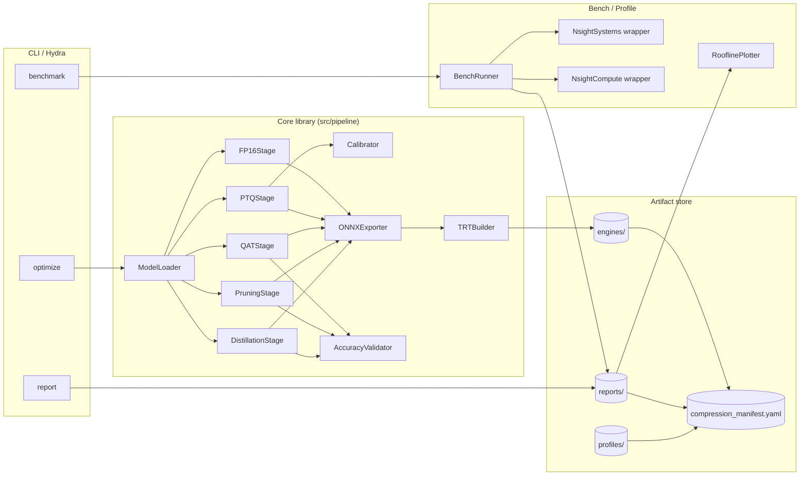
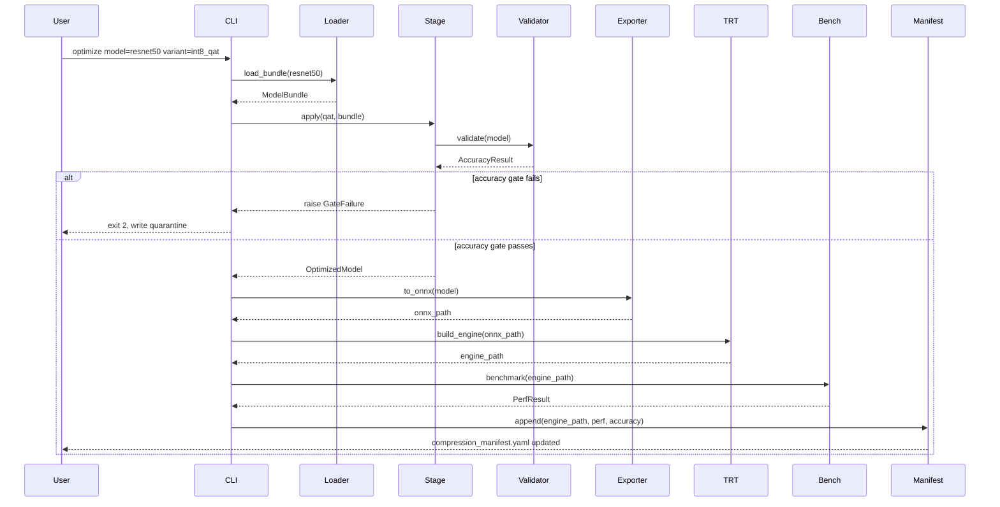
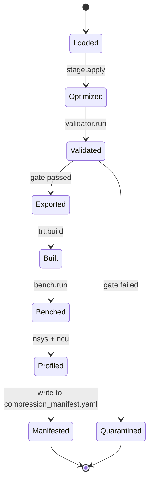

# Architecture — Production Model Optimization Pipeline

This document describes the internal structure of the pipeline, the data
flow through it, and the trade-offs taken at each junction. It is the
canonical reference when reviewing PRs against this project.

## 1. Architectural goals

1. **Composable**: each compression stage is a single Python function with
   a clear input contract (model, calibration data) and output contract
   (model + metadata + sidecar artifacts).
2. **Reproducible**: identical inputs and config produce bit-identical
   outputs given a warm timing cache.
3. **Observable**: every stage emits structured logs, a JSON report, and
   a Markdown summary; profiling artifacts are first-class outputs.
4. **Fail-fast**: accuracy and latency gates are checked at the end of
   every stage, not just at the end of the pipeline.
5. **Hardware-honest**: the runner refuses to report numbers if the GPU
   isn't in a known good state (clocks locked, no thermal throttle, no
   other tenants).

## 2. High-level component diagram



## 3. Module-by-module description

### 3.1 `pipeline.loader`

- Loads pinned model checkpoints (Torchvision ResNet-50 IMAGENET1K_V2,
  HuggingFace `bert-base-uncased` with an MNLI head).
- Returns a `ModelBundle` (`nn.Module` + tokenizer/preprocessor + canonical
  dataset adapter + expected accuracy oracle).
- The bundle is immutable; subsequent stages always start from a fresh
  copy (`copy.deepcopy`).

### 3.2 `pipeline.calibrator`

- Builds calibration datasets:
  - Vision: 1024 IN-1k images sampled with a deterministic seed.
  - NLP: 1024 MNLI sentence pairs.
- Implements `EntropyCalibrator`, `PercentileCalibrator` (99.9), and
  `MSECalibrator`. All share a `BaseCalibrator` interface.
- Emits `calibration_<variant>.json` mapping tensor name -> (min, max)
  ranges. This is the **handoff format** between the PyTorch world and
  the TRT calibrator.

### 3.3 `pipeline.fp16`

- Two execution paths:
  - **Pure half**: `model.half()` plus a fixed-FP32 epilogue for the
    final softmax.
  - **Autocast**: keep weights FP32, autocast at runtime. Used for
    BERT-base where attention probs and LayerNorm are accuracy-sensitive.
- Verifies no silent FP32 fallback by parsing the Nsight Systems CSV for
  `cudnn` kernel names and asserting `hgemm` / `hcudnn` are present in
  the hot path.

### 3.4 `pipeline.ptq`

- Wraps modules with observers (`MinMaxObserver`, `HistogramObserver`).
- Runs calibration data through the model in eval mode.
- Reads observed ranges into the calibration map.
- Runs sensitivity sweep:
  - For each quantizable module, build a "skip-this" variant.
  - Measure accuracy.
  - Emit `sensitivity_<variant>.csv` sorted by delta.

### 3.5 `pipeline.qat`

- Builds qconfig mapping per module type, with optional per-name
  overrides loaded from YAML.
- Calls `prepare_qat_fx` to insert fake-quant ops.
- Fine-tunes for the configured number of epochs using a cosine LR
  schedule starting at 10% of the original training LR.
- Special handling for BatchNorm: folds BN into Conv **after** training,
  with a unit test that asserts the folded weights produce numerically
  equivalent activations (within FP32 tolerance) on a held-out batch.

### 3.6 `pipeline.pruning`

- Builds a **dependency graph** of the model from the FX trace.
- For each `Conv2d` / `Linear` it identifies:
  - Upstream tensors whose output channels must shrink with this op.
  - Downstream tensors whose input channels must shrink to match.
  - BN affine parameters that must be sliced.
- L2-norm scoring per channel, prune lowest-scoring K%.
- Iterative schedule: e.g. 10% / 20% / 30% with fine-tuning between
  rounds.
- Emits `pruning_report_<variant>.json` listing layer-by-layer channel
  removals.

### 3.7 `pipeline.distillation`

- Two losses combined:
  - **Soft target** KL with temperature T: `KL(student/T || teacher/T) *
    T^2`
  - **Hard label** cross-entropy.
- Weighted by `alpha`.
- Optional intermediate-layer hint loss using a learnable projection if
  channel dimensions differ.
- Student architectures: ResNet-18 (from ResNet-50), DistilBERT-style
  (6 layers instead of 12) for BERT-base.

### 3.8 `pipeline.onnx_exporter`

- Uses `torch.onnx.export` with `opset_version=17` and `do_constant_folding=True`.
- Dynamic axes on batch dim only (sequence dim for BERT also dynamic).
- Validates the exported graph with `onnx.checker.check_model` and
  shape-inferences with `onnx.shape_inference.infer_shapes`.
- For QAT models, exports via the QDQ representation so TRT can fuse
  Quantize/DeQuantize pairs into INT8 layers.

### 3.9 `pipeline.trt_builder`

- Wraps `tensorrt.Builder` and `BuilderConfig`.
- Honors precision flags: `BuilderFlag.FP16`, `BuilderFlag.INT8`,
  `BuilderFlag.OBEY_PRECISION_CONSTRAINTS`.
- Loads per-layer overrides from `configs/trt/<variant>_overrides.yaml`.
- Wires an `IInt8EntropyCalibrator2` that reads from the calibration
  JSON of section 3.2.
- Sets a **timing cache** file (`engines/timing_cache.bin`) so the
  builder reuses tactic timings across runs.
- Supports building per-batch-size engines OR a single engine with
  optimization profiles. Choice driven by config.

### 3.10 `pipeline.validator`

- Runs the variant against the canonical accuracy oracle.
- For vision: top-1 / top-5 on a deterministic IN-1k val subset (or full
  if `--full-eval`).
- For NLP: MNLI-m / MNLI-mm accuracy.
- Returns a structured `AccuracyResult`. The CLI uses this to enforce
  per-stage gates.

### 3.11 `bench.runner`

- Uses `torch.cuda.Event` (with `enable_timing=True`) for timing.
- Warmup loop, then measured loop.
- After each measured run, samples `nvidia-smi --query-gpu=utilization.gpu,
  power.draw,clocks.gr,temperature.gpu --format=csv,noheader,nounits` and
  checks invariants (clocks locked, no throttling).
- Emits a JSON line per measurement to `reports/raw/`.

### 3.12 `bench.roofline`

- Reads kernel-level metrics from a Nsight Compute report (`ncu --csv`).
- Computes arithmetic intensity (`flops / bytes`) per kernel.
- Plots against the hardware roofline (A100: 19.5 TFLOPs FP16,
  1.555 TB/s HBM2e).
- Saves PNG and the underlying CSV for the rubric reviewer.

## 4. End-to-end data flow



## 5. Optimization stack (the why, not just the what)

```
+-------------------------+      Top of stack: highest leverage but
|  Kernel selection (TRT) |      requires upstream correctness.
+-------------------------+
|  Graph fusion (TRT/ORT) |      Layer fusion, constant folding,
+-------------------------+      activation fusion.
|  Memory layout (NHWC)   |      For ResNet-50, NHWC is faster on
+-------------------------+      Ampere/Hopper Tensor Cores.
|  Precision (FP16/INT8)  |      Dominant lever for throughput and
+-------------------------+      memory footprint.
|  Topology (prune/KD)    |      Pre-quantization model shrinkage.
+-------------------------+
|  Algorithm (model arch) |      Out of scope for this project.
+-------------------------+
```

Lower layers create headroom for the upper layers. INT8 quantization on a
giant overparameterized model wins less than INT8 on a model that has
already been pruned and distilled — because INT8 lift is proportional to
arithmetic intensity, which goes up when you reduce parameter count.

## 6. Key trade-offs

### 6.1 PTQ vs QAT

| Aspect | PTQ | QAT |
|--------|-----|-----|
| Engineering cost | Low | High (training loop required) |
| Calibration data | 256-1024 samples | Full or large fraction of train set |
| Accuracy recovery on hard models | Limited | Strong |
| Time to first engine | Minutes | Hours-days |
| When to choose | Activation ranges are well-behaved (CNNs, encoder LMs at FP16-equivalent precision) | Outlier-heavy activations (transformer FFN), aggressive precision (sub-INT8, mixed targets) |

For this project we ship **both**, gate QAT at < 0.5pp drop and PTQ at <
1.5pp, and let the rubric reward the candidate who picks the right one
per model.

### 6.2 Per-tensor vs per-channel quantization

- **Per-tensor weights**: smaller metadata, slightly faster, large
  accuracy hit on layers with wide channel-wise dynamic range.
- **Per-channel weights** (per output channel for `Conv2d` /
  `Linear`): standard for INT8 weights on modern hardware, modest cost.

We default to per-channel for weights, per-tensor for activations.

### 6.3 Symmetric vs asymmetric quantization

- **Symmetric** (zero-point = 0): cheap to compute, slight accuracy loss
  on activations with non-zero mean.
- **Asymmetric** (zero-point != 0): standard for activations (especially
  post-ReLU activations whose distribution starts at 0).

We use symmetric for weights, asymmetric for activations — the standard
TensorRT INT8 convention.

### 6.4 Structured vs unstructured pruning

- **Unstructured**: removes individual weights. High sparsity possible,
  but hardware can only exploit it with 2:4 sparse Tensor Cores on
  Ampere+.
- **Structured** (channel / filter): removes whole channels. Smaller
  dense tensors. Always wins on standard inference paths.

We choose structured. 2:4 sparsity is a stretch goal.

### 6.5 AWQ vs GPTQ (stretch)

| Aspect | AWQ | GPTQ |
|--------|-----|------|
| Calibration cost | Low (forward only) | Higher (Hessian) |
| Activation outlier handling | Strong (activation-aware) | Weaker |
| Speedup on memory-bound LLM decode | Strong | Strong |
| Tooling maturity | Newer | Established |

For an LLM stretch path AWQ generally produces better accuracy at the
same bit-width; we recommend it for the optional INT4 ablation.

### 6.6 ONNX QDQ vs TRT explicit precision API

- **QDQ**: portable, also works in ONNX Runtime. Larger ONNX file.
- **TRT explicit precision**: more flexible per-layer control, but
  TRT-only.

We export QDQ for compatibility; the TRT builder will fuse QDQ pairs
into INT8 layers automatically with INT8 flag set.

### 6.7 Batch-size = 1 engine vs optimization profiles

- **Per-batch-size engines**: simpler, smaller per-engine memory, but
  multiplies disk size.
- **Optimization profiles**: one engine handles a min/opt/max range.
  Slightly worse per-shape performance.

For latency-critical batch=1 paths we ship a dedicated engine; for the
high-throughput bs=8..32 range a single profiled engine is fine.

## 7. Failure handling and quarantine

When an accuracy gate fails:

1. The CLI writes the (partially) optimized model and its diagnostic
   report to `engines/quarantine/<variant>/`.
2. `compression_manifest.yaml` records the failure with a `quarantined:
   true` flag and the gate name.
3. Exit code is `2` (distinct from a setup error which is `1`).

When a latency gate fails the engine still ships but is marked
`gate_status: degraded`. The reviewer can then decide to retry with a
different calibrator, precision override, or batch size.

## 8. Determinism and reproducibility

- All seeds (Python, NumPy, PyTorch CPU, PyTorch CUDA) seeded from a
  single root seed in config.
- `torch.use_deterministic_algorithms(True)` in CI mode.
- TRT timing cache is committed only when explicitly requested
  (`--commit-timing-cache`) to avoid noisy diffs.
- Build inputs (model state_dict, calibration data, config) are hashed
  into a single `build_inputs_sha256` recorded in the manifest. Two
  identical inputs MUST produce two identical output engines (modulo
  timestamps stripped during hashing).

## 9. Extension points

The pipeline is designed to be extended without touching the core:

- **New compression stage**: implement `Stage` protocol
  (`apply(bundle) -> bundle`), register in `pipeline.registry`.
- **New calibrator**: subclass `BaseCalibrator`, register in
  `pipeline.calibrators`.
- **New backend** (e.g. ONNX Runtime, OpenVINO): implement
  `EngineBuilder` protocol, register in `pipeline.builders`.

## 10. Observability surfaces

| Surface | Format | Consumer |
|---------|--------|----------|
| Structured logs | JSON to stderr | log aggregator |
| Benchmark raw | JSONL | analysis scripts |
| Benchmark summary | Markdown | reviewers |
| Roofline | PNG + CSV | reviewers |
| Nsight Systems | `.nsys-rep` | reviewers, Nsight UI |
| Nsight Compute | `.ncu-rep` | reviewers, Nsight UI |
| Manifest | YAML | downstream pipelines, audit |

## 11. Diagram: lifecycle of a single variant



## 12. Why this stack and not vLLM / native TRT-LLM

This project deliberately stays at the **engine** level, not the
**serving** level. TRT-LLM and vLLM bundle inference engines with
batching, KV caching, and scheduling. They are excellent — and they are
the subject of Project 3.

By staying at the engine level here, we guarantee the candidate
understands every box in this diagram. The engines built here are then
**handed off** to Project 3's serving system in a clean contract.
