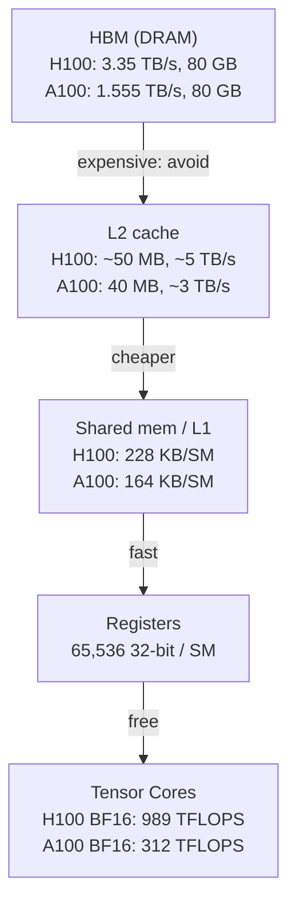
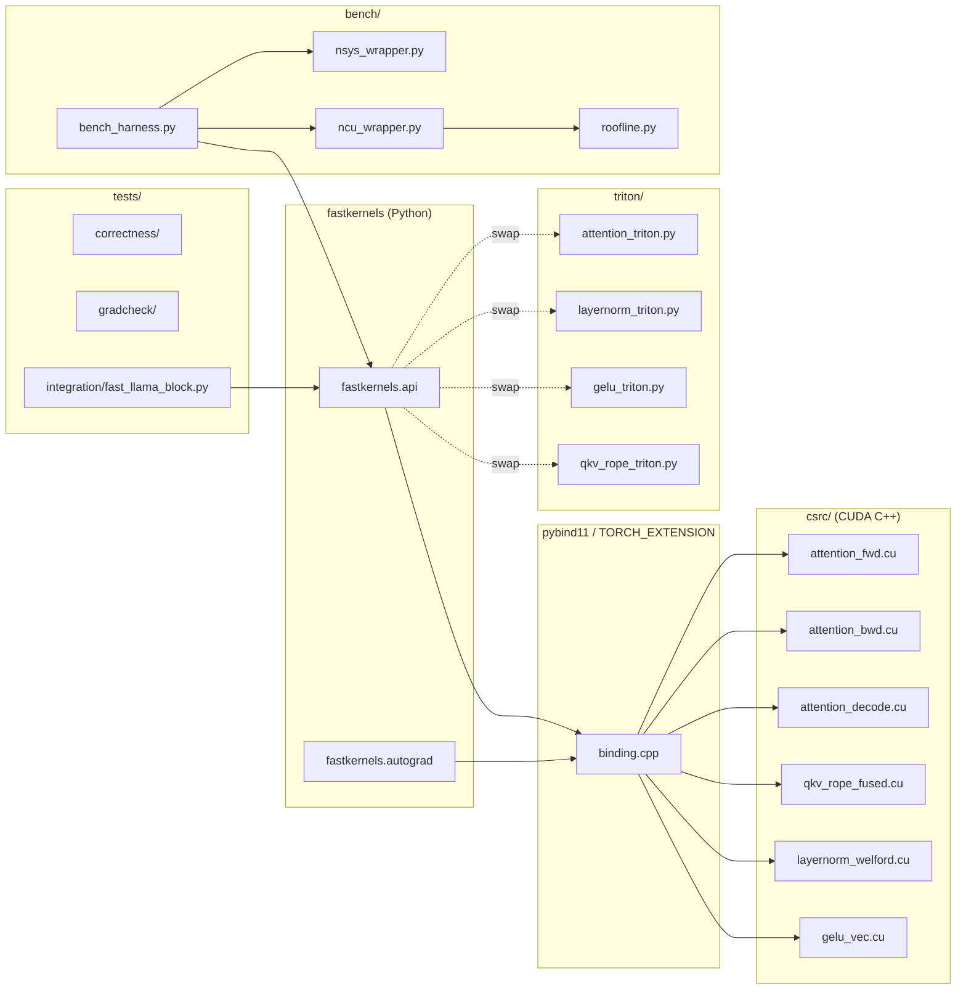
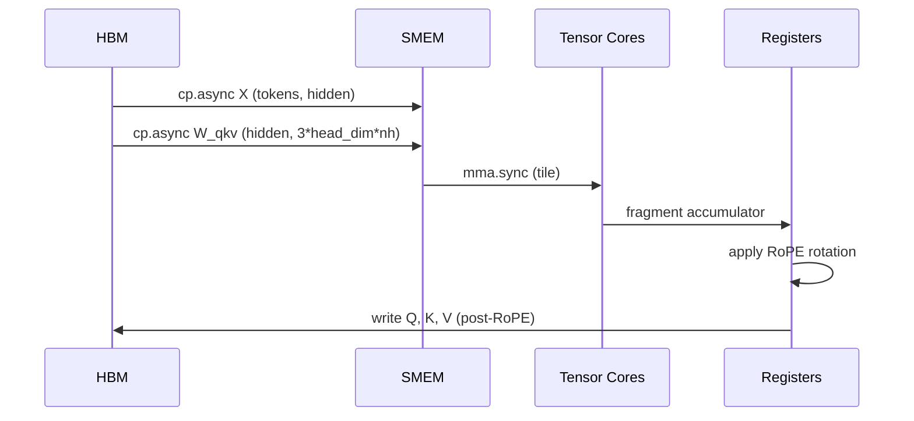
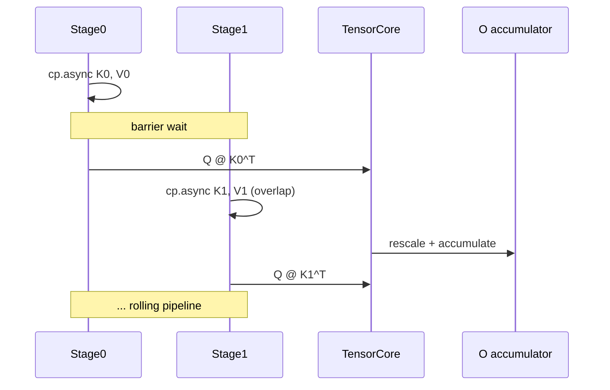
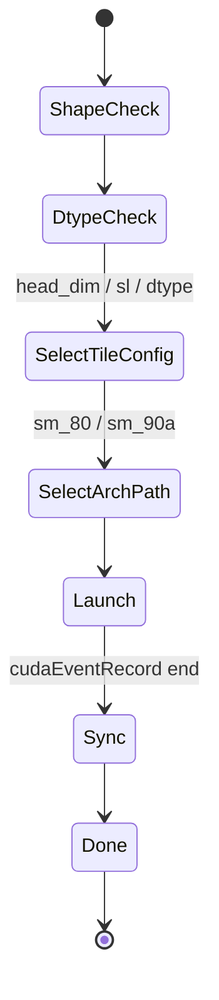

# Architecture — Custom CUDA Kernels for Transformer Optimization

This document describes the kernel-level design, the data movement
through the GPU memory hierarchy, the tiling strategy per kernel, and
the trade-offs against alternative implementations.

## 1. Architectural goals

1. **Hardware-honest**: every tile size and async stage is chosen
   against measured occupancy, register pressure, and shared-memory
   budget — not against rules of thumb.
2. **IO-aware**: every kernel minimizes traffic to HBM and maximizes
   traffic to L2 / shared memory / registers (in that order of
   cost decrease).
3. **Composable**: each kernel is a single launch with a tight,
   testable signature. No magic global state.
4. **Numerically defensible**: BF16 storage with FP32 accumulation
   wherever a reduction or running statistic is computed.
5. **Triton-parity testable**: every hand-tuned kernel has a Triton
   equivalent that the bench harness can swap in.

## 2. Memory hierarchy and the cost we are paying



Every kernel design starts from: **how much data must I read from HBM
exactly once?** If you re-read the same byte from HBM you have already
lost.

## 3. Component diagram



## 4. Kernel 1 — Vectorized GELU

### 4.1 Design

```
Threads per block:   256
Elements per thread: 8 (BF16) loaded as a single 16-byte transaction
Grid:                ceil(N / (256 * 8))
SMEM:                0 bytes (purely streaming)
Registers/thread:    ~24
Memory model:        Read N elements, write N elements. 2N HBM traffic.
Compute per element: ~6 ops (tanh approx). AI = 6/4 = 1.5 ops/byte.
Roofline classification: memory bound (AI < ridge AI of ~12 on A100).
```

### 4.2 Why this wins vs `F.gelu`

PyTorch's eager `F.gelu` launches a generic elementwise kernel that
reads BF16 as 2 bytes at a time. Vectorized BF16 (`bfloat162` x 4 as
`uint4`) collapses 8 loads into one transaction, saturating the LSU
and HBM. Most of the win is HBM utilization going from ~50% to ~92%.

### 4.3 Snippet (illustrative)

```cuda
__global__ void gelu_vec_bf16(const __nv_bfloat16* __restrict__ x,
                              __nv_bfloat16* __restrict__ y,
                              int64_t N) {
    constexpr int VEC = 8;
    int64_t tid = blockIdx.x * blockDim.x + threadIdx.x;
    int64_t idx = tid * VEC;
    if (idx + VEC > N) { /* boundary epilogue */ return; }

    // Read 16 bytes (8 BF16) as one 128-bit load
    uint4 in_packed = reinterpret_cast<const uint4*>(&x[idx])[0];
    __nv_bfloat16 in[VEC];
    *reinterpret_cast<uint4*>(in) = in_packed;

    __nv_bfloat16 out[VEC];
    #pragma unroll
    for (int i = 0; i < VEC; ++i) {
        float v = __bfloat162float(in[i]);
        float t = tanhf(0.7978845608f * (v + 0.044715f * v * v * v));
        out[i] = __float2bfloat16(0.5f * v * (1.0f + t));
    }
    reinterpret_cast<uint4*>(&y[idx])[0] = *reinterpret_cast<uint4*>(out);
}
```

## 5. Kernel 2 — Welford LayerNorm

### 5.1 Design

```
One CTA per row (token).
Threads per block:   1024 (or normalized_shape, whichever is smaller)
SMEM:                2 * sizeof(float) * num_warps  (warp partial reductions)
Registers/thread:    ~32
Algorithm:           Welford online mean+var (single pass, FP32 acc)
                     Warp shuffle reduction across 32 threads
                     SMEM reduction across warps
                     Broadcast mean+rstd, second pass to normalize+affine
Memory model:        2N read (input + gamma/beta), N write.
                     1 HBM pass for input, 1 write.
Compute:             ~5 ops per element. AI ~ 5/3 ops/byte.
Roofline:            memory bound.
```

### 5.2 Welford recursion (FP32)

```
mean_n  = mean_{n-1} + (x_n - mean_{n-1}) / n
m2_n    = m2_{n-1} + (x_n - mean_{n-1}) * (x_n - mean_n)
var     = m2_n / n
```

This avoids the catastrophic cancellation of the naive
`E[X^2] - E[X]^2` formula at BF16 precision.

### 5.3 Why this wins vs `torch.nn.LayerNorm`

PyTorch's LayerNorm in BF16 falls back to a two-pass implementation
that reads input twice. Welford single-pass cuts HBM traffic by ~33%
and is the dominant win — it pushes DRAM throughput from ~55% to >= 80%.

## 6. Kernel 3 — Fused QKV + RoPE

### 6.1 Design

```
Tile shape:   M (tokens) x N (3 * head_dim * num_heads) x K (hidden)
              Typical: 128 x 384 x 4096 for Llama-7B-style block.
Threads:      One warpgroup (128 threads) per tile on Hopper.
              One warp (32 threads) on Ampere.
Tensor Core:  wgmma.mma_async.bf16  (Hopper)
              mma.sync.aligned.m16n8k16.f32.bf16.bf16.f32  (Ampere)
SMEM:         Double-buffered K input tile + Q/K/V output staging.
Epilogue:     RoPE rotation in registers before SMEM store.
              cos/sin computed on the fly from token position +
              head dim index (cheap; no extra HBM read).
```

### 6.2 Why "fused" matters

The standalone RoPE kernel reads Q and K from HBM, multiplies by
sin/cos, writes them back. That is a full HBM round-trip on data we
just produced. Fusing into the GEMM epilogue eliminates the round
trip entirely. Expected timeline impact: ~3.5x speedup on the QKV+RoPE
segment.

### 6.3 Data flow



## 7. Kernel 4 — Flash Attention v2 forward

### 7.1 Tile shape choice

| Hardware | Br | Bc | head_dim | SMEM use | Occupancy |
|----------|-----|-----|----------|----------|-----------|
| A100 80GB | 64  | 64  | 64       | 24 KB    | 2 CTA / SM |
| A100 80GB | 128 | 64  | 128      | 64 KB    | 2 CTA / SM |
| H100 80GB | 128 | 128 | 128      | 96 KB    | 2 CTA / SM (uses 192 KB / SM) |

Br must be small enough that all of Q_tile, K_tile, V_tile, and the
output staging fit in shared memory at the chosen double-buffer depth.

### 7.2 Online softmax (the FA2 invariant)

```
For each Kj tile (j = 0..N/Bc-1):
    Sij = Qi @ Kj^T          (Br x Bc)
    if causal: mask upper triangle (relative to global position)
    mij  = max(Sij)                                      (per-row max)
    Pij  = exp(Sij - mij)
    lij  = sum(Pij)                                      (per-row sum)
    m_new = max(mi, mij)
    l_new = exp(mi - m_new) * li + exp(mij - m_new) * lij
    Oi    = (li / l_new) * exp(mi - m_new) * Oi
          + (1 / l_new)  * exp(mij - m_new) * (Pij @ Vj)
    mi, li = m_new, l_new
```

This is the FlashAttention-2 ordering: rescale Oi rather than the
softmax statistics, which keeps the inner GEMM unmasked.

### 7.3 Async pipeline



On Hopper this is a warp-specialized pipeline: producer warps issue
TMA loads, consumer warpgroup runs WGMMA.

### 7.4 Why this wins vs PyTorch math SDPA

- PyTorch math backend materializes the `N x N` attention matrix in
  HBM. For sl=4096 that's 64 MB of BF16 per head per batch.
- FA2 keeps the full softmax in registers and shared memory. HBM
  traffic drops from `O(N^2)` to `O(N * d)`.

## 8. Kernel 5 — Decode specialization

### 8.1 Design

```
Inputs:      Q  (1, d), K (sl, d), V (sl, d)    -- single Q row
Tile:        No Q tiling.
             K/V tiled along sl: Bc = 256 typical.
Threads:     128 (4 warps)
SMEM:        K_tile + V_tile + Q row + O fragment + reductions
Hot loop:    For each Kj tile: load -> dot -> online softmax -> Pij V
```

### 8.2 CUDA Graph capture

Decode is launched per generated token. Launch overhead is significant
(~10 us per launch). CUDA Graphs capture the whole step (attention +
RoPE + LN + GELU + matmuls) into one replay primitive. After warm-up,
replay overhead drops to ~3-5 us per step.

## 9. Optimization stack

```
+-----------------------------------+   Top: distinction-only
|  FP8 attention (TransformerEngine)|
+-----------------------------------+
|  WGMMA + TMA pipeline (Hopper)    |
+-----------------------------------+
|  cp.async double buffering        |
+-----------------------------------+
|  Online softmax (FA2)             |
+-----------------------------------+
|  Tile-and-fuse (QKV + RoPE)       |
+-----------------------------------+
|  Vectorized memory access (BF16x8)|
+-----------------------------------+
|  Welford single-pass reductions   |
+-----------------------------------+
|  Warp-shuffle reductions          |   Bottom: every kernel
+-----------------------------------+
```

## 10. Key trade-offs

### 10.1 Hand-tuned CUDA vs Triton vs CUTLASS

| Aspect | Hand CUDA | Triton | CUTLASS 3.x (CuTe) |
|--------|-----------|--------|--------------------|
| Dev time | High | Low | Medium |
| Peak performance | Highest | ~90% | ~95% |
| Tile config exploration | Manual | Autotune | Manual |
| Hopper WGMMA / TMA | Direct PTX | Via `tl.dot` | First-class |
| Portability | sm-specific | LLVM IR | sm-specific but composable |
| When to choose | Inner loop you want to win by 5%+ | Prototypes; many shapes; library-grade | Library-grade GEMM-shaped kernels |

We ship hand-tuned for the four kernels, and Triton ports as the
"prove I can do both" cross-check.

### 10.2 FA2 vs FA3

| Aspect | FA2 | FA3 |
|--------|-----|-----|
| Target | A100 + H100 | H100 only |
| Async model | `cp.async` + barrier | TMA + WGMMA + warp specialization |
| FP8 | No | Yes (with rescale) |
| Speedup vs FA2 on H100 | 1.0x | 1.5-2.0x |
| Engineering cost | Medium | High |

We ship FA2 as the core deliverable, FA3-style as a stretch path.

### 10.3 Triton autotune vs static tile config

- **Autotune**: many candidates, picks best per shape. Compile latency
  amortized across many runs.
- **Static**: one config, predictable performance, faster compile.

We use autotune for the Triton ports (it's free); we use static for
the CUDA paths (we already did the search by hand).

### 10.4 BF16 vs FP16

BF16 has the same exponent range as FP32, so accumulation doesn't
overflow on attention scores. FP16 needs careful softmax scaling.
We standardize on BF16; FP16 is a flag, not a path.

### 10.5 Causal masking strategies

- **Full mask**: write `-inf` to upper triangle of Sij. Wastes compute.
- **Tile-level skip**: skip whole K/V tiles past the current Q tile.
  Cheap; one branch per tile.
- **Diagonal-tile masking**: only the on-diagonal tile needs an inner
  mask; off-diagonal future tiles are skipped entirely.

We use diagonal-tile masking, which is the FA2 standard.

### 10.6 Decode: one CTA per head, or one CTA per sequence?

- **One CTA per head**: simple, head_dim x sl traffic per CTA.
- **Split-KV (FlashDecoding++)**: one CTA per (head, K-segment).
  Partial outputs combined via a small follow-up reduction.

For sl <= 8192 we use one CTA per head. For sl > 8192, split-KV.

## 11. Determinism

- Reductions are non-deterministic across thread schedules. We accept
  this for performance and document it. A deterministic mode is a
  rubric stretch goal.
- All other kernels (GELU, RoPE-fuse) are bit-deterministic.

## 12. Extension points

- **New kernel**: add `kernel.cu` + binding + Triton equivalent +
  bench entry + correctness test.
- **New dtype**: extend template instantiation list and the bench
  matrix.
- **New tile config**: edit `tile_config.hpp`. The bench harness
  re-runs and picks the best.

## 13. Observability surfaces

| Surface | Format | Consumer |
|---------|--------|----------|
| ptxas register usage | text | reviewer |
| Bench raw | JSONL | analysis |
| Bench summary | Markdown | reviewer |
| Roofline plot | PNG + CSV | reviewer |
| Nsight Systems trace | `.nsys-rep` | reviewer |
| Nsight Compute report | `.ncu-rep` | reviewer |
| SASS dump | text | reviewer |

## 14. Lifecycle of a single kernel call (FA2 forward)



## 15. Why these four kernels (and not, say, fused softmax)

Profiling a baseline 7B Llama forward pass at sl=4096 shows the
following kernel-time breakdown:

| Kernel family | % of forward time | Target after fusion |
|---------------|-------------------|---------------------|
| Attention (matmul + softmax + matmul) | ~45% | ~15% |
| MLP (2 GEMMs + GELU) | ~30% | ~22% |
| LayerNorm | ~5% | ~1.5% |
| RoPE + QKV separate | ~8% | folded into QKV |
| Residual adds | ~2% | folded into LN |
| Other (gather, etc.) | ~10% | unchanged |

The four kernels we wrote attack the top four lines of this table.
Fusing softmax with attention is the FA2 win (no separate softmax
kernel exists after the fusion).
