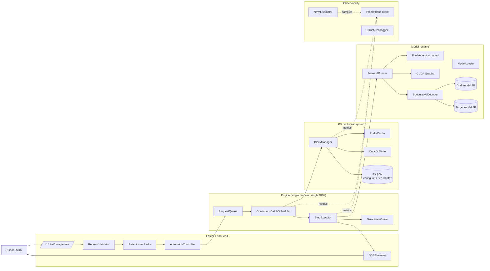
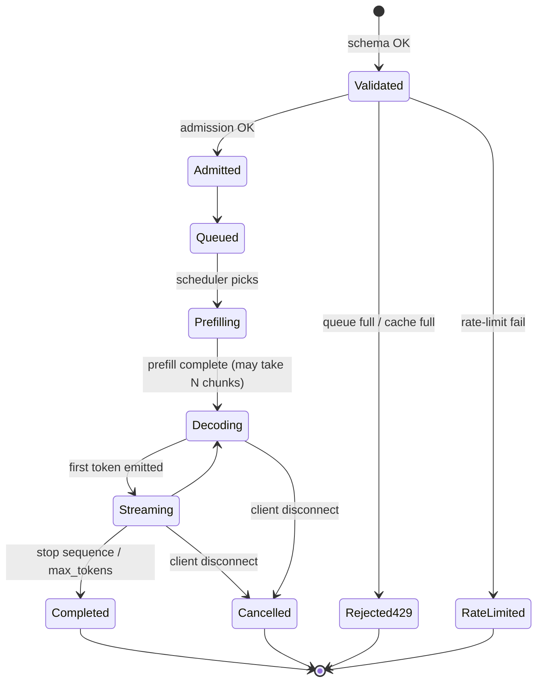
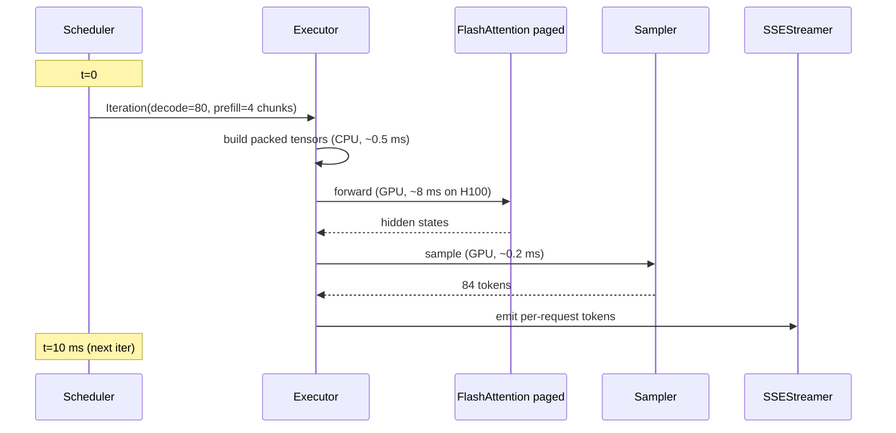
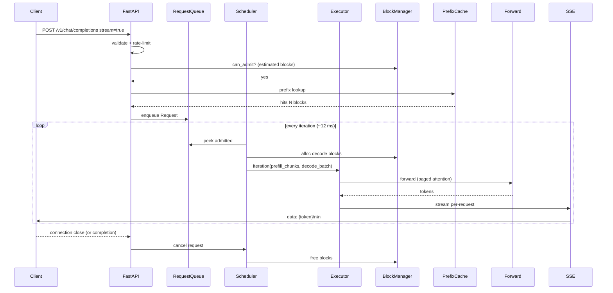

# Architecture — High-Performance LLM Inference System

This document describes the serving system's internal structure, the
request lifecycle, the scheduler design, and the trade-offs against
alternative implementations (vLLM, TensorRT-LLM, Triton Inference
Server).

## 1. Architectural goals

1. **Throughput-first under a P99 latency SLO**: the system optimizes
   for goodput (requests that meet SLO), not raw req/sec.
2. **Per-iteration scheduling**: every model step is a fresh decision;
   no static batches.
3. **No KV cache pinning per request**: PagedAttention block tables
   decouple logical position from physical layout.
4. **Backpressure over crash**: cache exhaustion is a 429, never an
   OOM panic.
5. **Observable by default**: every state transition is a Prometheus
   event; nothing is silent.
6. **Line-by-line defensible**: vLLM and TensorRT-LLM are baselines,
   not dependencies. The candidate must be able to walk every box in
   this diagram.

## 2. High-level component diagram



## 3. Request lifecycle



State transitions emit Prometheus events. The transition latency from
`Queued` to `Streaming` is the TTFT histogram. The inter-token gap
during `Streaming -> Decoding -> Streaming` is the TPOT histogram.

## 4. Module-by-module description

### 4.1 `engine.queue`

- Async-safe `RequestQueue` keyed by priority class
  (default / interactive / batch).
- Per-priority head-of-line backpressure via `asyncio.Semaphore`.
- Queue depth gauge exported.

### 4.2 `engine.scheduler`

- Runs in the event loop alongside the executor.
- Per-iteration decision:

```
def step():
    free_blocks = block_manager.free_count()

    # Step A: select decode batch (alive requests).
    decode_batch = [r for r in alive if r.needs_new_block_implies_free()]
    decode_batch = decode_batch[:max_decode_batch_size]

    # Step B: chunked prefill admission.
    prefill_budget = max_prefill_tokens_per_iter
    prefill_chunks = []
    for req in queue.peek_admitted():
        chunk = req.next_prefill_chunk(remaining=prefill_budget)
        if chunk is None: continue
        if not block_manager.can_admit(req, chunk): continue
        prefill_chunks.append((req, chunk))
        prefill_budget -= chunk.tokens
        if prefill_budget <= 0: break

    # Step C: defend decode under tight KV.
    if free_blocks < low_water_mark:
        prefill_chunks = []   # decode-only step

    return Iteration(decode_batch=decode_batch, prefill=prefill_chunks)
```

- Tuning knobs: `max_decode_batch_size`, `max_prefill_tokens_per_iter`,
  `low_water_mark`, `chunk_size`, `prefill_decode_ratio`.

### 4.3 `engine.executor`

- Holds the model.
- Builds the packed input tensors for the iteration:
  - `input_ids` (concatenated prefill chunks + 1-token-per-decode).
  - `position_ids`.
  - `block_table` (one row per request, padded).
  - `slot_mapping` (where each new token's KV will be written).
  - `seqlens` (for FlashAttention varlen).
- Calls the forward.
- Samples tokens (greedy / nucleus / temperature).
- Routes tokens back to the SSE streamer.

### 4.4 `cache.block_manager`

- Owns the GPU-side contiguous KV pool:

```
pool_shape = (num_blocks, block_size, 2, num_kv_heads, head_dim)
pool_dtype = torch.bfloat16
```

- Free list as a Python `deque`.
- O(1) `alloc` / `free`.
- Maintains a `block_table` per request.
- Reports:
  - `kv_blocks_total`
  - `kv_blocks_free`
  - `kv_fragmentation_ratio` (1 - used_tokens / (used_blocks * block_size))

### 4.5 `cache.prefix_cache`

- Hashes block-aligned prefixes (Murmur or SHA1, doesn't matter; pick
  one and stick with it).
- LRU map: `hash -> List[block_id]`.
- On admission, walks the prompt by `block_size`; for each matched
  prefix hash, bumps refcount on the referenced blocks and points the
  new request's block table at them.
- Copy-on-write: when a request would write into a shared block, it
  allocates a new block, copies the K/V data, and updates its block
  table.

### 4.6 `cache.cow`

- Implements the per-block refcount table.
- `refcount[block_id] > 1` -> shared.
- Write triggers COW: alloc new, memcpy K/V slice, decrement old
  refcount.

### 4.7 `kernels.paged_attention`

- Wraps `flash_attn_with_kvcache` (FA 2.6+) or a custom Triton kernel.
- Inputs: query, KV cache pool, block_table, context_lens.
- One launch per iteration regardless of how many requests are in
  flight.

### 4.8 `spec.draft_target`

- Pre-loads a draft model (typically a 1B-param model from the same
  family).
- Per request:
  - Draft generates K tokens autoregressively.
  - Target model verifies all K in one forward pass.
  - Tokens are accepted up to the first rejection point.
  - Rejection sampling produces a corrected next token.
- Tracks accept rate; adapts K dynamically (smaller K when accept rate
  is low).

### 4.9 `api.fastapi_app`

- ASGI app with two routes (`/v1/completions`,
  `/v1/chat/completions`).
- Validates request schema.
- Rate-limits via Redis (sliding window).
- Hands the request to the engine.
- Pipes engine token stream out as SSE.
- Listens for `request.is_disconnected()` and signals cancellation.

### 4.10 `obs.metrics`

- Single Prometheus registry.
- Bounded label cardinality enforced at registration time.
- Histograms with explicit buckets (don't use defaults; they are wrong
  for sub-second latencies).

```
TTFT_BUCKETS = [.005, .01, .02, .04, .08, .12, .2, .4, .8, 1.6, 3.2]
TPOT_BUCKETS = [.005, .01, .015, .02, .025, .03, .05, .08, .15]
E2E_BUCKETS  = [.1, .25, .5, 1.0, 2.0, 4.0, 8.0, 16.0, 30.0]
```

### 4.11 `obs.nvml`

- Background async task samples NVML every 250 ms:
  - SM busy %
  - Memory used / total
  - Power draw
  - Temperature
- Aborts the process if temperature > threshold (configurable, default
  85 C).

## 5. Iteration timeline (Nsight Systems view)



A healthy iteration on Llama-3 8B BF16, H100, decode batch ~80,
prefill chunk total ~512 tokens is ~12 ms forward + 1 ms scheduling =
~13 ms wall-clock. At 13 ms/iter the system emits ~80 tokens/iter =
~6150 tokens/sec aggregated across all in-flight requests.

## 6. Optimization stack

```
+--------------------------------------+   Stretch: tensor parallel
|  Tensor parallelism (NCCL)           |
+--------------------------------------+
|  FP8 weights (TransformerEngine)     |
+--------------------------------------+
|  Speculative decoding (draft + verify)|
+--------------------------------------+
|  CUDA Graphs (decode-only step)      |
+--------------------------------------+
|  Chunked prefill                     |
+--------------------------------------+
|  Continuous batching                 |
+--------------------------------------+
|  PagedAttention KV cache             |
+--------------------------------------+
|  FlashAttention paged kernel         |
+--------------------------------------+
|  BF16 model                          |   Foundation
+--------------------------------------+
```

Each layer assumes the layer below works. Speculative decoding only
helps if the underlying attention path is already efficient.

## 7. Key trade-offs

### 7.1 Continuous batching vs static batching

| Aspect | Static | Continuous |
|--------|--------|------------|
| Implementation cost | Low | High |
| GPU utilization | Bursty | Steady |
| TTFT under load | Spikes when batch fills | Bounded |
| TPOT for short requests | Slow (wait for tail) | Fast |
| Throughput at high load | Lower | Higher |

We pick continuous. The candidate must defend the iteration scheduler
choices.

### 7.2 PagedAttention vs contiguous KV

| Aspect | Contiguous | Paged |
|--------|------------|-------|
| Fragmentation | High under varied lengths | Bounded by block_size |
| Implementation cost | Low | High |
| Memory wasted on max_seq_len padding | Yes | No |
| Prefix sharing | Hard | Easy (COW) |
| Kernel cost | Slightly faster (no indirection) | Small overhead from block_table |

We pick paged. The overhead is < 5% based on Kwon et al. measurements.

### 7.3 Block size: 8 vs 16 vs 32 tokens

| Block size | Fragmentation | Kernel overhead | Recommendation |
|------------|---------------|------------------|----------------|
| 8 | Lowest | Highest | Only if very many short requests |
| 16 | Low | Low | Default |
| 32 | Higher | Lowest | Long-prompt-dominated workloads |

Default 16. Tune via config.

### 7.4 Chunked prefill: chunk size

| Chunk | TTFT cost (long prompt) | Decode stall risk |
|-------|--------------------------|--------------------|
| 256 | Highest (more iters) | Low |
| 512 | Balanced | Low |
| 1024 | Lower TTFT | Decode iters delayed by ~20 ms |

Default 512.

### 7.5 Speculative decoding draft size

| Draft K | Accept rate (typical) | Speedup | Wasted work |
|---------|------------------------|---------|--------------|
| 2 | ~80% | 1.5x | Low |
| 4 | ~65% | 1.8x | Medium |
| 8 | ~45% | 2.0x | High |

Start at K=4 with adaptive tuning to K in {2,4,6,8}.

### 7.6 Prefix cache hash function

Murmur3 vs SHA1 vs FNV. We pick **xxh64** for speed + low collision
rate. The hash domain is small (millions of block prefixes) so 64-bit
collisions are negligible.

### 7.7 Where vLLM and TensorRT-LLM are better and why

- **vLLM**: faster across the whole shape grid because it has more
  hand-tuned paths (FlashInfer kernels, CUDA Graph paths per shape
  bucket). We accept within 10% on the canonical workload because the
  point of this project is to *understand* the system, not beat the
  best library.
- **TensorRT-LLM**: typically 1.1-1.4x faster than ours on H100 due to
  tighter kernel integration, FP8 paths, and ahead-of-time compilation.
  Within 25% is the soft target.

If our submission beats vLLM on the canonical workload, we have
either found a real optimization or made a measurement error. Investigate.

## 8. End-to-end data flow



## 9. Determinism

- Single-GPU greedy decoding is deterministic.
- Top-p / top-k with seeds: reproducible if seed is supplied.
- Continuous batching can change the order of accumulator updates
  inside the forward; for inference (no gradient) this does not break
  determinism modulo floating-point reductions.
- We document non-determinism cases and offer a `deterministic=true`
  per-request flag that disables speculative decoding and forces a
  fixed batch placement.

## 10. Extension points

- **New scheduler**: implement `Scheduler` protocol (`step() ->
  Iteration`), register in `engine.scheduler_registry`.
- **New decoding mode**: add to `engine.sampler` (e.g. beam search,
  contrastive).
- **New KV management**: implement `BlockAllocator` protocol.
- **Tensor parallel**: split `ForwardRunner` across 2 GPUs via NCCL
  all-reduce on the attention output projection and MLP down-projection.

## 11. Observability surfaces

| Surface | Format | Consumer |
|---------|--------|----------|
| Structured logs | JSON | log aggregator (loki, ELK) |
| Prometheus metrics | /metrics | Prometheus -> Grafana / Alertmanager |
| Grafana dashboard | dashboard.json | SRE |
| Distributed traces | OTLP (optional) | Tempo / Jaeger |
| Load test results | JSONL + CDF PNGs | reviewer |
| Nsight Systems trace | .nsys-rep | reviewer |

## 12. Why not just use vLLM?

vLLM is excellent. We don't ship vLLM here because:

1. **Pedagogy**: the candidate needs to walk every box. Wrapping vLLM
   teaches one API; building the engine teaches the algorithms.
2. **Customization**: production teams routinely fork serving engines
   for custom routing, custom metrics, custom auth, or custom
   speculative paths. The skill of "fork and extend a serving engine
   safely" is the deliverable.
3. **Benchmark fairness**: we want a head-to-head comparison against
   vLLM with workload control on both sides. If we ARE vLLM, the
   comparison is meaningless.

The submission ships within 10% of vLLM and the candidate can defend
where the 10% goes (we lack FlashInfer's per-shape autotune; we don't
have CUDA Graph capture per request shape bucket; etc.).
